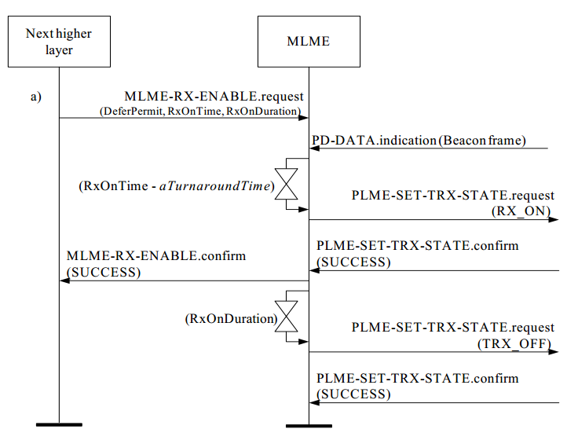
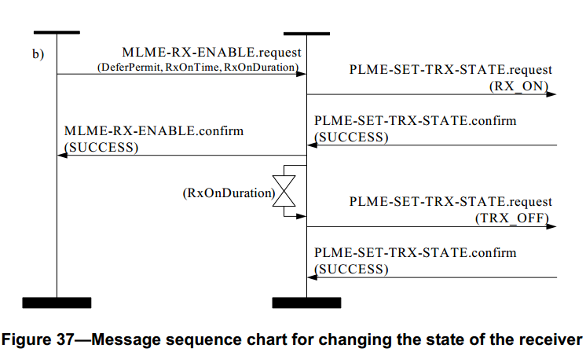

# 7.1.10 接收器时间使能原语
>在G3标准中该部分不相关，也就是未使用

　　MAC层管理实体服务接入点的接收机状态原语定义了一个设备如何能在给定的时间开启和关闭接收机。

　　这些接收机状态原语是可选的。

## 7.1.10.1 MLME-RX-ENABLE.request原语
　　MLME-RX-ENABLE.request原语允许MAC层上层请求接收机在一定的时间内处于激活接收工作状态还是关闭接收工作状态。

### 7.1.10.1.1 服务原语的语义
　　MLME-RX-ENABLE.request原语的语义如下：
```
MLME-RX-ENABLE.request(
                      DeferPermit,
                      RxOnTime,
                      RxOnDuration
)
```
　　表65描述了MLME-RX-ENABLE.request原语的参数。
<center>表65 MLME-RX-ENABLE.request原语的参数</center>

名字|类型|有效范围|功能描述
----|----|----|----
DeferPermit|布尔型|TRUE或FALSE|该值为TRUE，则表示在请求时间超时情况下，可延迟到下一个超帧开启接收机。为FALSE，则只允许在当前的超帧中开启接收机。在不支持信标的PAN中，忽略此参数。<br>如果发送的设备是PAN协调器，所说的“超帧”就是它自己的超帧。否则，“超帧”就是发送设备连接的协调器的超帧。
RxOnTime|整型|0x000000–0xffffff|该值为从超帧起始符号到接收机开始接收前的符号数。这是一个24比特值，此值精度最小为20比特，最低4比特位为最低有效位。在不支持信标的PAN中，忽略此参数。<br>如果发送的设备是PAN协调器，所说的“超帧”就是它自己的超帧。否则，“超帧”就是发送设备连接的协调器的超帧。
RxOnDuration|整型|0x000000–0xffffff|接收机开启的持续时间，以符号数表示。如果该参数等于0x000000，关闭接收机。

### 7.1.10.1.2 适当的用法
　　MLME-RX-ENABLE.request原语由MAC层的上层生成，并发送给MAC层管理实体使接收机持续固定的一段接收时间。其发送时间分为两种情况：在支持信标PAN中，时间与当前超帧或下一个超帧的起始有关；在不支持信标的PAN中，将立即发送此原语。此原语也可以是为了取消一个先前发送的开启接收机的请求而生成。每一个原语都请求接收机开启一次。

### 7.1.10.1.3 接收效应
　　MAC层管理实体在处理设备的请求时，相对于设备的其他功能来说，开启和关闭接收机的请求是次要的(比如，保护时隙，协调器信标帧跟踪，信标帧传输)。当发送的原语是开启接收机时，那么，只有在下面两种情况下，设备才会开启它的接收机：设备有一个冲突事件或者RxOnDuration指定的接收机开启的持续时间期满。在一个冲突事件情况下，设备将中断接收操作。在中断操作完成后，检查RxOnDuration以确定时间是否到期。如果时间到期，操作完成。如果时间没有到期，遇到下面两种情况之一，接收机将再次被开启：设备有另一个冲突事件或RxOnDuration指定的时间到期。当发送的原语是关闭接收机时，除非设备有一个冲突事件，否则设备将关闭接收机。

　　在不支持信标的PAN中，MAC层管理实体将忽略DeferPermit和RxOnTime参数，并请求物理层立即开启或者关闭接收机。如果请求开启接收机，并将保持开启状态直到RxOnDuration符号数到期。

　　在支持信标的PAN中，MAC层管理实体在试图开启接收机之前将首先决定RxOnTime+RxOnDuration是否小于信标帧间隔，该信标帧间隔由macBeaconOrder定义。如果不小于，MAC层管理实体将返回一个状态为ON_TIME_TOO_LONG的MLME-RX-ENABLE.confirm原语。

　　然后，MAC层管理实体将决定接收机能否在当前的超帧内开启。如果发送此原语的设备是PAN协调器，它将根据自己的超帧做出决定；如果该设备不是PAN协调器，那么它将根据所连接的协调器的超帧做出判断。如果从超帧开始，所测得的当前符号数小于RxOnTime-aTurnaroundTime，则MAC层管理实体就试图在在当前的超帧内开启接收机。如果从超帧开始，所测得的当前符号数小于RxOnTime-aTurnaroundTime并且DeferPermit值为TRUE，则MAC层管理实体将延迟到下一个超帧时期，再试图开启接收机。否则，如果MAC层管理实体既不能在当前超帧开启接收机又不能延迟到下一个超帧开启接收机，那么它将返回一个状态为PAST_TIME的MLME-RX-ENABLE.confirm原语。

　　如果RxOnDuration参数为0，那么，MAC层管理实体请求物理层关闭接收机。

　　如果在MLME-RX-ENABLE.request原语中，有不符合语义的参数或者参数值超出其规定范围，MAC层就会发送一个带有INVALID_PARAMETER状态的MLME-RX-ENABLE.confirm原语。

　　如果成功地开启或关闭接收机，MAC层管理实体将发送一个带有SUCCESS状态的MLME-RX-ENABLE.confirm原语。

## 7.1.10.2 MLME-RX-ENABLE.confirm原语
　　MLME-RX-ENABLE.confirm原语用来报告试图开启或关闭接收机请求原语的执行结果。

### 7.1.10.2.1 服务原语的语义
　　MLME-RX-ENABLE.confirm原语的语义如下：
```
MLME-RX-ENABLE.confirm(
status
)
```
　　表66描述了MLME-RX-ENABLE.confirm原语的参数。
<center>表66 MLME-RX-ENABLE.confirm原语的参数</center>

名字|类型|有效范围|功能描述
----|----|----|----
status|枚举型|SUCCESS,<br>PAST_TIME,<br>ON_TIME_TOO_LONG,<br>INVALID_PARAMETER|请求开启或关闭接收机的结果。

### 7.1.10.2.2 生成时间
　　MLME-RX-ENABLE.confirm原语由MAC层管理实体生成，并作为对MLME-RX-ENABLE.request原语的响应发送给它的上层。

### 7.1.10.2.3 适当的用法
　　在MAC层上层MLME-RX-ENABLE.confirm原语时，就得到开启或关闭接收机请求原语的执行结果。如果请求原语成功地开启或关闭接收机，则原语返回状态为SUCCESS，否则返回相应的错误代码。状态值都在7.1.10.1.3节中作了详细介绍。

## 7.1.10.3 消息序列表为改变接收机状态
　　图37的描述当设备没有任何冲突责任时，使接收机持续固定的一段接收时间所必需的消息序列表。a）的情形为：在支持信标的PAN中，假定MAC层管理实体接收到MLME-RX-ENABLE.request原语，但在当前的超帧没有足够的可用时间来开启接收机，并且DeferPermit参数为TRUE的例子。b）的情形为：在不支持信标的PAN中，接收机立即开启。

<center><center>
<center><center>
<center>图 37. 用于更改接收器状态的消息序列图 <center>
