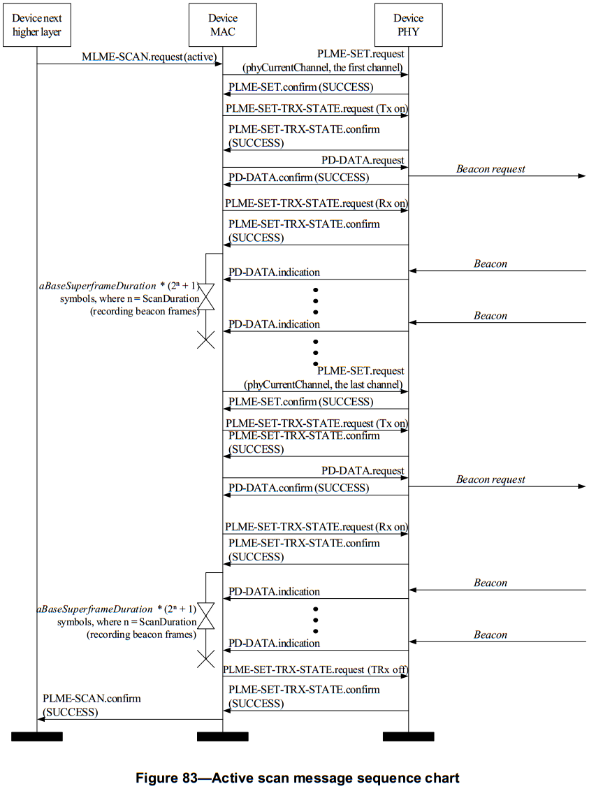

# 7.1.11 信道扫描原语
>在G3标准中该部分作为规范

　　MAC层管理实体服务接入点扫描原语定义了设备如何检测在通信信道中的能量，判断是否存在个域网。

　　所有的设备都为这些扫描原语提供接口。

## 7.1.11.1 MLME-SCAN.request
　　MLME-SCAN.request原语用来对给定的通信信道列表进行信道扫描。设备能够使用信道扫描测量某个信道的能量，搜索与它建立连接的协调器，或者搜索在它的个域网工作范围（POS）内所有发送信标帧的协调器。

### 7.1.11.1.1 服务原语的语义
>在G3标准中该部分进行了修改
<br>- ScanType参数唯一支持的值是0×01的主动扫描。
<br>- ScanChannels参数不使用，并且它的所有27位都必须被设置为0。
<br>- 不使用ChannelPage参数，并且必须始终设置为0。
<br>- SecurityLevel必须为0.因此，KeyIdMode，KeyIndex和KeySource参数可以忽略，并设置为0。

　　MLME-SCAN.request原语的语义如下：
```
MLME-SCAN.request(
                  ScanType,
                  ScanChannels,
                  ScanDuration,
                  ChannelPage,
                  SecurityLevel,
                  KeyIdMode,
                  KeySource,
                  KeyIndex
                  )
```
　　表67描述了MLME-SCAN.request原语的参数。
<center>表67 MLME-SCAN.request原语的参数</center>

名字|类型|有效范围|功能描述
----|----|----|----
ScanType|整型|0x00-0x03|表明执行的扫描类型：<br>0x00=ED扫描(对简化功能设备是可选的)。<br>0x01=主动扫描(对简化功能设备是可选的)。<br>0x02=被动扫描。<br>0x03=孤点扫描。
ScanChannels|位|27位字段|这27位(b0，b1，…b26)表示ChannelPage参数支持的27个被扫描的信道(1=扫描，0=不扫描)。
ScanDuration|整型|0-14|此值用来计算在能力检测扫描、主动扫描和被动扫描上用的时间。孤点扫描时忽略此参数。每个信道扫描所用的时间为：0[aBaseSuperframeDuration*(2n+1)]个符号，n为参数ScanDuration的值。
ChannelPage|整型|0-31|执行扫描的信道页(见6.1.2)。
SecurityLevel|整型|0x00–0x07|使用的安全等级(见7.6.2.2.1节表95)。
KeyIdMode|整型|0x00–0x03|使用的密钥模式(见7.6.2.2.2节表96)。如果SecurityLevel参数被设置为0x00,此参数被忽略。
KeySource|0，4或8字节|与KeyIdMode参数的描述相对应|使用的密钥的originator。(见7.6.2.4.2节)若KeyIdMode参数被忽略或被设置为0x00,此参数被忽略。
KeyIndex|整型|0x01–0xff|使用的密钥的索引。(见7.6.2.4.2节)若KeyIdMode参数被忽略或被设置为0x00,此参数被忽略。

### 7.1.11.1.2 适当的用法
>在G3标准中该部分进行了修改
<br>- 仅支持主动扫描
<br>- ED扫描，不使用被动扫描和孤立扫描。所有设备必须能够执行主动扫描。

　　MLME-SCAN.request原语由MAC层管理实体上层生成，并发送给MAC层管理实体以对在设备的个域网工作范围内的信道进行扫描，以便搜索出活跃的设备。此原语可用于执行下列类型的信道扫描：能量检测扫描来决定信道的用法；主动或被动扫描用来锁定任意一个协调器的信标帧；孤点扫描用来锁定设备已连接的PAN。每一类型的扫描将在7.5.2.1节中进行详细描述。

　　所有的设备都能执行被动扫描和孤点扫描;对于简化功能设备，ED扫描和主动扫描是可选的。然而，简化功能设备也许支持主动扫描参与一个不支持信标的网络。

### 7.1.11.1.3 接收效应
>在G3标准中该部分进行了修改
<br>- 仅支持主动扫描
<br>- ED扫描，不使用被动扫描和孤立扫描。所有设备必须能够执行主动扫描。
<br>- 在扫描期间没有物理信道概念，因为底层PHY层不支持多个信道。

　　当MAC层管理实体收到MLME-SCAN.request原语时正在执行先前开始的扫描操作，它将返回状态为SCAN_IN_PROGRESS的MLME-SCAN.confirm原语。否则，MAC层管理实体将对ScanChannels参数指定的所有信道开始扫描。

　　MAC层管理实体通过重复向物理层发送PLME-ED.request原语，对每个信道进行能量检测扫描，扫描将持续[aBaseSuperframeDuration*(2n+1)]个符号，n为参数ScanDuration的值。MAC层管理实体记录下测量到的最大的能量值后，对指定信道列表中的下一个信道进行测量。更多关于能量检测信道扫描过程的详细信息见7.5.2.1.1节。

　　MAC层管理实体首先通过发送一个信标帧请求命令，对每个信道进行主动扫描(见7.3.7节)。然后，开启接收机，使接收机处于接收状态，并记录在每个接收到的信标帧中的信息，个域网的信息结构中。(见7.1.5.1.1节表55)。主动扫描在某个特定的信道终止的条件为：当存储的个域网描述符的等于最大数或者当经过[aBaseSuperframeDuration*(2n+1)]个符号周期（n为参数ScanDuration的值）。更多关于主动信道扫描过程的详细信息见7.5.2.1.2节。

　　MAC层管理实体首先通过发送一个信标帧请求命令，对每个信道进行被动扫描。然后，开启接收机，并记录在每个接收到的信标帧中的信息，个域网的信息结构中。(见7.1.5.1.1节表55)。被动扫描在某个特定的信道终止的条件为：当存储的个域网描述符的等于最大数或者当经过[aBaseSuperframeDuration*(2n+1)]个符号周期（n为参数ScanDuration的值）。更多关于被动信道扫描过程的详细信息见7.5.2.1.3节。

　　MAC层管理实体首先通过发送一个孤点通告命令来执行对每个信道的扫描。(见7.3.6)。如果设备接收到一个协调器再连接命令，MAC层管理实体将关闭其接收机。否则，设备将在信道列表的下一个信道上重复扫描过程。更多关于孤点信道扫描过程的详细信息见7.5.2.1.4节。

　　SecurityLevel、KeyIdMode、KeySource和KeyIndex参数仅在孤点扫描时使用。

　　如果SecurityLevel参数被设置为除0x00之外的一个有效值,表明该帧需要安全机制,MAC层管理实体将把帧控制领字段的安全性子字段设置为1。那MAC层将会基于macCoordExtendedAddress、SecurityLevel、KeyIdMode、KeySource和KeyIndex参数执行输出处理过程，此过程将7.5.8.2.1节介绍。在输出帧处理过程中发生任何错误，MAC层管理实体都将丢弃该帧并返回一个带有输出帧处理过程返回的错误状态的MLME-SCAN.confirm原语。

　　能量检测扫描的结果记录在能量检测的列表中，并通过返回一个状态为SUCCESS的MLME-SCAN.confirm原语向MAC层上层报告。

　　主动或被动扫描的结果通过MLME-SCAN.confirm原语向其上层报告。如果扫描成功并且macAutoRequest为TRUE，原语结果将包含一系列PAN描述符的值。如果扫描成功并且macAutoRequest为FALSE，原语结果将包含A null set of PAN描述符的值;每个PAN描述符的值将分别使用MLME-BEACON-NOTIFY(见7.1.5.1)原语单独地发送到MAC层的上层。在两个种情况下，MLME-SCAN.confirm原语都包含未扫描信道的列表和SUCCESS状态。

　　如果在一个主动扫描期间，由于信道接入失败，MAC层管理实体在ScanChannels参数指定的信道上无法发送信标帧请求命令，该信道将列入未扫描信道列表中，该列表由MLME-SCAN.confirm原语返回。如果MAC层管理实体至少能在其中一个信道中传送信标帧请求命令，但没有发现其他的帧，MLME-SCAN.confirm原语将包含AnullsetofPAN描述符的值和NO_BEACON状态，而不管macAutoRequest的值是TRUE还是FALSE。

　　孤点扫描的结果通过MLME-SCAN.confirm原语向MAC层的上层报告。如果扫描成功，MLME-SCAN.confirm原语将包含SUCCESS状态。如果由于信道接入失败，MAC层管理实体在ScanChannels参数指定的信道上无法发送孤点通告命令，该信道将列入未扫描信道列表中，该列表由MLME-SCAN.confirm原语返回。MAC层管理实体至少能在其中一个信道中传送孤点通告命令，但设备没有接收到协调器再连接命令，MLME-SCAN.confirm原语将包含NO_BEACON状态。这样，MLME-SCAN.confirm原语的PANDescriptorList和EnergyDetectList参数为空。

　　如果在能量检测、主动或者被动扫描期间达到指定的执行的最大次数，从而扫描终止，MAC层将发送状态为LIMIT_REACHED的MLME-SCAN.confirm原语。

　　如果MLME-SCAN.request原语中有不符合语义的参数或者参数值超出范围，MAC层管理实体将发送一个带有INVALID_PARAMETER状态的MLME-SCAN.confirm原语。

## 7.1.11.2 MLME-SCAN.confirm原语
>在G3标准中该部分作为规范

　　MLME-SCAN.confirm原语报告信道扫描请求的结果。

### 7.1.11.2.1 服务原语的语义
>在G3标准中该部分进行了修改
<br>- ScanType参数唯一支持的值是0×01的主动扫描。
<br>- 未使用UnscannedChannels参数，其所有27位必须设置为0。
<br>- 不使用ChannelPage参数，并且必须始终设置为0。
<br>- 不使用EnergyDetectList参数，并且必须始终为null。

　　MLME-SCAN.confirm原语的语义如下：
```
MLME-SCAN.confirm(
                  status,
                  ScanType,
                  ChannelPage,
                  UnscannedChannels,
                  ResultListSize,
                  EnergyDetectList,
                  PANDescriptorList
                  )
```
　　表68描述了MLME-SCAN.confirm原语的参数。
<center>表68 MLME-SCAN.confirm原语的参数</center>

名称|类型|有效范围|功能描述
----|----|----|----
status|枚举型|SUCCESS,<br>LIMIT_REACHED,<br>NO_BEACON,<br>SCAN_IN_PROGRESS,<br>COUNTER_ERROR,<br>FRAME_TOO_LONG,<br>UNAVAILABLE_KEY,<br>UNSUPPORTED_SECURITY,<br>INVALID_PARAMETER|扫描请求的结果
ScanType|整型|0x00-0x03|表明执行扫描的类型：<br>0x00=能量检测扫描(对RFD可选)。<br>0x01=主动扫描(对RFD可选)。<br>0x02=被动扫描。<br>0x03=孤点扫描。
ChannelPage|整型|0-31|扫描执行的信道页
UnscannedChannels|位|27位字段|表明请求扫描的信道是否被扫描(1=未扫描，0=扫描或未请求)。这个参数对能量检测扫描是无效的。
ResultListSize|整型|特定执行|返回到相应结果列表中元素的个数。孤点扫描时此值是零。
EnergyDetectList|整型列表|每个整型都为0x00-0xff|能量检测列表，每个值为在ED扫描期间每个信道能量检测值。对于主动，被动和孤点扫描这个参数是无效的。
PANDescriptorList|PAN描述符值列表|见表55|在主动和被动扫描期间，如果macAutoRequest为TRUE，则为发现的每个信标的PAN描述符列表。如果macAutoRequest为FALSE，或者在能量检测和孤点扫描中该参数为空

### 7.1.11.2.2 生成时间
>在G3标准中该部分进行了修改
<br>- 仅支持主动扫描
<br>- ED扫描，不使用被动扫描和孤立扫描。所有设备必须能够执行主动扫描。

　　MLME-SCAN.confirm原语在MLME-SCAN.request原语信道扫描完成后，由MAC层管理实体生成，并发送给它的上层。如果MLME-SCAN.request原语请求一个主动，被动，或孤点扫描，EnergyDetectList参数为空。如果MLME-SCAN.request原语请求能量检测或孤点扫描，PANDescriptorList参数为空;如果MLME-SCAN.request原语请求主动或被动扫描并且macAutoRequest参数设置为FALSE，PANDescriptorList参数也为空。如果MLME-SCAN.request原语请求孤点扫描，ResultListSize参数为0。

　　如果请求的扫描成功，则MLME-SCAN.confirm原语返回状态为SUCCESS；否则，返回状态为相应的错误代码。状态值都在7.1.11.1.3节及其相关章节进行了详细描述。

### 7.1.11.2.3 适当的用法
>在G3标准中该部分作为规范

　　当MAC层上层接收到MLME-SCAN.confirm原语后，就得到扫描过程的结果。如果请求扫描成功，则状态参数为SUCCESS。否则，状态参数为错误代码。

## 7.1.11.3 信道扫描消息顺序图
>在G3标准中该部分进行了修改
<br>- 忽略图79（不支持ED扫描）
<br>- 忽略图82（不支持被动扫描）
<br>- 忽略图86（不支持孤立扫描）
<br>- 主动扫描消息序列图经过修改并替换参考文件的图83

图79，图82，图83和图86图表(见7.7)分别给出了执行能量检测扫描、被动扫描、主动扫描和孤点扫描所必须的消息序列表。在流程图中还包括物理层所采取的相关步骤。

<center><center>
<center>图 79. ED扫描消息序列图 <center>
<br>
<br>
<center><center>
<center>图 82. 被动扫描消息序列图 <center>
<br>
<br>
<center><center>
<center>图 83. 主动扫描消息序列图 <center>
<br>
<br>
<center><center>
<center>图 86. 孤立的设备调整消息序列图 <center>
<br>
<br>
<center><center>
<center>图 86. G3标准的主动扫描消息序列图  <center>
