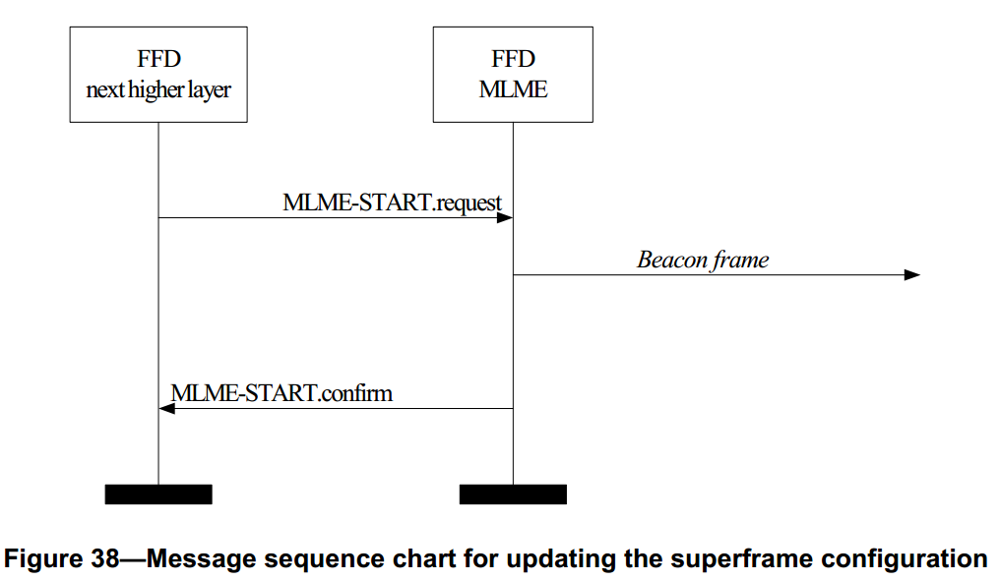

# 7.1.14 更新超帧结构原语
>在G3标准中该部分进行了修改
<br>该原语仅用于PAN协调器进行网络初始化

　　MAC层管理实体服务接入点启动原语定义了一个完整功能设备如何开始使用一个新的超帧配置来激活一个PAN，如何在一个已存在的PAN中开始传输信标帧，从而便于发现设备，或者停止信标帧的传输。
　　对于简化功能设备，此原语是可选的。

## 7.1.14.1 MLME-START.request原语
>在G3标准中该部分进行了修改
<br>该原语仅用于初始化一个新的PAN

　　MLME-START.request原语允许PAN协调器构建一个新的PAN或开始使用新的超帧配置。此原语也可以由一个已经连接到一个已存PAN上的设备用来开始使用新的超帧配置。

### 7.1.14.1.1 服务原语的语义
>在G3标准中该部分进行了修改
<br>主要修改的是内部一些赋值的默认值。参见READ中标注的引用位置

　　MLME-START.request原语的语义如下：
```
MLME-START.request(
                  PANId,
                  LogicalChannel,
                  ChannelPage,
                  StartTime,
                  BeaconOrder,
                  SuperframeOrder,
                  PANCoordinator,
                  BatteryLifeExtension,
                  CoordRealignment,
                  CoordRealignSecurityLevel,
                  CoordRealignKeyIdMode,
                  CoordRealignKeySource,
                  CoordRealignKeyIndex,
                  BeaconSecurityLevel,
                  BeaconKeyIdMode,
                  BeaconKeySource,
                  BeaconKeyIndex
                  )
```
　　表72描述了MLME-START.request原语的参数。
<center>表72 MLME-START.request原语的参数</center>

名称|类型|有效范围|功能描述
----|----|----|----
PANId|整型|0x0000–0xffff|设备使用的PAN标识符。
LogicalChannel|整型|从ChannelPage参数指定的可用的逻辑信道中选择。|开始使用新的超帧配置的逻辑信道。
ChannelPage|整型|从PHY支持的可用的信道页中选择。(见6.1.2节)|开始使用新的超帧配置的信道页。
StartTime|整型|0x000000–0xffffff|开始传送信标帧的时间。如果这个参数等于0x000000，信标帧立即开始传输。否则，与设备同步的协调器的信标帧指定的时间相关。<br>如果BeaconOrder参数值为15或PANCoordinator参数为TRUE，忽略此参数。<br>时间用符号周期表示，并且与退避时隙边界一致。这是一个24位的值，并且该值的精度最小20位，最低4位是最低有效位。
BeaconOrder|整型|0–15|传输信标帧的频率。值为15表明协调器不发送信标帧。7.5.1.1节解释了信标帧命令和信标帧间隔之间的关系。
SuperframeOrder|整型|0–BO或15|超帧的活跃部分的长度，包括信标帧。如果BeaconOrder参数(BO)值为15，忽略此参数。7.5.1.1节解释了超帧命令和超帧持续时间之间的关系。
PANCoordinator|布尔型|TRUEorFALSE|如果为TRUE，设备将成为一个新的PAN的协调器。如果为FALSE，设备将在与它相连的PAN中开始使用新的超帧配置。
BatteryLifeExtension|布尔型|TRUE或FALSE|如果值为TRUE，则在信标帧间隔期(IFS)后整个macBattLifeExtPeriods期内，不能接收信标帧。如果此值为FALSE，则在整个CAP期间，信标接收保持接收状态。如果BeaconOrder参数值为15，忽略此参数。
CoordRealignment|布尔型|TRUE或FALSE|如果协调器重新分配命令的传送先于更改超帧配置，则为TRUE，否则为FALSE。
CoordRealignSecurityLevel|整型|0x00–0x07|协调器重新分配命令帧使用的安全等级（见7.6.2.2.1节表95）
CoordRealignKeyIdMode|整型|0x00–0x03|表明使用的密钥的模式(见7.6.2.2.2节表96)。<br>如CoordRealignSecurityLevel参数为0x00，忽略此参数。
CoordRealignKeySource|0，4，8字节|由CoordRealignKeyIdMode参数指定使用的密钥的originator。(见7.6.2.4.1节)。如果CoordRealignKeyIdMode参数被忽略或为0x00，忽略此参数。
CoordRealignKeyIndex|整型|0x01–0xff|使用的密钥的索引(见7.6.2.4.2节)。如果CoordRealignKeyIdMode参数被忽略或为0x00，忽略此参数。
BeaconSecurityLevel|整型|0x00–0x07|信标帧使用的安全等级(见7.6.2.2.1节表95)。
BeaconKeyIdMode|整型|0x00–0x03|表明使用的密钥的模式(见7.6.2.2.2节表96)。如果BeaconSecurityLevel参数被为0x00，忽略此参数。
BeaconKeySource|0，4，8位字节设置|由BeaconKeyIdMod参数指定使用的密钥的originator。(见7.6.2.4.1节)。如BeaconKeyIdMode参数被忽略或为0x00，忽略此参数。
BeaconKeyIndex|整型|0x01–0xff|使用的密钥的索引(见7.6.2.4.2节)。如BeaconKeyIdMode参数被忽略或被设置为0x00，忽略此参数。

### 7.1.14.1.2 适当的用法
>在G3标准中该部分作为规范

　　MLME-START.request原语由MAC层管理实体上层生成，并发送给它的MAC层管理实体以请求设备开始使用新的超帧配置。

### 7.1.14.1.3 接收效应
>在G3标准中该部分进行了修改
<br>只要涉及一些默认值

　　如果该原语的macShortAddress为0xffff时，即设备为非已连接的网络设备，则设备的MAC层管理实体接收到MLME-START.request原语后，将发送状态为NO_SHORT_ADDRESS的MLME-START.confirm原语。

　　当CoordRealignment参数为TRUE时，协调器试图按照7.5.2.3.2节所描述的方式传送协调器重新分配命令帧。如果由于通道访问失败使得协调器重新分配命令传输失败，MAC层管理实体不会做对超帧配置作任何变动(即，不改变PIB属性)，并发送状态为CHANNEL_ACCESS_FAILURE的MLME-START.confirm原语。如果协调器重新分配命令传送成功，MAC层管理实体更新相应的PIB参数为BeaconOrder、SuperframeOrder、PANId、ChannelPage和LogicalChannel参数的值，如7.5.2.3.4节所述，并发送状态为SUCCESS的MLME-START.confirm原语。

　　当CoordRealignment参数为FALSE时，MAC层管理实体更新相应的PIB参数为BeaconOrder、SuperframeOrder、PANId、ChannelPage和LogicalChannel参数的值，如7.5.2.3.4节所述。

　　协调器的信标帧使用的地址取决于macShortAddress的当前值，该值由上层在发送此原语之前设置。如果BeaconOrder参数小于15，MAC层管理实体把设置macBattLifeExt的值为BatteryLifeExtension参数的值。如果BeaconOrder参数等于15，BatteryLifeExtension参数的值被忽略。

　　如果SecurityLevel参数被设置为除0x00之外的一个有效值，表明该帧需要安全机制，MAC层管理实体将把帧控制领字段的安全性子字段设置为1。MAC层将执行输出处理过程，此过程将在7.5.8.2.1节介绍。如果设置CoordRealignment参数为TRUE，CoordRealignSecurityLevel、CoordRealignKeyIdMode、CoordRealignKeySource和CoordRealignKeyIndex参数将用于处理MAC层命令帧。如果BeaconOrder参数表明网络支持信标，BeaconSecurityLevel、BeaconKeyIdMode、BeaconKeySource和BeaconKeyIndex参数将用于处理信标帧。在输出帧处理过程中发生任何错误，MAC层管理实体都将丢弃该帧并返回一个带有输出帧处理过程返回的错误状态的MLME-START.confirm原语。

　　如果信标帧的长度超出aMaxPHYPacketSize(比如由于安全处理要求增加的帧头)，MAC层将放弃该信标帧，并发送状态为FRAME_TOO_LONG的MLME-START.confirm原语。

　　如果BeaconOrder参数是等于15，则表明该网络不支持信标帧，MAC层管理实体将忽略StartTime参数。如果BeaconOrder参数小于15，MAC层管理实体检查StartTime参数以确定开始传输信标帧的时间;时间用符号周期表示，并且与退避时隙边界一致。如果设置PAN协调器参数为TRUE，MAC层管理实体将忽略StartTime参数并立即开始传输信标帧。把StartTime参数设置为0x000000也会造成MAC层管理实体立即开始传输信标帧。如果PANCoordinator参数设置为FALSE，并且StartTime参数非零，当MAC层管理实体接收到它所连接的协调器的信标帧时，MAC层管理实体通过把StartTime符号时间加到本地时钟的时间上计算得到信标帧传输时间。如果计算得到的时间造成输出帧与输入帧的重叠，MAC层管理实体不会开始传输信标帧。在这种情况下，MAC层管理实体发送状
态为SUPERFRAME_OVERLAP的MLME-START.confirm原语。否则，当从本地时钟获得的当前时间等于计算得到的符号时间时，MAC层管理实体开始传输信标帧。

　　如果StartTime参数是非零的，并且当前MAC层管理实体没有跟踪与它相连的协调器的信标帧，MAC层管理实体将发送状态为TRACKING_OFF的MLME-START.confirm原语。

　　MAC层管理实体完成此过程后，将以MLME-START.confirm原语作为对该原语的响应。如果开始使用新的超帧配置成功，状态参数置为SUCCESS，如果存在无效参数或超出有效范围，状态参数置为INVALID_PARAMETER。

## 7.1.14.2 MLME-START.confirm原语
>在G3标准中该部分作为规范

　　MLME-START.confirm原语用于报告尝试开始使用更新的超帧配置的请求结果。

### 7.1.14.2.1 服务原语的语义
>在G3标准中该部分作为规范

　　MLME-START.confirm原语的语义如下：
```
MLME-START.confirm(
                  status
                  )
```
　　表73描述了MLME-START.confirm原语的参数。
<center>表73 MLME-START.confirm原语的参数<center>

名称|类型|有效范围|功能描述
----|----|----|----
status|枚举型|SUCCESS,<br>NO_SHORT_ADDRESS,<br>SUPERFRAME_OVERLAP,<br>TRACKING_OFF,<br>INVALID_PARAMETER,<br>COUNTER_ERROR,<br>FRAME_TOO_LONG,<br>UNAVAILABLE_KEY,<br>UNSUPPORTED_SECURITY,<br>CHANNEL_ACCESS_FAILURE|开始使用更新的超帧配置的请求结果。

### 7.1.14.2.2 生成时间
>在G3标准中该部分作为规范

　　MLME-START.confirm原语由MAC层管理实体生成，并作为对MLME-START.request原语的响应向上层进行通报。MLME-START.confirm原语返回状态SUCCESS表示MAC层已经开始使用新的超帧配置，或返回代表产生错误的状态。这些状态值都在7.1.14.1.3节及其相关章节中进行了详细描述。

### 7.1.14.2.3 适当的用法
>在G3标准中该部分作为规范

　　当MAC层管理实体的上层接收到MLME-START.confirm原语时，就得到它请求开始使用新的超帧配置的结果。如果成功，则状态参数被设置为SUCCESS，否则，状态参数指示错误。

## 7.1.14.3 更新超帧配置的消息序列表
>在G3标准中该部分不相关，也就是未使用

　　图38为在完整功能设备中启动信标帧传输所必需的消息序列表。图78(见7.7)为PAN协调器开始在一个新的PAN发送信标所必需的消息序列表。此图包括在物理层所采取的步骤。

<center><center>
<center>图 38.更新超帧配置的消息序列 <center>
