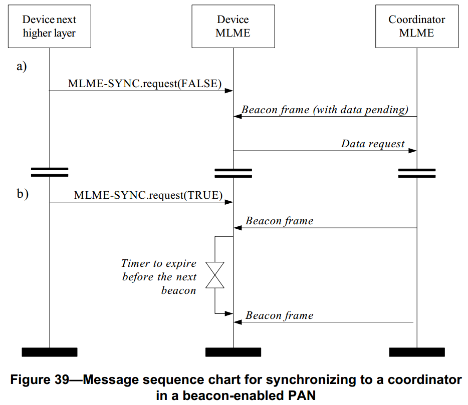

# 7.1.15 与协调器同步原语
>在G3标准中该部分进行了修改
<br>这部分是用来告知上层的PAN ID冲突或PAN调整.

　　MAC层管理实体服务接入点同步原语定义了如何与一个协调器取得同步，以及如何将同步失去信息通告给它的上层。

　　所有的设备都为指示原语提供接口，请求原语是可选的。

## 7.1.15.1 MLME-SYNC.request原语
>在G3标准中该部分不相关，也就是未使用

　　MLME-SYNC.request原语用来请求通过获取、跟踪信标来达到与协调器同步。

### 7.1.15.1.1 服务原语的语义
>在G3标准中该部分不相关，也就是未使用

　　MLME-SYNC.request原语的语义如下：
```
MLME-SYNC.request(
                  LogicalChannel,
                  ChannelPage,
                  TrackBeacon
                  )
```
　　表74描述了MLME-SYNC.request原语的参数。
表74 MLME-SYNC.request原语的参数

名称|类型|有效范围|功能描述
----|----|----|----
LogicalChannel|整型|从物理层支持的可用的逻辑信道中选择|与协调器同步所用的逻辑信道。
ChannelPage|整型|从物理层支持的可用的逻辑信道中选择（见6.1.2节）|与协调器同步所用的信道页。
TrackBeacon|布尔型|TRUE或FALSE|如果MLME与下一个信标帧同步并跟踪所有后面的信标帧，则为TRUE。如果MLME仅与下一个信标帧同步，则为FALSE。

### 7.1.15.1.2 适当的用法
　　在支持信标的PAN中，MLME-SYNC.request原语由设备的上层生成，并发送给它的MAC层管理实体，使它同PAN的协调器同步。

### 7.1.15.1.3 接收效应
　　在支持信标的PAN中，如果MAC层管理实体接收到MLME-SYNC.request原语，首先设置参数phyCurrentPage和phyCurrentChannel分别等于参数ChannelPage和LogicalChannel的值，并通过发送PLME-SET.request原语给物理层来更新两个属性值。如果参数TrackBeacon为TRUE，MAC层管理实体将跟踪信标帧，即仅在每个预期信标帧时间到来前，接收信标，以便能处理信标帧。如果参数TrackBeacon为FALSE，MAC层管理实体将锁定信标帧，但不继续跟踪信标。
　　如果MAC层管理实体正在跟踪当前的信标帧时，接收到此原语，它不会丢弃此原语，而是将它作为一个新的同步请求。
　　如果在最初的搜索或在跟踪时，没有锁定信标，MAC层管理实体将发送状态参数为BEACON_LOST的MLME-SYNC-LOSS.indication原语。

## 7.1.15.2 MLME-SYNC-LOSS.indication原语
>在G3标准中该部分不相关，也就是未使用
<br>PAN ID冲突检测由本文档的条款5.7.2中描述的LoWPAN引导协议执行。

　　MLMESYNCLOSS.indication原语表示同PAN协调器失去同步。

### 7.1.15.2.1 服务原语的语义
　　MLME-SYNC-LOSS.indication原语的语义如下：
```
MLME-SYNC-LOSS.indication(
                          LossReason,
                          PANId,
                          LogicalChannel,
                          ChannelPage,
                          SecurityLevel,
                          KeyIdMode,126
                          KeySource,
                          KeyIndex
                          )
```
　　表75 MLME-SYNC-LOSS.indication原语的参数

名称|类型|有效范围|功能描述
----|----|----|----
LossReason|枚举型|PAN_ID_CONFLICT,<br>REALIGNMENT,<br>BEACON_LOST|失去同步的原因
PANId|整型|0x0000–0xffff|与设备失去同步的PAN标识符或者设备被编入的新的PAN的标识符。
LogicalChannel|整型从物理层支持的可用的逻辑信道中选择（见6.1.2节）|设备失去同步的逻辑信道或者设备被编入的新的逻辑信道。
ChannelPage|整型|从物理层支持的可用的信道页中选择（见6.1.2节）|设备失去同步的信道页或者设备被编入的新的信道页。
SecurityLevel|整型|0x00-0x07|如果该原语是在下面两种情况下生成的，则该参数设置为0x00。<br>1）失去同步之后由设备生成。<br>2）PAN协调器为了检测PAN标识符的冲突而生成。<br>如果该原语是在收到一个协调器重新分配命令或收到一个PANID冲突通告命令后生成的，则该参数设置为：<br>收到的MAC层帧使用的安全等级(见7.6.2.2.1节表95)。
KeyIdMode|整型|0x00–0x03|如果该原语是在下面两种情况下生成的，则忽略此参数。<br>1）失去同步之后由设备生成。<br>2）PAN协调器为了检测PAN标识符的冲突而生成。<br>如果该原语是在收到一个协调器重新分配命令或收到一个PANID冲突通告命令后生成的，则该参数设置为：<br>收到的MAC层帧的发送方使用的密钥模式(见.6.2.2.2节表96)。如果参数SecurityLevel设置为0x00，则此参数无效。
KeySource|0，4，8位字节设置|由KeyIdMode参数指定|如果该原语是在下面两种情况下生成的，则忽略此参数。<br>1）失去同步之后由设备生成。<br>2）PAN协调器为了检测PAN标识符的冲突而生成。<br>如果该原语是在收到一个协调器重新分配命令或收到一个PANID冲突通告命令后生成的，则该参数设置为：<br>收到的MAC层帧的发送方使用的密钥的originator(见7.6.2.4.1节)。如果参数SecurityLevel设置为0x00，则此参数无效。
KeyIndex|整型|0x01–0xff|如果该原语是在下面两种情况下生成的，则忽略此参数。<br>1）失去同步之后由设备生成。<br>2）PAN协调器为了检测PAN标识符的冲突而生成。如果该原语是在收到一个协调器重新分配命令或收到一个PANID冲突通告命令后生成的，则该参数设置为：<br>收到的MAC层帧的发送方使用的密钥索引(见7.6.2.4.2节)。如果参数SecurityLevel设置为0x00，则此参数无效。

### 7.1.15.2.2 生成时间
　　MLME-SYNC-LOSS.indication原语时由设备的MAC层管理实体生成，同协调器失去同步事件产生时，向上层发送该原语。当PAN的标识符发生冲突事件时，也可由PAN协调器的MAC层管理实体生成，并发送给它的上层。

　　如果与PAN协调器相连的设备检测到PAN标识符冲突，并向协调器发送标识符冲突的信息，设备的MAC层管理实体将以参数LossReason为PAN_ID_CONFLICT的MLME-SYNC-LOSS.indication原语向它的上层通报。同样，如果PAN协调器接收到PAN标识符冲突通告命令(见7.3.5节)，MAC层管理实体将向上层发送同样参数设置的此原语

　　如果设备接收到协调器发送的重新分配命令(见7.3.8节)，并且MAC层管理实体不是执行孤点扫描命令，则它发送向上层发送参数LossReason被设置为REALIGNMENT的MLME-SYNC-LOSS.indication原语，并且原语中的参数PANId、LogicalChannel、ChannelPage和安全相关参数都按照7.5.2.3.3节所述设置。

　　在发送MLME-SYNC.request原语后，如果设备连续在aMaxLostBeacons个超帧内没有侦测到或跟踪到信标帧，那么MAC层管理实体将发送参数LossReason设置为BEACON_LOST的MLME-SYNC-LOSS.indication原语，并且原语中的参数PANId、LogicalChannel和ChannelPage参数根据失去同步的协调器设置。参数SecurityLevel设置为0，则参数KeyIdMode、KeySource和KeyIndex将被忽略。如果正在跟踪信标帧，MAC层管理实体将不再试图跟踪信标帧。

### 7.1.15.2.3 适当的用法
　　当MAC层管理实体的上层接收到MLME-SYNC-LOSS.indication原语时，就得知与协调器失去同步的信息。

## 7.1.15.3 协调器同步的消息序列表
>在G3标准中该部分不相关，也就是未使用
<br>在G3中不使用与信标的同步。

　　图39为设备与协调器同步所必需的消息序列。在a）中，发送一个同步请求后，MAC层管理实体开始搜索信标帧，若搜索到，将判断在PAN协调器中是否有此设备的未处理数据，如果有，按照7.5.6.3所述发送请求数据。在b）中，MAC层管理实体发送跟踪同步请求后，搜寻信标帧，若搜索到，将试图使用一个定时器为预期下个信标帧到来的时间。

　　在a）和b）中都有，接收的信标帧不包含有效载荷，并且macAutoRequest设置为TRUE。当接收到一个信标帧时，MAC层管理实体也将检查协调器是否有设备的未处理的数据。

<center><center>
<center>图 39. 在一个信标使能的PAN协调器同步序列 <center>
