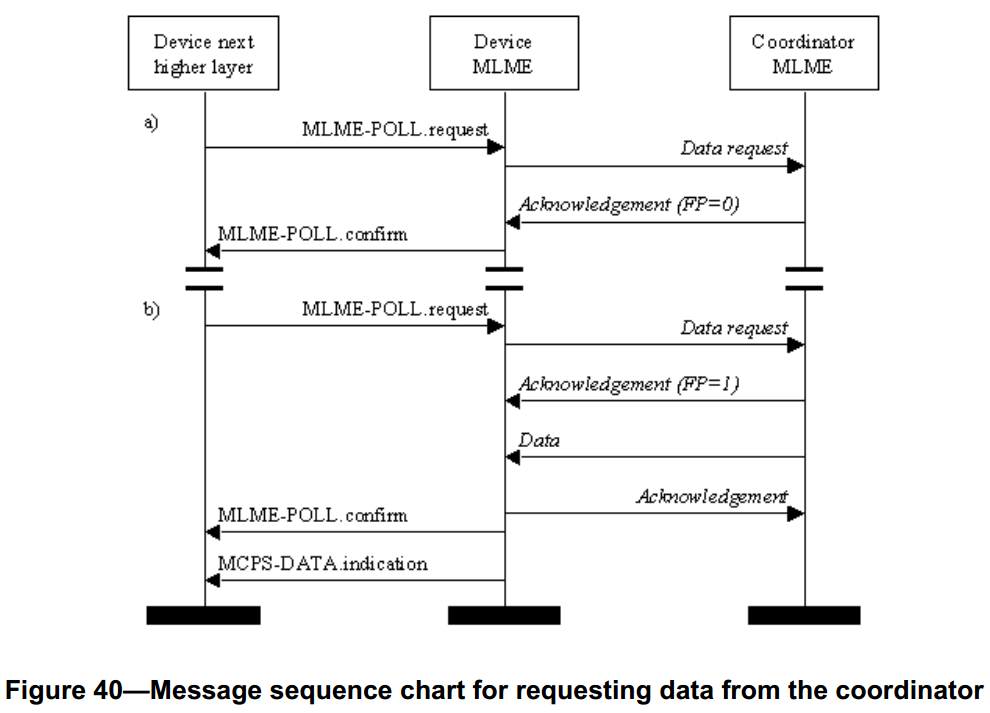

# 7.1.16 从协调器请求数据原语
>在G3标准中该部分不相关，也就是未使用
<br>G3不支持间接传输和事务

　　MAC层管理实体服务接入点轮询原语定义了如何向协调器请求数据。

　　所有的设备都为这些轮询原语提供接口。

## 7.1.16.1MLME-POLL.request
　　MLME-POLL.request原语用来由设备向协调器请求数据。

### 7.1.16.1.1服务原语的语义
　　MLME-POLL.request原语的语义如下：
```
MLME-POLL.request(
                  CoordAddrMode,
                  CoordPANId,
                  CoordAddress,
                  SecurityLevel,
                  KeyIdMode,
                  KeySource,
                  KeyIndex
                  )
```
　　表76描述了MLME-POLL.request原语的参数。
<center>表76 MLME-POLL.request原语的参数<center>

名称|类型|有效范围|功能描述
----|----|----|----
CoordAddrMode|整型|0x02–0x03|请求轮询的协调器的地址模式。此参数取以下值：<br>2=16位短地址<br>3=64位扩展地址。
CoordPANId|整型|0x0000–0xfffe|请求轮询的协调器PAN标识符。
CoordAddress|设备地址|由参数CoordAddrMode指定|请求轮询的协调器的地址
SecurityLevel|整型|0x00–0x07|使用的安全等级(见7.6.2.2.1节表95)。
KeyIdMode|整型|0x00–0x03|使用的密钥模式(见7.6.2.2.2节表96)。如果SecurityLevel参数被设置为0x00,此参数被忽略。
KeySource|0，4或8字节|与KeyIdMode参数的描述相对应|使用的密钥的originator。(见7.6.2.4.2节)若KeyIdMode参数被忽略或被设置为0x00,此参数被忽略。
KeyIndex|整型|0x01–0xff|使用的密钥的索引。(见7.6.2.4.2节)若KeyIdMode参数被忽略或被设置为0x00,此参数被忽略。

### 7.1.16.1.2 适当的用法
　　MLME-POLL.request原语由MAC层管理实体的上层生成，并向协调器请求数据时，发送给MAC层管理实体。

### 7.1.16.1.3 接收效应
　　当MAC层管理实体接收到MLME-POLL.request原语时，就生成并发送数据请求命令(见7.3.4节)。如果轮询直接指向PAN协调器，那么生成的数据请求命令将没有任何目的地址信息。否则，生成的数据请求命令将有目的地址信息，即参数CoordPANId和参数CoordAddress。

　　如果SecurityLevel参数被设置为除0x00之外的一个有效值,表明该帧需要安全机制,MAC层将把帧控制领字段的安全性子字段设置为1。MAC层将会基于参数CoordAddress、SecurityLevel、KeyIdMode、KeySource和KeyIndex执行输出处理过程，此过程将7.5.8.2.1节介绍。在输出帧处理过程中发生任何错误，MAC层管理实体都将丢弃该帧并返回一个带有输出帧处理过程返回的错误状态的MLME-POLL.confirm原语。

　　如果由于CSMA-CA算法失败导致不能传送数据请求命令，则MAC层管理实体将发送状态为CHANNEL_ACCESS_FAILURE的MLME-POLL.confirm原语。

　　如果MAC层管理实体成功地发送了一个数据请求命令，那么将期望收到一个返回的确认帧。如果没有收到确认帧，那么将发送状态为NO_ACK的MLME-POLL.confirm原语(见7.5.6.4节)。

　　如果MAC层管理实体成功接收到确认帧，并且确认帧的FramePendingsubfield的值为1时，则MAC层管理实体请求物理层启动接收机。如果确认帧的FramePendingsubfield的值为0时，则MAC层管理实体将发送状态为NO_DATA的MLME-POLL.confirm原语。

　　如果从协调器接收到的帧的载荷长度为0或此帧为MAC命令帧，MAC层管理实体将发送状态为NO_DATA的MLME-POLL.confirm原语。如果接收到的帧的载荷长度非零，则，MAC层管理实体将发送状态为SUCCESS的MLME-POLL.confirm原语。在这种情况下，实际的数据将通过
MCPS-DATA.indication原语发送给它的上层(见7.1.1.3节)。在下面两种情况下将发送状态为NO_DATA的MLME-POLL.confirm原语。（1）在支持信标的PAN中，竞争接入期内经过macMaxFrameTotalWaitTime个符号仍没有接收到帧信息。（2）在不支持信标的PAN中，尽管数据请求命令的确认帧的FramePendingsubfield值为1，但在macMaxFrameTotalWaitTime个符号期内没有接收到帧信息。

　　如果在MLME-POLL.request原语中有不符合语义的参数或者参数值超出范围，MAC层管理实体将发送状态为INVALID_PARAMETER的MLME-POLL.confirm原语。

## 7.1.16.2 MLME-POLL.confirm原语
　　MLME-POLL.confirm原语用来向上层通报向协调器轮询数据请求的结果。

### 7.1.16.2.1服务原语的语义
　　MLME-POLL.confirm原语的语义如下：
```
MLME-POLL.confirm(
                  status
                  )
```
　　表77描述了MLME-POLL.confirm原语的参数。
<center>表77 MLME-POLL.confirm原语的参数<center>

名称|类型|有效范围|功能描述
----|----|----|----
status|整型|SUCCESS,<br>CHANNEL_ACCESS_FAILURE,<br>NO_ACK,NO_DATA,<br>COUNTER_ERROR,<br>FRAME_TOO_LONG,<br>UNAVAILABLE_KEY,<br>UNSUPPORTED_SECURITY,<br>INVALID_PARAMETER|数据请求的状态

### 7.1.16.2.2 生成时间
　　MLME-POLL.confirm原语由MAC层管理实体生成，并作为对MLME-POLL.request原语的响应发送给它的上层。如果请求成功，状态参数为SUCCESS，表示成功地对数据进行了轮询。否则，返回代表产生错误的状态。这些状态值都在7.1.16.1.3节及其相关章节进行了详细介绍。

### 7.1.16.2.3适当的用法
　　当MAC层管理实体的上层收到MLME-POLL.confirm原语时，就得知向协调器请求数据轮询的结果。

##7.1.16.3请求协调器数据的消息序列表
　　图40描述了设备请求协调器数据所必需的消息序列表，包括设备的各层和空中接口的行为。
　　在如下两种情况，轮询请求发送给MAC层管理实体，然后MAC层管理实体向协调器发数据请求命令。在图40a中，对应的确认的FramePending(FP)子字段值为0时，MAC层管理实体将立即发送MLME-POLL.confirm原语。在图40b中，对应的确认帧的FramePendingsubfield值为1时，MAC层管理实体将启动接收机，以期望接收来自协调器的数据帧。当接收到数据帧时，MAC层管理实体首先发送MLME-POLL.confirm原语，然后发送包含接收到的帧中数据的数据
确认原语。

<center><center>
<center>图 40. 从协调器请求数据的消息序列图 <center>
