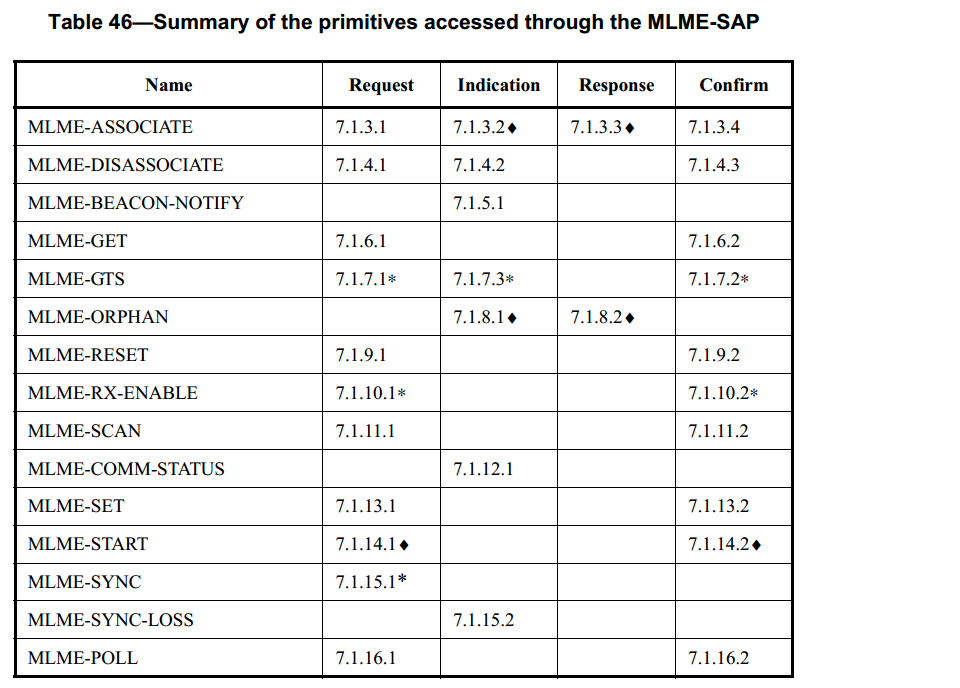

# 7.1.2 MAC 管理服务
>在G3标准中该部分作为规范

　　MAC 层管理实体的服务接入点（ MLME-SAP）允许在上层和 MAC 层管理实体（ MLME）
之间传输管理命令。表 46 列出了 MLME 通过 MLME-SAP 所支持的原语。 标有符号(♦)的原语对简化功能设备来说是可选的。 标有星号 (\*) 的原语对两种设备类型（ RFD 和 FFD)均是可选的。 这些原语在表中提及的章节进行详细描述。

表46. 通过MLME-SAP访问的原语的摘要

Name|Request|Indication|Response|Confirm
----|----|----|----|----
MLME-ASSOCIATE|7.1.3.1|7.1.3.2♦|7.1.3.3♦|7.1.3.4
MLME-DISASSOCIATE|7.1.4.1|7.1.4.2| |7.1.4.3
MLME-BEACON-NOTIFY| |7.1.5.1| |
MLME-GET|7.1.6.1| | |7.1.6.2
MLME-GTS|7.1.7.1*|7.1.7.3*| |7.1.7.2*
MLME-ORPHAN| |7.1.8.1♦|7.1.8.2♦|
MLME-RESET|7.1.9.1| | |7.1.9.2
MLME-RX-ENABLE| 7.1.10.1*| | |7.1.10.2*
MLME-SCAN|7.1.11.1| | |7.1.11.2
MLME-COMM-STATUS| |7.1.12.1| |
MLME-SET|7.1.13.1| | |7.1.13.2
MLME-START|7.1.14.1♦| | |7.1.14.2♦
MLME-SYNC|7.1.15.1*| | |
MLME-SYNC-LOSS| |7.1.15.2| |
MLME-POLL|7.1.16.1|||7.1.16.2
