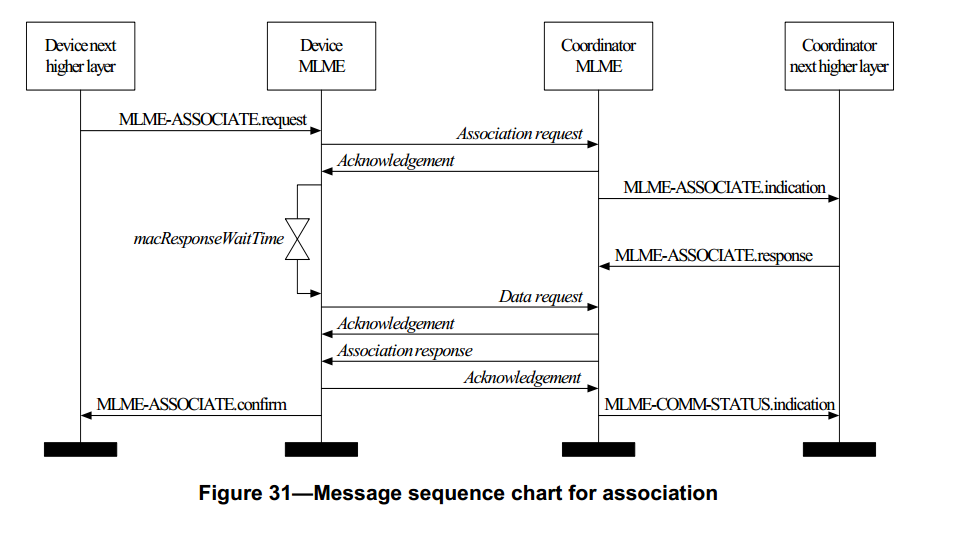

# 7.1.3 关联原语
>在G3标准中该部分不相关，也就是未使用
<br>关联由G3的第5.5节中描述的LoWPAN引导协议执行

　　MLME-SAP 原语用来定义一个设备如何与个域网建立连接，成为网络设备。所有的设备都为请求和确认连接原语提供一个接口。对于简化功能的设备来数，指示（ indication）和响应（ response）连接原语是可选项。

## 7.1.3.1 MLME-ASSOCIATE.request 原语
　　当一个设备请求与协调器建立连接时，就发出一个MLME-ASSOCIATE.request原语。

### 7.1.3.1.1 服务原语的语义
　　MLME-ASSOCIATE.request 原语的语义如下：
```
MLME-ASSOCIATE.request (
                        LogicalChannel,
                        ChannelPage,
                        CoordAddrMode,
                        CoordPANId,
                        CoordAddress,
                        CapabilityInformation,
                        SecurityLevel,
                        KeyIdMode,
                        KeySource,
                        KeyIndex
                        )
```
表47 描述了MLME-ASSOCIATE.request原语中的参数。
<center>表47 MLME-ASSOCIATE.request原语的参数</center>

名称 | 类型 | 变化范围 | 描述
-----|------|------- | ------
LogicalChannel | 整型 | 从物理层所支持的所有可用信道中选择 | 用于连接的物理信道
ChannelPage | 整型 | 从物理层所支持的可用信道页中选择|用于连接的逻辑信道
CoordAddrMode| 整型 | 0x02-0x03 | 被请求连接的协调器地址模式，取值的含义如下：<br>2=16 位短地址<br>3=64 位长地址
CoordPANId | 整型 | 0x0000-0xffff | 被请求连接的PAN标识符
CoordAddress|设备地址|与CoordAddrMode参数描述的相对应|被请求连接的协调器的地址
CapabilityInformation|位|见 7.3.1.2|描述已连接设备的操作性能
SecurityLevel|整型|0x01-0x07|传输使用的安全等级（见 7.6.2.2.1节表 95）
KeyIdMode|整型|0x00—0x03 表明使用的密钥模式（见 7.6.2.2.2节表 96）。如果 SecurityLevel 参数被设置为 0x00,此参数被忽略。
KeySource|4或8字节|与 KeyIdMode 参数的描述相对应|使用的密钥的originator。(见7.6.2.4.2)若 KeyIdMode 参数被忽略或被设置为 0x00,此参数被忽略。
KeyIndex|整型|0x01—0xff|使用的密钥的索引。(见 7.6.2.4.2)若 KeyIdMode 参数被忽略或被设置为 0x00,此参数被忽略。

### 7.1.3.1.2 适当的用法
　　MLME-ASSOCIATE.request 原语由非连接设备的上层生成，并且发送给MAC层管理实体请求与一个协调器建立连接。如果设备要与一个支持信标的PAN 中的协调器建立连接，那么 MAC 层管理实体在发送该原语之前将先跟踪信标。

### 7.1.3.1.3 接收效应
　　未连接的设备MAC层管理实体收到其MAC层的上层发送来的MLME-ASSOCIATE.request 的原语后, 首先更新相应的物理层和 MAC 层 PIB 属性，然后再产生一个连接请求命令(见 7.3.1)，其连接步骤将在 7.5.3.1 中介绍。

　　SecurityLevel 参数指定了连接请求命令使用的安全等级。通常在连接请求命令中不使用安全保护性措施。但是，如果请求连接的设备与协调者共用一个密钥，那么要采用安全性保护措施。

　　如果 SecurityLevel 参数被设置为除 0x00 之外的一个有效值, 表明该帧需要安全机制, MAC 层将把帧控制领字段的安全性子字段设置为 1。 那 MAC 层将会基于 CoordAddress、 SecurityLevel、 KeyIdMode、 KeySource 和 KeyIndex 参数执行输出处理过程，此过程将 7.5.8.2.1 节介绍。 在输出帧处理过程中发生任何错误， MAC 层管理实体都将丢弃该帧并返回一个带有输出帧处理过程返回的错误状态的 MLME-ASSOCIATE.confirm 原语。

　　如果因为 CSMA-CA 算法指出信道忙，而不能向协调器发送该连接请求命令时， MAC 层管理实体将发送一个带有 CHANNEL_ACCESS_FAILURE 状态的MLME-ASSOCIATE.confirm 原语。

　　如果 MAC 层管理实体成功地发送了一个连接请求命令,它将期望收到一个返回的确认原语帧。 如果没有收到确认原语帧， MAC 层管理实体将发送一个带有 NO_ACK 状态的 MLME-SSOCIATE.Confirm 原语。 (见 7.5.6.4)

　　如果未连接设备的 MAC 层管理实体成功地收到连接请求命令的确认原语帧，它将等待接收连接响应(见 7.5.3.1)。如果设备的 MAC 层管理实体没有接收到来自协调器的连接响应命令帧，它将发送一个带有NO_DATA状态的MLME-ASSOCIATE.confirm原语。

　　如果设备的 MAC 层管理实体接收到来自协调器的连接响应命令帧, MAC 层管理实体将发送一个与连接响应命令有相同连接状态的MLME-ASSOCIATE.confirm 原语(见 7.3.2.3)。
协调器的 MAC 层管理实体收到连接请求命令后，它的 MAC 层管理实体就发送一个 MLME-ASSOCIATE.indication 原语， 表明有设备请求连接。

　　如果在 MLME-ASSOCIATE.request 原语中， 有不符合语义的参数或者参数值超出其规定范围，MAC层管理实体就会发送一个带有INVALID_PARAMETER 状态的 MLME-ASSOCIATE.confirm 原语。
## 7.1.3.2 MLME-ASSOCIATE.indication 原语

　　MLME-ASSOCIATE.indication 原语用来指示网络协调器设备已成功地接收到一个来自非连接设备的连接请求命令原语帧。

### 7.1.3.2.1 服务原语的语义
MLME-ASSOCIATE.indication 原语的语义如下：
```
MLME-ASSOCIATE.indication (
                          DeviceAddress,
                          CapabilityInformation,
                          SecurityLevel,
                          KeyIdMode,
                          KeySource,
                          KeyIndex
                          )
```
表48 描述了 MLME-ASSOCIATE. indication 原语中的参数。
<center>表48 MLME-ASSOCIATE.indication原语的参数</center>

名称|类型|有效范围|功能描述
-----|------|------- | ------
DeviceAddress|设备地址|扩展的64位IEEE地址|请求连接的设备地址
CapabilityInformation|位|见7.3.1.2节|设备请求连接的工作性能
SecurityLevel|整型|0x00—0x07|接收的 MAC 层命令帧使用的安全等级（见 7.6.2.2.1 节表 95）
KeyIdMode|整型|0x00—0x03|帧的发送方使用的密钥模式（见7.6.2.2.2 节表 96）。如果SecurityLevel参数被设置为 0x00,此参数被忽略。
KeySource|4或8字节|与KeyIdMode参数的描述相对应|帧的发送方使用的密钥的 originator。(见 7.6.2.4.2)若 KeyIdMode参数被忽略或被设置为 0x00,此参数被忽略。
KeyIndex|整型|0x01—0xff|帧的发送方使用的密钥的索引。 (见7.6.2.4.2)若KeyIdMode 参数被忽略或被设置为 0x00,此参数被忽略。


### 7.1.3.2.2 产生时间
　　MLME-ASSOCIATE.indication 原语由协调器的 MAC 层管理实体生成， 当接收到连接请求命令是， 向其上层发送该原语。 (见 7.3.1 节)

### 7.1.3.2.3 适当的用法
　　当协调器的上层收到 MLME-ASSOCIATE.indication原语时,协调器确定是接受还是拒绝该未连接设备的连接请求，这由它所采用的算法来确定，对于该算法的介绍已超出本标准的讨论范围，在此不做介绍。在做出是接受连接还是拒绝连接后，协调器的 MAC 层的上层发送 MLMEASSOCIATE. response 原语到它的 MAC层管理实体。

　　在 macResponseWaitTime 内，协调器应对 MLME-ASSOCIATE.indication 原语做出连接的结果和连接响应(见 7.5.3.1 节)。在这之后,请求连接的设备将试图通过 7.5.6.3 节介绍的方法尝试提取来自协调器的连接响应命令帧,从而判定连接是否成功。

## 7.1.3.3 MLME-ASSOCIATE.response 原语
　　MLME-ASSOCIATE.response 原语是对 MLME-ASSOCIATE.indication 原语的响应。

### 7.1.3.3.1 服务原语的语义
　　MLME-ASSOCIATE.response 原语的语义如下：
```
MLME-ASSOCIATE.response (
                        DeviceAddress,
                        AssocShortAddress,
                        status,
                        SecurityLevel,
                        KeyIdMode,
                        KeySource,
                        KeyIndex
)
```
表49 描述了 MLME-ASSOCIATE.response原语中的参数。

<center>表49 MLME-ASSOCIATE.response原语的参数<center>

名称|类型|有效范围|功能描述
-----|------|-------|------
DeviceAddress|设备地址|扩展的64位IEEE地址|请求连接的设备地址
AssocShortAddress|整型|0x0000—0xffff|成功连接后协调器分配的短地址码。如果连接失败,此参数设置为0xffff
Status|枚举型|见7.3.2.3节|请求连接的状态
SecurityLevel|整型|0x00—0x07|传输使用的安全等级见 7.6.2.2.1 节表95）
KeyIdMode|整型|0x00—0x03|表明使用的密钥模式（见 7.6.2.2.2 节表 96）。如果 SecurityLevel 参数被设置为 0x00,此参数被忽略。
KeySource|4或8字与|KeyIdMode参数的描述相对应|使用的密钥的originator。 (见 7.6.2.4.2)若 KeyIdMode 参数被忽略或被设置为0x00,此参数被忽略。
KeyIndex|整型|0x01—0xff|使用的密钥的索引。(见 7.6.2.4.2)若KeyIdMode 参数被忽略或被设置为0x00,此参数被忽略。

### 7.1.3.3.2适当的用法
　　MLME-ASSOCIATE.response原语由协调器的上层产生，并发送给它的MAC层管理实体，作为对MLME-ASSOCIATE.indication原语的响应。

### 7.1.3.3.3接收效应
　　当协调器的MAC层管理实体接收到MLME-ASSOCIATE.response原语时,它产生一个连接响应命令(见7.3.2节)。此命令帧以直接传输方式发送给请求连接的设备。也就是说,此命令帧被加到存储在协调器的未决事务处理列表中，根据各从设备的判断，从该列表中取出，并进行相应的处理，相关判断方法将在7.5.6.3小节中介绍。

　　如果SecurityLevel参数被设置为除0x00之外的一个有效值,表明该帧需要安全机,MAC层将把帧控制领字段的安全性子字段设置为1。那MAC层将会基于DeviceAddress、SecurityLevel、KeyIdMode、KeySource和KeyIndex参数执行输出处理过程，此过程将7.5.8.2.1节介绍。在输出帧处理过程中发生任何错误，MAC层管理实体都将丢弃该帧并返回一个带有输出帧处理过程返回的错误状态的MLME-COMM-STATUS.indication原语。协调器的MAC层管理实体一旦收到MLME-ASSOCIATE.response原语，就试图把包含在原语中的信息添加到它的未决事务处理列表中。如果存储事务的容量不够,那么，MAC层将会丢弃该MAC层服务数据单元，并返回一个带TRANSACTION_OVERFLOW状态的MLME-COMM-STATUS.indication原语。

　　如果能够存储该事务，那么，协调者将把事务信息添加到该未决事务列表中。如果在macTransactionPersistenceTime内，没有处理该事务，则将丢弃该事务信息，并且MAC层将返回一个带有TRANSACTION_EXPIRED状态的MLME-COMM-STATUS.indication原语。事务的处理过程将在7.5.5节中介绍。

　　如果MAC层成功地传输了该MAC层协议数据单元，并且接收到应答帧（如果以应答方式传输），那么MAC将向它的上层发送一个带有SUCCESS状态的MLME-COMM-STATUS.indication原语如果在MLME-ASSOCIATE.response原语中，有不符合语义的参数或者参数值超出其规定范围，MAC层就会发送一个带有INVALID_PARAMETER状态的MLME-COMM-STATUS.indication原语，表示响应参数错误。

## 7.1.3.4 MLME-ASSOCIATE.confirm原语
　　MLME-ASSOCIATE.confirm原语是用来把连接成功与否的状态，通报给连接发起设备的上层。

### 7.1.3.4.1服务原语的语义
　　MLME-ASSOCIATE.confirm原语的语义如下：
```
MLME-ASSOCIATE.confirm(
                      AssocShortAddress,
                      status,
                      SecurityLevel,
                      KeyIdMode,
                      KeySource,
                      KeyIndex
)
```
　　表50描述了MLME-ASSOCIATE.confirm原语中的参数。
<center>表50 MLME-ASSOCIATE.confirm原语的参数。<center>

名称类型|有效范围|功能描述
----|-----|-----|-----
AssocShortAddress|整型|0x0000—0xffff|成功连接后协调器所分配的短地址。如果连接失败,此参数置为0xffff
status|枚举型|连接响应命令状态的有效值(见7.3.2.3节)<br>SUCCESS,<br>CHANNEL_ACCESS_FAILURE,<br>NO_ACK,<br>NO_DATA,<br>COUNTER_ERROR,<br>FRAME_TOO_LONG,<br>IMPROPER_SECURITY_LEVEL,<br>SECURITY_ERROR,<br>UNAVAILABLE_KEY,<br>UNSUPPORTED_LEGACY,<br>UNSUPPORTED_SECURITY,<br>INVALID_PARAMETER|连接请求的状态
SecurityLevel|整型|0x00—0x07|如果此原语是在一个输出处理过程失败的连接请求命令之后产生的，此参数表示传输使用的安全等级(见7.6.2.2.1节表95)。如果此原语是在接收到一个连接响应命令之后产生的，其安全等级应该为接收到的帧使用的安全等级(见7.6.2.2.1节表95)
KeyIdMode|整型|0x00—0x03|如果此原语是在一个输出处理过程失败的连接请求命令之后产生的，此参数表示传输使用的密钥模式（见7.6.2.2.2节表96）。如果SecurityLevel参数被设置为0x00,此参数被忽略。如果此原语是在接收到一个连接响应命令之后产生的，其模式为接收到的帧的发送方使用的密钥模式(见7.6.2.2.2节表96)。如果SecurityLevel参数设置为0x00,此参数被忽略.
KeySource|4或8字节|与KeyIdMode参数的描述相对应|如果此原语是在一个输出处理过程失败的连接请求命令之后产生的，此参数表示传输使用的密钥的发送方(见7.6.2.4.1节)。若KeyIdMode参数被忽略或被设置为0x00,此参数被忽略。如果此原语是在接收到一个连接响应命令之后产生的，其密钥发送方为收到的帧使用的密钥发送方(见7.6.2.4.1节)。如果KeyIdMode参数被忽略或设置为0x00,此参数被忽略.
KeyIndex|整型|0x01—0xff|如果此原语是在一个输出处理过程失败的连接请求命令之后产生的，此参数表示传输使用的密钥的索引。(见7.6.2.4.2节)若KeyIdMode参数被忽略或被设置为0x00,此参数被忽略。如果此原语是在接收到一个连接响应命令之后产生的，其索引为收到的帧使用的密钥发送方使用的密钥的索引。(见7.6.2.4.2)若KeyIdMode参数被忽略或被设置为0x00,此参数被忽略。

### 7.1.3.4.2产生时间
　　MLME-ASSOCIATE.confirm原语是由连接发起设备的MAC层管理实体生成，并作为对MLME-ASSOCIATE.request原语的响应。如果连接请求成功，连接响应命令的状态字段将表示连接成功。否则，状态字段将为两种类型的代码，一种是来自接收到的连接响应命令的错误代码，另一种是返回表50中相应的错误代码。这些状态值都已经在7.1.3.1.3节中和与7.1.3.1.3节相关的章节作了介绍。

### 7.1.3.4.3适当的用法
　　当连接发起设备的上层接收到MLME-ASSOCIATE.confirm原语后,即可得知与协调器连接请求的结果。如果连接请求成功，那么其原语中的状态参数就指示为一个成功的连接，此状态参数如包含在连接响应命令的状态字段中。同时，该设备会得到一个短地址码(见7.5.3.1节表87)。如果连接请求失败,短地址码为0xffff，它的状态参数就会指示错误状态。

## 7.1.3.5连接消息序列表
　　图31给出了一个没有追踪协调器的信标帧（见7.5.6.3节）的设备要成功与个域网连接的消息序列表。图80和图81(见7.7)分别为设备向协调器请求连接以及允许连接所必须的信息流程。这些图包括了物理层所采取的措施和步骤。

<center><center>
<center>图 29. 关联的消息序列图 <center>
