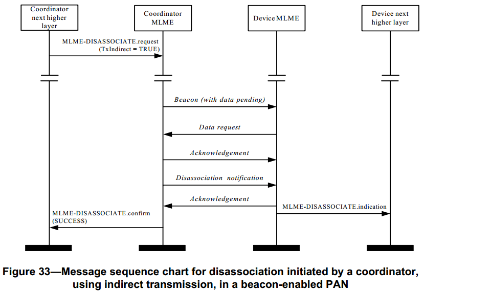

# 7.1.4 解关联原语
>在G3标准中该部分不相关，也就是未使用
<br>关联由G3的第5.5节中描述的LoWPAN引导协议执行

　　MLME-SAP断开连接原语定义了一个设备如何与PAN断开连接。所有的设备均具有断开连接原语的接口。

## 7.1.4.1 MLME-DISASSOCIATE.request原语
　　MLME-DISASSOCIATE.request原语向协调器请求断开网络连接。该原语也可由协调器用来命令一个连接设备与PAN断开连接。

### 7.1.4.1.1 服务原语的语义
　　MLME-DISASSOCIATE.request原语的语义如下:
```
MLME-DISASSOCIATE.request(
DeviceAddrMode,
DevicePANId,
DeviceAddress,
DisassociateReason,
TxIndirect,
SecurityLevel,
KeyIdMode,
KeySource,
KeyIndex
)
```
表51描述了MLME-DISASSOCIATE.request原语中的参数。
<center>表51 MLME-DISASSOCIATE.request原语的参数</center>

名称|类型|有效范围|功能描述
----|----|------|------
DeviceAddrMode|整型|0x02—0x03|接收断开连接命令的设备地址模式
DevicePANId|整型|0x0000—0xffff|接收断开连接命令的PAN标识符
DeviceAddress|设备地址|与DeviceAddrMode参数的描述相对应|命令断开连接的设备地址
DisassociateReason|整型|0x00—0xff|断开连接的原因(见7.3.3.2节)
TxIndirect|布尔|True或False|断开连接命令采用间接传输，则为True
SecurityLevel|整型|0x00—0x07|传输使用的安全等级（见7.6.2.2.1节表95）
KeyIdMode|整型|0x00—0x03|表明使用的密钥模式（见7.6.2.2.2节表96）。如果SecurityLevel参数被设置为0x00,此参数被忽略。
KeySource|4或8字节|与KeyIdMode参数的描述相对应|使用的密钥的originator。(见
7.6.2.4.2)若KeyIdMode参数被忽略或被设置为0x00,此参数被忽略。
KeyIndex|整型|0x01—0xff|使用的密钥的索引。(见7.6.2.4.2)若KeyIdMode参数被忽略或被设置为0x00,此参数被忽略。

### 7.1.4.1.2 适当的用法
　　MLME-DISASSOCIATE.request原语生成有两种情况，一种是由已连接的设备的上层产生，发送给它的MAC层管理实体请求与个域网断开连接。另外一种是由协调器的上层产生，并发送给它的MAC层管理实体命令一个已连接的设备离开该个域网。

### 7.1.4.1.3 接收效应
　　当MAC层管理实体收到MLME-DISASSOCIATE.request原语时,就会把参数DevicePANId与macPANId进行比较。

　　如果参数DevicePANId与macPANId不相等,那么MAC层管理实体就返回一个带INVALID_PARAMETER的状态的MLME-DISASSOCIATE.confirm原语。如果参数DevicePANId和macPANId相等，MAC层管理实体便会对原语的地址字段进行评估。

　　如果参数DeviceAddrMode等于0x02，并且参数DeviceAddress与macCoordShortAddress相等；或者参数DeviceAddrMode等于0x03，并且参数DeviceAddress与macCoordExtendedAddress相等，将忽略参数TxIndirect,MAC层管理实体将采用如下两种方式向协调器发送一个断开连接命令：（1）在信标支持的PAN中的竞争接入期间；（2）在非信标支持的PAN中，立即发送。

　　如果参数DeviceAddrMode等于0x02，并且参数DeviceAddress与macCoordShortAddress不相等，或者参数DeviceAddrMode等于0x03，并且参数DeviceAddress与macCoordExtendedAddress不相等,并且协调器的MAC层管理实体收到的原语的参数TxIndirect为TRUE，该断开连接命令将使用间接传输方式发送，也就是说,此命令帧将被添加到存储在协调器的未决事务列表中，并且将根据设备的判断力，用7.5.6.3节中所介绍的方法提取该命令帧。

　　如果参数DeviceAddrMode等于0x02，并且参数DeviceAddress与macCoordShortAddress不相等或者参数DeviceAddrMode等于0x03，并且参数DeviceAddress与macCoordExtendedAddress不相等，并且协调器的MAC层管理实体收到的原语的参数TxIndirect为FALSE，MAC层管理实体将采用如下两种方式向设备发送一个断开连接命令：（1）在信标支持的PAN中的竞争接入期间；（2）在非信标支持的PAN中，立即发送。

　　另外,MAC层管理实体返回一个带有INVALID_PARAMETER状态的MLME-DISASSOCIATE.confirm原语，不产生断开连接命令。

　　如果协调器以间接传输的方式断开连接命令，则设备地址将添加至信标的地址列表字段，指示存在一个未处理的消息。在这种情况下，协调器试图把原语中所包含的信息添加到它的未决事务处理列表中。如果存储事务的容量不够，MAC层管理实体将丢弃该帧，并发送一个带有TRANSACTION_OVERFLOW状态的MLME-DISASSOCIATE.confirm原语。如果有能够存储事务的容量，则协调器将把该事务信息添加在未决事务处理列表中。如果在macTransactionPersistenceTime内，没有处理该事务,则将丢弃该事务信息，MAC层管理实体将发送一个带有TRANSACTION_EXPIRED状态的MLME-DISASSOCIATE.confirm原语。事务处理的过程和步骤将在7.5.5节中进行描述。

　　如果因为CSMA-CA算法而导致断开连接通告命令传输失败，并且协调器的MAC层管理实体收到的原语的TxIndirect参数设置为FALSE，那么MAC层管理实体将发送一个带有CHANNEL_ACCESS_FAILURE状态的MLME-DISASSOCIATE.confirm原语。

　　如果SecurityLevel参数被设置为除0x00之外的一个有效值,表明该帧需要安全机制,MAC层将把帧控制领字段的安全性子字段设置为1。那MAC层将会基于DeviceAddress、SecurityLevel、KeyIdMode、KeySource和KeyIndex参数执行输出处理过程，此过程将7.5.8.2.1节介绍。在输出帧处理过程中发生任何错误，MAC层管理实体都将丢弃该帧并返回一个带有输出帧处理过程返回的错误状态的MLME-DISASSOCIATE.confirm原语。

　　如果MAC层管理实体成功地发送了一个断开连接请求通告命令，MAC层管理实体将期望接收到一个返回的确认帧。如果没有收到确认帧，并且该原语被TxIndirect参数设置为FALSE的的协调器接收，或者一个设备的MAC层管理实体接收，那么MAC层管理实体将发送一个带有NO_ACK状态的MLME-DISASSOCIATE.confirm原语。(见7.5.6.4)

　　如果MAC层管理实体成功地发送了断开连接通告命令，并收到相应的确认帧，那么MAC层管理实体将发送一个带有SUCCESS状态的MLME-DISASSOCIATE.confirm原语。

　　接收方的MAC层管理实体收到断开连接通告命令后，就会发送MLMEDISASSOCIATE.indication原语。

　　如果在MLME-DISASSOCIATE.request原语中，有不符合语义的参数或者参数值超出其规定范围，MAC层管理实体就会发送一个带有INVALID_PARAMETER状态的MLME-DISASSOCIATE.confirm原语。

## 7.1.4.2 MLME-DISASSOCIATE.indication原语
　　MLME-DISASSOCIATE.indication原语用来指示MAC层管理实体已接收到一个断开连接命令。

### 7.1.4.2.1 服务原语的语义
　　MLME-DISASSOCIATE.indication原语的语义如下：
```
MLME-DISASSOCIATE.indication(
                             DeviceAddress,
                             DisassociateReason,
                             SecurityLevel,
                             KeyIdMode,
                             KeySource,
                             KeyIndex
)
```
　　表52 描述了MLME-DISASSOCIATE.indication原语中的参数。
<center>表52 MLME-DISASSOCIATE.indication原语的参数</center>

名称|类型|有效范围|功能描述
----|----|----|----
DeviceAddress|设备地址|与DeviceAddrMode参数的描述相对应|命令断开连接的设备地址
DisassociateReason|整型|0x00—0xff|断开连接的原因(见7.3.3.2节)
SecurityLevel|整型|0x00—0x07|接收的MAC层命令帧使用的安全等级（见7.6.2.2.1节表95）
KeyIdMode|整型|0x00—0x03|帧的发送方使用的密钥模式（见7.6.2.2.2节表96）。如果SecurityLevel参数被设置为0x00,此参数被忽略。
KeySource|4或8字节|与KeyIdMode参数的描述相对应帧的发送方使用的密钥的originator。(见7.6.2.4.2)若KeyIdMode参数被忽略或被设置为0x00,此参数被忽略。
KeyIndex|整型|0x01—0xff|帧的发送方使用的密钥的索引。(见型7.6.2.4.2)若KeyIdMode参数被忽略或被设置为0x00,此参数被忽略。

### 7.1.4.2.2 产生时间
　　MLME-DISASSOCIATE.indication原语由MAC层管理实体产生，并在收到断开连接通告命令后发送到它的上层。
### 7.1.4.2.3 适当的用法
　　MAC层用此原语向上层通告断开连接的原因。

## 7.1.4.3 MLME-DISASSOCIATE.confirm原语
　　MLME-DISASSOCIATE.confirm原语用来报告MLME-DISASSOCIATE.request原语的执行结果。

### 7.1.4.3.1 服务原语的语义
　　MLME-DISASSOCIATE.confirm原语的语义如下：
```
MLME-DISASSOCIATE.confirm(
status,
DeviceAddrMode,
DevicePANId,
DeviceAddress
)
```
　　表53描述了MLME-DISASSOCIATE.confirm原语中的参数。
<center>表53 MLME-DISASSOCIATE.confirm原语的参数</center>

名称|类型|有效范围|功能描述
----|----|----|----
Status|枚举型|SUCCESS,<br>TRANSACTION_OVERFLOW,<br>TRANSACTION_EXPIRED,<br>NO_ACK,<br>CHANNEL_ACCESS_FAILURE,<br>COUNTER_ERROR,<br>FRAME_TOO_LONG,<br>UNAVAILABLE_KEY,<br>UNSUPPORTED_SECURITY<br>INVALID_PARAMETER|断开连接的状态或结果
DeviceAddrMode|整型|0x02—0x03|请求或者被命令断开连接的设备地址模式
DevicePANId|整型|0x0000—0xffff|请求或者被命令断开连接的设备PAN标识符
DeviceAddress|设备地址|与DeviceAddrMode参数的描述相对应|请求或者被命令断开
连接的设备地址

### 7.1.4.3.2 产生时间
　　MLME-DISASSOCIATE.confirm原语由断开连接发起设备方的MAC层管理实体产生，并作为对MLME-DISASSOCIATE.request原语的响应发送到上层。该原语将返回一个代表请求发送成功的状态SUCCESS，或者返回一个代表出错的代码。这些状态值在7.1.4.1.3节和在7.1.4.1.3节中提及的相关章节中进行了描述。

### 7.1.4.3.3 适当的用法
　　发起设备的上层收到MLME-DISASSOCIATE.confirm原语后，即可得知断开连接请求响应结果。如果此断开连接尝试成功,则原语的状态参数置为SUCCESS；否则，其状态参数为错误状态。

### 7.1.4.4 断开连接消息顺序表
　　断开连接的请求可能由一个设备发起，也可由一个已连接设备的协调器发起。图32描述了一个设备成功地与个域网断开连接的消息序列。

<center></center>
<center>图 32. 由设备启动的解离的消息序列图 </center>

　　图33 描述了一个信标帧使能个域网的协调器成功地使用间接传输方式将一个设备与它断开连接的消息序列。

<center></center>
<center>图 32. 在启用信标的PAN中，由协调器使用间接传输发起的解离的消息序列图 </center>
