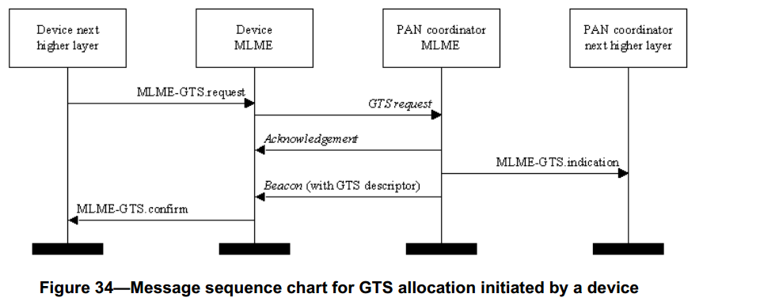
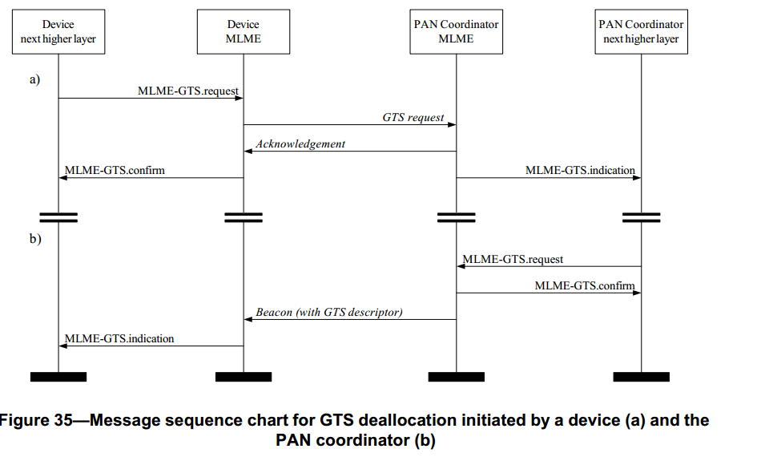

# 7.1.7 GTS 管理原语
>在G3标准中该部分不相关，也就是未使用

　　MAC层管理实体服务接入点的保护时隙（GTS）管理原语定义了如何请求和维护保护时隙。通常，使用这些原语和保护时隙的设备总是跟踪个域网的协调器信标。

　　这些保护时隙管理原语是可选的。

## 7.1.7.1 MLME-GTS.request原语
　　MLME-GTS.request原语允许一个设备向PAN协调器发送一个请求，用于申请分配新的保护时隙或取消一个已经存在的保护时隙。PAN协调器也使用该原语请求取消保护时隙。

### 7.1.7.1.1 服务原语的语义
　　MLME-GTS.request原语的语义如下：
```
MLME-GTS.request(
                GTSCharacteristics,
                SecurityLevel,
                KeyIdMode,
                KeySource,
                KeyIndex
)
```
　　表58描述了MLME-GTS.request原语中的参数。
<center>表58 MLME-GTS.request原语的参数<center>

名称|类型|有效范围|功能描述
----|----|----|----
GTSCharacteristics|GTS特性|见7.3.9.2节|GTS请求特性，包括该请求是为分配一个新的保护时隙还是取消一个已经存在的保护时隙
SecurityLevel|整型|0x00—0x07|传输使用的安全等级（见7.6.2.2.1节表95）
KeyIdMode|整型|0x00—0x03|表明使用的密钥模式（见7.6.2.2.2节表96）。如果SecurityLevel参数被设置为0x00,此参数被忽略。
KeySource|4或8字节|与KeyIdMode参数的描述相对应|使用的密钥的originator。(见7.6.2.4.2)若KeyIdMode参数被忽略或被设置为0x00,此参数被忽略。
KeyIndex|整型|0x01—0xff|使用的密钥的索引。(见7.6.2.4.2)若KeyIdMode参数被忽略或被设置为0x00,此参数被忽略。

### 7.1.7.1.2 适当的用法
　　MLME-GTS.request原语由MAC层的上层生成，发送MAC层管理实体以请求分配一个新的保护时隙或取消一个已经存在的保护时隙。它也可由PAN协调器的上层生成，发送到它的MAC层管理实体取消一个已经存在的保护时隙。

### 7.1.7.1.3 接收效应
　　当设备的MAC层管理实体收到MLME-GTS.request原语时，试图生成一个保护时隙请求命令帧(见7.3.9节)，此命令帧包含该原语的信息，如果成功地生产该命令帧，则将该命令帧发送给PAN协调器。

　　如果设备的macShortAddress等于0xfffe或0xffff，这是设备与PAN之间只能采用扩展的64位设备地址码同PAN的协调器进行通信连接，因此，将禁止设备请求一个保护时隙。在这种情况下，MAC层管理实体将返回一个状态为NO_SHORT_ADDRESS的MLME-GTS.confirm原语。
如果SecurityLevel参数被设置为除0x00之外的一个有效值,表明该帧需要安全机制,MAC层将把帧控制领字段的安全性子字段设置为1。那MAC层将会基于macCoordExtendedAddress、SecurityLevel、KeyIdMode、KeySource和KeyIndex参数执行输出处理过程，此过程将7.5.8.2.1节介绍。在输出帧处理过程中发生任何错误，MAC层管理实体都将丢弃该帧并返回一个带有输出帧处理过程返回的错误状态的MLME-GTS.confirm原语。

　　如果由于CSMA-CA算法失败不能传送GTS请求命令，MAC层管理实体将返回一个带有CHANNEL_ACCESS_FAILURE状态的MLME-GTS.confirm原语。

　　如果MAC层管理实体成功地传送GTS请求命令，它将等待一个返回的确认帧。如果没有确认帧，MAC层管理实体将返回一个带有NO_ACK状态的MLME-GTS.confirm原语(见7.5.6.4节)。
如果保护时隙正在分配(见7.5.7.2节)，并且该请求命令帧已经得到确认帧，MAC层管理实体将通过来自PAN协调器的信标帧中所指定的一个保护时隙描述符来得到进一步证实。如果PAN协调器能够分配所请求的保护时隙，它将向其上层发送带有已分配GTSCharacteristics参数的MLME-GTS.indication原语，该描述符具有已分配的保护时隙特性和请求设备的短地址。如果PAN协调器的MAC层管理实体不能分配所请求的保护时隙，它将生成一个包含零起始时隙和请求设备短地址的保护时隙描述符。

　　如果设备从PAN协调器接收到一个信标帧，该信标帧的描述符包含与macShortAddress相匹配的短地址码，则设备将对该描述符进行处理。如果设备没有收到上述的描述符，MAC层管理实体将发送一个带有NO_DATA状态的MLME-GTS.confirm原语。

　　如果描述符与请求命令帧的参数相匹配(表明PAN协调器批准了GTS分配请求)，MAC层管理实体将发送状态为SUCCESS和GTSCharacteristics参数为1的MLME-GTS.confirm原语，来表明成功分配了一个保护时隙。

　　如果描述符为零起始时隙(表明PAN协调器否认了GTS分配请求)，请求保护时隙的设备将发送状态为DENIED的MLME-GTS.confirm原语，忽略保护时隙参数。

　　如果保护时隙正在取消(见7.5.7.4节)，并且该请求命令已经得到PAN协调器的确认，设备发送状态为SUCCESS和GTSCharacteristics参数为1的MLME-GTS.confirm原语，表明取消一个保护时隙。收取消保护时隙的请求命令后，PAN协调器将返回一个确认帧并且取消该保护时隙。之后，PAN协调器的MAC层管理实体将发送具有适当的GTS特性的MLME-GTS.indication原语。如果PAN协调器没有收到取消保护时隙请求，PAN协调器将采用相应的措施确保连接(见7.5.7.6节)。

　　如果PAN协调器的MAC层管理实体接收到一个取消保护时隙的MLME-GTS.request原语，PAN协调器将取消该保护时隙并且发送一个状态为SUCCESS和GTSCharacteristics参数为0的MLME-GTS.confirm原语。

　　如果设备收到一个来自PAN协调器的信标帧，该信标帧包含一个与macShortAddress相匹配的短地址码和零起始时隙的描述符，立刻停止使用保护时隙。

　　设备的MAC层管理实体发送MLMEGTS.indication原语通知上层取消保护时隙，该原语的GTSCharacteristics参数包含被取消的保护时隙的特性。

　　如果MLME-GTS.request原语中有不符合寓意的参数或者参数值超出范围，MAC层管理实体就会发送一个带有INVALID_PARAMETER状态的MLME-GTS.confirm原语。

## 7.1.7.2 MLME-GTS.confirm原语
　　MLME-GTS.confirm原语用来通报设备执行请求保护时隙原语的结果，包括请求一个新的保护时隙或是取消一个已存在的保护时隙。

### 7.1.7.2.1 服务原语的语义
　　MLME-GTS.confirm原语的语义如下：
```
MLME-GTS.confirm(
                GTSCharacteristics,
                status
)
```
　　表59描述了MLME-GTS.confirm原语中的参数。
表59MLME-GTS.confirm原语的参数

名称|类型|有效范围|功能描述
----|----|----|----
GTSCharacteristics|GTS特性|见7.3.9.2节GTS的特性
status|枚举型|SUCCESS,<br>DENIED,<br>NO_SHORT_ADDRESS,<br>CHANNEL_ACCESS_FAILURE,<br>NO_ACK,<br>NO_DATA,<br>COUNTER_ERROR,<br>FRAME_TOO_LONG,<br>UNAVAILABLE_KEY,<br>UNSUPPORTED_SECURITY,<br>INVALID-PARAMETER|
GTS请求的状态

### 7.1.7.2.2 产生时间
　　MLME-GTS.confirm原语由MAC层管理实体产生，并作为对被MLME-GTS.request原语的响应发送给它的上层。

　　如果分配或取消一个GTS的请求成功，则该原语返回状态为SUCESS，并且GTSCharacteristics参数的特征类型字段值分别为1或0。否则，将返回状态表明相应的错误代码。产生这些状态值的原因在7.1.7.1.3节和7.1.7.1.3提及的章节进行描述。

### 7.1.7.2.3 适当的用法
　　当MAC层的上层接收到MLME-GTS.confirm原语时，可得到请求分配保护时隙或取消保护时隙请求命令的结果。如果请求命令是成功的，其状态参数指示成功的GTS操作。否则，状态参数将表明错误。

## 7.1.7.3 MLME-GTS.indication原语
　　MLME-GTS.indication原语表明已分配一个保护时隙或已取消以前所分配的保护时隙。

### 7.1.7.3.1 服务原语的语义
　　MLME-GTS.indication原语的语义如下：
```
MLME-GTS.indication(
                    DeviceAddress,
                    GTSCharacteristics,
                    SecurityLevel,
                    KeyIdMode,
                    KeySource,
                    KeyIndex
)
```
　　表60 描述了MLME-GTS.indication原语中的参数。
<center>表60 MLME-GTS.indication原语的参数<center>

名称|类型|有效范围|功能描述
----|----|----|----
DeviceAddress|设备地址|0x0000—0xfffd|已分配或取消GTS的设备短地址
GTSCharacteristics|GTS特性|见7.3.9.2节|GTS特性
SecurityLevel|整型|0x00—0x07|如果该原语是在PAN协调器自身取消一个保护时隙时产生的,安全等级将设置为0x00.<br>如果该原语是在接收到GTS请求命令之后产生的，则使用收到的MAC层命令帧的安全等级(见7.6.2.2.1节表95)
KeyIdMode|整型|0x00—0x03|如果该原语是在PAN协调器自身取消一个保护时隙时产生的，忽略该参数。<br>如果该原语是在接收到GTS请求命令之后产生的，则使用发送该MAC层命令帧的设备使用的密钥模式(见7.6.2.2.2节表96)。如果SecurityLevel参数被设置为0x00，忽略该参数。
KeySource|0，4或8字节|与KeyIdMode参数的描述相对应|如果该原语是在PAN协调器自身取消一个保护时隙时产生的，忽略该参数。如果该原语是在接收到GTS请求命令之后产生的，则使用发送该MAC层命令帧的设备使用的密钥的originator(见7.6.2.4.1节)。如果KeyIdMode参数被设置为0x00，忽略该参数。
KeyIndex|整型|0x01—0xff|如果该原语是在PAN协调器自身取消一个保护时隙时产生的，忽略该参数。如果该原语是在接收到GTS请求命令之后产生的，则使用发送该MAC层命令帧的设备使用的密钥索引(见7.6.2.4.2节)。如果KeyIdMode参数被设置为0x00，忽略该参数。

### 7.1.7.3.2 产生时间
　　当PAN协调器的MAC层管理实体接收到一个保护时隙请求命令后，一旦分配或取消一个保护时隙(见7.3.9节)，就生成MLME-GTS.indication原语，并发送给它的上层。当取消一个保护时隙是PAN协调器自身发起时，协调器的MAC层管理实体也生成该原语。分配一个保护时隙时，GTSCharacteristics参数的特性类型子字段置1，如果取消一个已分配的保护时隙时,则该字段置0。

　　当PAN协调器取消一个GTS时，设备的MAC层管理实体MLME也生成此原语，并发送给设备的MAC层的上层。此时，GTSCharacteristics参数的特性类型子字段为0。

### 7.1.7.3.3 适当的用法
　　当设备的MAC层的上层收到MLME-GTS.indication原语后,就得知已分配或取消一个保护时隙

## 7.1.7.4 保护时隙（GTS）管理消息序列表
　　图34和图35为成功地保护时隙管理的消息序列表。图34为设备发起分配保护时隙的消息序列表。图35为保护时隙的两种情况，一种是设备发起的(a)，另一种是PAN协调器发起的(b)。

<center><center>
<center>图 34. 设备发起分配保护时隙的消息序列表 <center>

<center><center>
<center>图 35. 保护时隙的两种情况 <center>
