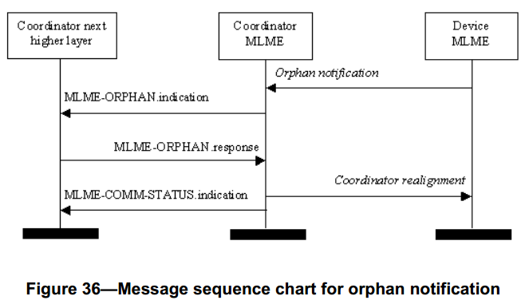

# 7.1.8 孤立通知原语
>在G3标准中该部分不相关，也就是未使用

　　MAC层管理实体服务接入点的孤点通告原语定义了一个协调器如何发送一个孤点设备通告。

　　对于简化功能设备来说，孤点通告原语是可选的。
## 7.1.8.1 MLME-ORPHAN.indication原语
　　MLME-ORPHAN.indication原语允许协调器的MAC层管理实体通知上层存在一个孤点设备。

### 7.1.8.1.1 服务原语的语义
　　MLME-ORPHAN.indication原语的语义如下：
```
MLME-ORPHAN.indication(
                      OrphanAddress,
                      SecurityLevel,
                      KeyIdMode,
                      KeySource,
                      KeyIndex
)
```
　　表61描述了MLME-ORPHAN.indication原语的参数
<center>表61 PLME-SET-TRX-STATE.request原语的参数<center>

名字|类型|有效范围|功能描述
----|----|----|----
OrphanAddress|设备地址|64位IEEE地址孤点设备地址
SecurityLevel|整型|0x00–0x07|接收的MAC命令帧使用的安全等级(见7.6.2.2.1节表95)。
KeyIdMode|整型|0x00–0x03|帧的发送方使用的密钥模式(见7.6.2.2.2节表96)。如果SecurityLevel参数被设置为0x00,此参数被忽略。
KeySource|0，4或8字节|与KeyIdMode参数的描述相对应|帧的发送方使用的密钥的originator。(见7.6.2.4.2节)若KeyIdMode参数被忽略或被设置为0x00,此参数被忽略。
KeyIndex|整型|0x01–0xff|帧的发送方使用的密钥的索引。(见7.6.2.4.2)若KeyIdMode参数被忽略或被设置为0x00,此参数被忽略。

### 7.1.8.1.2 生成时间
　　当协调器的MAC层管理实体接收到孤点通告命令时，就生成MLME-ORPHAN.indication原语，并将其发送给它的上层。（见7.3.6节）

### 7.1.8.1.3合适的用法
　　当MAC层上层接收到MLME-ORPHAN.indication原语时，就可得知存在一个孤点设备。其上层将判断该设备是否是已经连接的设备，此判断结果随MLME-ORPHAN.response原语发送给MAC层管理实体。

　　如果设备为已经连接的设备，则MAC层管理实体将响应原语MLME-ORPHAN.response发送给孤点设备，其AssociatedMember参数值为TRUE，ShortAddress参数值为孤点设备已分配的短地址码。如果设备没有与该协调器相连接，将发送AssociatedMember参数值为FALSE的MLME-ORPHAN.response原语。

## 7.1.8.2 MLME-ORPHAN.response原语
　　协调器的MAC层管理实体上层使用MLME-ORPHAN.response原语做出对MLME-ORPHAN.indication原语的响应。

### 7.1.8.2.1 服务原语的语义
　　MLME-ORPHAN.response原语的语义如下：
```
MLME-ORPHAN.response(
                    OrphanAddress,
                    ShortAddress,
                    AssociatedMember,
                    SecurityLevel,
                    KeyIdMode,
                    KeySource,
                    KeyIndex
                    )
```
　　表62描述了MLME-ORPHAN.response原语的参数。
<center>表62 MLME-ORPHAN.response原语的参数<center>

名字|类型|有效范围|功能描述
----|----|----|----
OrphanAddress|设备地址|64位IEEE地址|孤点设备地址
ShortAddress|整型|0x0000–0xffff|如果设备与协调器已连接，此值为其分配的短地址码。短地址码0xfffe表示设备没有分配到短地址码；设备将使用64位长地址进行
其所有的通信。如果设备没有与协调器连接，则此与值为0xffff，并在接收时忽略。
AssociatedMember|布尔型|TRUE或FALSE|如果孤点设备与协调器已连接，则为TRUE，否则为FALSE。
SecurityLevel|整型|0x00–0x07|使用的安全等级(见7.6.2.2.1节表95)。
KeyIdMode|整型|0x00–0x03|使用的密钥模式(见7.6.2.2.2节表96)。如果SecurityLevel参数被设置为0x00,此参数被忽略。
KeySource|0，4或8字节|与KeyIdMode参数的描述相对应使用的密钥的originator。(见7.6.2.4.2节)若KeyIdMode参数被忽略或被设置为0x00,此参数被忽略。
KeyIndex|整型|0x01–0xff|使用的密钥的索引。(见7.6.2.4.2)若KeyIdMode参数被忽略或被设置为0x00,此参数被忽略。

### 7.1.8.2.2 适当的用法。
　　当MAC层管理实体的上层根据MLME-ORPHAN.indication原语参数做出孤点设备是否与协调器连接的判断后，生成MLME-ORPHAN.response原语，发送给它的MAC层管理实体，作为对MLME-ORPHAN.indication原语的响应。

### 7.1.8.2.3 接收效应
　　如果AssociatedMember参数为TRUE，表明孤点设备已经同协调器连接。这种情况下，MAC层管理实体将生成协调器重新分配命令，并发送给孤点设备(见7.3.8节)，其中包含短地址码。如果在支持信标的PAN中，此命令将在竞争接入期中传送，在非信标PAN中将立即传送该命令。如果AssociatedMember参数值为FALSE，则孤点设备没有与协调器建立连接，将忽略此原语。在孤点通告后macResponseWaitTime个符号周期内，如没有收到协调器重新分配命令，设备将认为在它的有效范围内没有与任何协调器建立连接。

　　如果SecurityLevel参数被设置为除0x00之外的一个有效值,表明该帧需要安全机制,MAC层将把帧控制领字段的安全性子字段设置为1。那MAC层将会基于OrphanAddress、SecurityLevel、KeyIdMode、KeySource和KeyIndex参数执行输出处理过程，此过程将7.5.8.2.1节介绍。在输出帧处理过程中发生任何错误，MAC层管理实体都将丢弃该帧并返回一个带有输出帧处理过程返回的错误状态的MLME-COMM-TATUS.indication原语。

　　如果因为CSMA-CA算法指出信道忙，MAC层管理实体将丢弃该帧，并且发送一个带有CHANNEL_ACCESS_FAILURE状态的MLME-COMM-TATUS.indication原语。

　　MAC层在传输帧后，将立刻激活接收机，并且等待接收来自接收设备的确认帧。如果没有收到来自接收设备的确认帧，MAC层管理实体将丢弃该帧并发送一个带有NO_ACK状态的MLME-COMM-STATUS.indication原语。(见7.5.6.4)

　　如果成功地传送了该帧，并且接收到确认帧（如果以应答方式传输），那么MAC层将发送一个带有SUCCESS状态的MLME-COMM-STATUS.indication原语。

　　如果在MLME-ORPHAN.response原语中，有不符合语义的参数或者参数值超出其规定范围，MAC层就会发送一个带有INVALID_PARAMETER状态的MLME-COMM-STATUS.indication原语

## 7.1.8.3孤点通告消息序列表
　　图36为协调器给一个设备发送孤点通告的消息序列表
<center><center>
<center>图 36. 孤立通知的消息序列图 <center>
