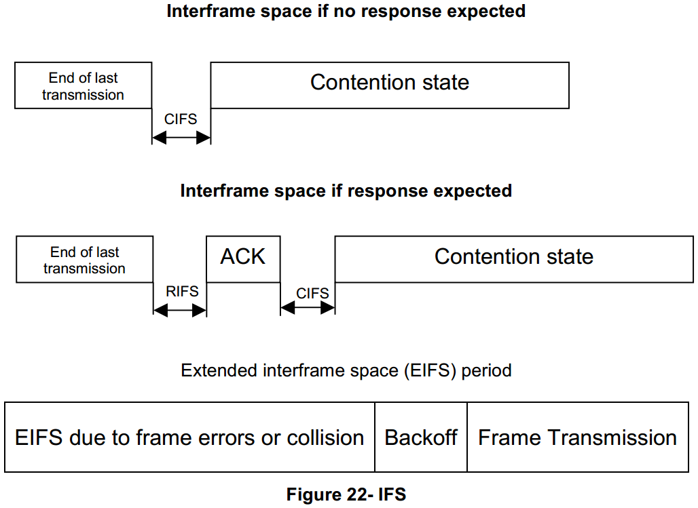

# 7.10.4.2 Interframe (IFS) Spacing 帧间间隔
　　A time intervals between frames on the medium constitute the Interframe Space and are necessary due to propagation and processing time. Three interframe space values are defined. Contention Interframe Space (CIFS) occurs after the end of the previous transmission. The second defined interval is the Response Interframe Space (RIFS).  
　　由于传播和处理时间的必需介质上的帧之间的时间间隔构成帧间间隔。 定义了三个帧间间隔值。 争用帧间间隔（CIFS）发生在上一次传输结束之后。 第二个定义的间隔是响应帧间间隔（RIFS）。  

　　RIFS is the time between the end of a transmission and the start of its associated response. If no response is expected, the CIFS is in effect.  
　　RIFS是传输结束与其关联的响应之间的时间。 如果不期望响应，则CIFS生效。  

　　An Extended Interframe Space (EIFS) is defined for conditions when the station does not have complete knowledge of the state of the medium. This can occur when the station initially attaches to the network, when errors in the received frames make them impossible to decode unambiguously. If a packet is received and correctly decoded before the expiration of the EIFS, then the EIFS is cancelled. The EIFS is significantly longer than the other interframe spaces, providing protection from Collision for an ongoing frame transmission or segment burst when any of these conditions occur. The EIFS is calculated as follows:  
　　当站不完全知道介质的状态时，为条件定义扩展帧间间隔（EIFS）。 这可能发生在站点最初附接到网络时，当接收到的帧中的错误使得它们不可能明确地解码时。 如果在EIFS期满之前接收到分组并且正确地解码，则EIFS被取消。 EIFS比其他帧间间隔显着更长，当这些条件中的任何一个发生时，提供针对正在进行的帧传输或段突发的冲突的保护。 EIFS计算如下：
$aEIFS = aAckTime + aCIFS + aRIFS + MaxFrameSize*aSymbolTime$

