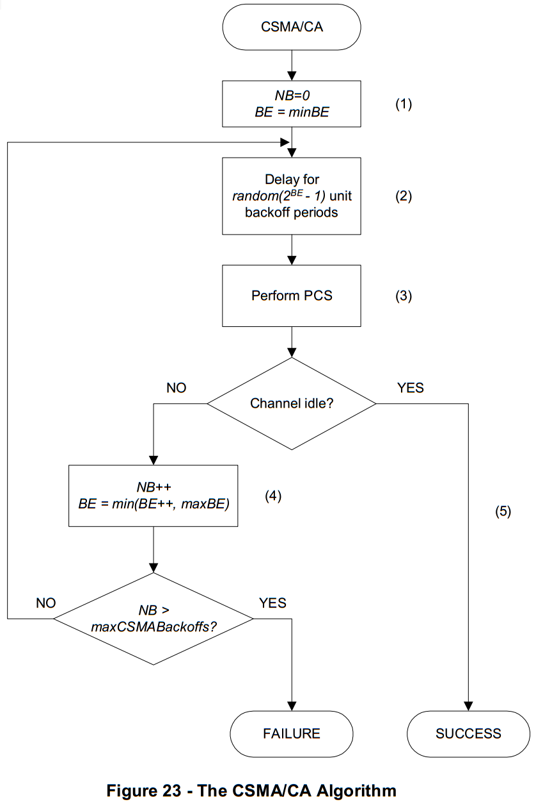

# 7.10.4.3 CSMA-CA
　　The present specification supports only an unslotted version of the CSMA-CA algorithm for non-beacon PAN described in IEEE 802.15.4  
　　本说明书仅支持IEEE 802.15.4中描述的用于非信标PAN的CSMA-CA算法的非时隙版本  

　　The random backoff mechanism spreads the time over which stations attempt to transmit, thereby reducing the probability of collision, using a truncated binary exponential backoff mechanism.  
　　随机回退机制使用截断的二进制指数退避机制来扩展站试图发送的时间，从而减少冲突的概率。  

　　The CSMA-CA algorithm shall be used before the transmission of data or MAC command frames   
　　CSMA-CA算法应该在传送数据或者MAC层命令帧之前使用  

　　The algorithm is implemented using units of time called backoff periods, where one backoff period shall be equal to unitBackoffPeriod symbols.  
　　该算法使用称为退避周期的时间单位来实现，其中一个退避周期应等于unitBackoffPeriod符号。  

　　Each device shall maintain two variables for each transmission attempt: **NB** and **BE**.  
　　每个设备应为每个传输尝试保持两个变量：NB和BE。  

　　**NB** is the number of times the CSMA-CA algorithm was required to backoff while attempting the current transmission; this value shall be initialized to 0 before each new transmission attempt.  
　　NB是在尝试当前传输时需要CSMA-CA算法退避的次数，在每次传输之前该值应该被初始化为0。    

　　**BE** is the backoff exponent, which is related to how many backoff periods a device shall wait before attempting to assess a channel. BE shall be initialized to the value of minBE.  
　　BE是退避指数，其与在尝试评估信道之前设备应当等待多少退避周期相关。 BE应初始化为minBE的值。  

　　Note that if minBE is set to 0, collision avoidance will be disabled during the first iteration of this algorithm. Figure 69 illustrates the steps of the CSMA-CA algorithm.   
　　注意，如果minBE设置为0，则在该算法的第一次迭代期间将禁用冲突避免。 图69示出了CSMA-CA算法的步骤。  

　　The MAC sublayer shall first initialize NB, and BE [step (1)] and then proceed directly to step (2).
　　MAC子层应首先初始化NB和BE [步骤（1）]，然后直接进行到步骤（2）。  

　　The MAC sublayer shall delay for a random number of complete backoff periods in the range 0 to 2BE –1 [step (2)] and then request that the PHY perform a PCS (Physical Carrier Sense) [step (3)].  
　　MAC子层应当延迟在0到2BE –1的范围内的完整回退周期的随机数，[步骤（2）]，然后请求PHY执行PCS（物理载波侦听） 步骤（3）]。

Backoff Time = Random(2BE –1) × aSlotTime

　　If the channel is assessed to be busy [step (4)], the MAC sublayer shall increment both NB and BE by one, ensuring that BE shall be no more than maxBE. Note: for high priority packets maxBE should be equal to minBE.  
　　如果信道被评估为忙[步骤（4）]，则MAC子层将使NB和BE增加一，确保BE不超过maxBE。 注意：对于高优先级数据包，maxBE应等于minBE。  

　　If the value of NB is less than or equal to maxCSMABackoffs, the CSMA-CA algorithm shall return to step (2). If the value of NB is greater than maxCSMABackoffs, the CSMA-CA algorithm shall terminate with a Channel Access Failure status.  
　　如果NB的值小于或等于maxCSMABackoffs，则CSMA-CA算法将返回步骤（2）。 如果NB的值大于maxCSMABackoffs，则CSMA-CA算法将以信道接入失败状态终止。

　　If the channel is assessed to be idle [step (5)], the MAC sublayer shall begin transmission of the frame immediately.  
　　如果信道被评估为空闲[步骤（5）]，则MAC子层将立即开始帧的传输。

