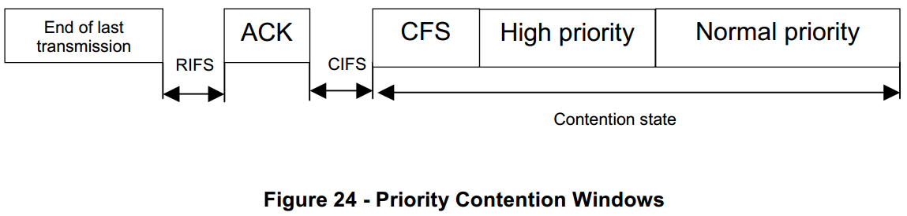

# 7.10.4.4 Priority 优先
　　Prioritized access to the channel can be beneficial for real time application or control application when urgent message should be delivered as soon as possible.  
　　当应当尽可能快地递送紧急消息时，对信道的优先接入对于实时应用或控制应用可以是有益的。  

　　Only two levels of priority (High and Normal) will be used to minimize complexity.  
　　只有两个优先级（高和正常）将用于最小化复杂性。  

　　Priority resolution is implemented by using two contention time windows during contention state as shown in Figure 24.  
　　通过在如图24所示的争用状态期间使用两个争用时间窗来实现优先级解决。

　　First slot of contention window is called Contention Free Slot (CFS). It is used to implement packet bursting without backoff procedure in order to prevent possible interruption from other nodes.  
　　争用窗口的第一时隙称为无竞争时隙（CFS）。 它用于实现没有退避过程的分组突发，以防止可能从其他节点中断。  

　　The high and normal priority stations will compete for channel during HPCW and NPCW correspondingly. Since HPCW is located before NPCW high priority stations will get access to the channel before station with normal priority. Duration of HPCW and NPCW are calculated as follow:  
　　高和正常优先站将在HPCW和NPCW期间相应地竞争信道。 由于HPCW位于NPCW之前，高优先级站点将在具有正常优先级的站点之前访问该信道。 HPCW和NPCW的持续时间计算如下：  
HPCW time = macHighPrioirtyWindowSize * aSlotTime;  
NPCW time = (2maxBE * aSlotTime) - HPCW time;  
CFS time = aSlotTime;
