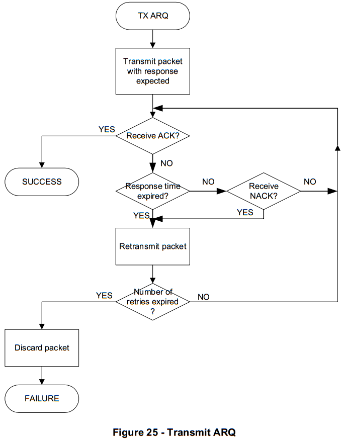
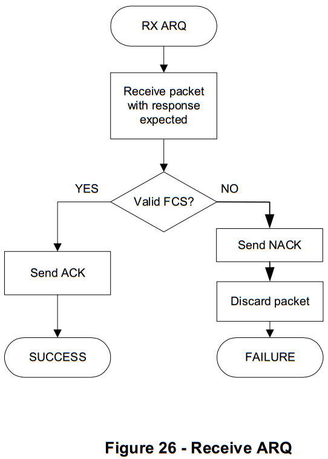

# 7.10.4.5 ARQ
　　ARQ (Automatic Repeat reQuest) is implemented based on acknowledged and unacknowledged retransmission. The MAC uses a response type as part of its ARQ mechanism. ACK is a traditional positive acknowledgment that when received allows the transmitter to assume successful delivery of the frame. The negative acknowledgment (NACK) is used to inform a packet originator that the receiver received the packet but it was corrupted.  
　　基于确认和未确认的重传实现ARQ（自动重复请求）。 MAC使用响应类型作为其ARQ机制的一部分。 ACK是传统的肯定确认，其在被接收时允许发射机假定帧的成功递送。否定确认（NACK）用于通知分组发起方接收器接收到分组，但它已损坏。  

　　A successful reception and validation of a data can be confirmed with an acknowledgment. If the receiving device is unable to handle the received data frame for any reason, the message is not acknowledged.   
　　可以使用确认来确认数据的成功接收和验证。如果接收设备由于任何原因不能处理所接收的数据帧，则该消息不被确认。  

　　If the originator does not receive an acknowledgment after waiting period, it assumes that the transmission was unsuccessful and retries the frame transmission. If an acknowledgment is still not received after several retries, the originator can choose either to terminate the transaction or to try again. When the acknowledgment is not required, the originator assumes the transmission was successful. Also if acknowledgment is not required, the originator can retransmit the same packets few times to increase probability of data delivery. The receiver should be able distinguishand discard redundant copies using the Sequence Number and Segment Count.  
　　如果始发者在等待时段之后没有接收到确认，则假定传输不成功并且重试帧传输。如果在几次重试后仍未收到确认，发起方可以选择终止事务或重试。当不需要确认时，发起方假定传输成功。此外，如果不需要确认，则发起者可以重传相同的分组几次以增加数据传送的可能性。接收器应该能够使用序列号和段计数来区分和丢弃冗余副本。  

　　The retransmitted packet will have the same SequenceNumber and Segment Count as original.  
　　重传的分组将具有与原始分组相同的序列号和分段计数。  

　　The acknowledgment cannot be requested for broadcast or multicast transmission. On transmit side ARQ requires configurable number of retransmissions (macMaxFrameRetries from 7.4.2 of [802.15.4-2006]) as shown in Figure 25.  
　　不能为广播或多播传输请求确认。在发送侧ARQ需要可配置的重传次数（从[802.15.4-2006]的7.4.2起的macMaxFrameRetries），如图25所示。  

　　On receive side ARQ generates acknowledgement for PLC packet with correct FCS (CRC16) if packet corresponds to this address as shown in Figure 26.  
　　在接收侧，如果分组对应于该地址，ARQ将对具有正确FCS（CRC16）的PLC数据包生成确认，如图26所示。    

　　The received packet FCS (16 bit) will be sent back to the packet originator as a part of an acknowledgement (Frame Control Header).  
　　接收的分组FCS（16比特）将作为确认（帧控制报头）的一部分被发送回分组始发者。    

　　All nodes will detect ACK during response time but only one station expecting ACK will accept it as acknowledgement and use 16 bit of FCS from ACK for identification.   
　　所有节点在响应时间期间将检测到ACK，但是只有一个期望ACK的站将接受它作为确认，并使用来自ACK的16位FCS进行识别。  

　　MAC acknowledgement is described in details in section 7.6 of this document.  
　　MAC确认在本文档的7.6节中详细描述。

   

