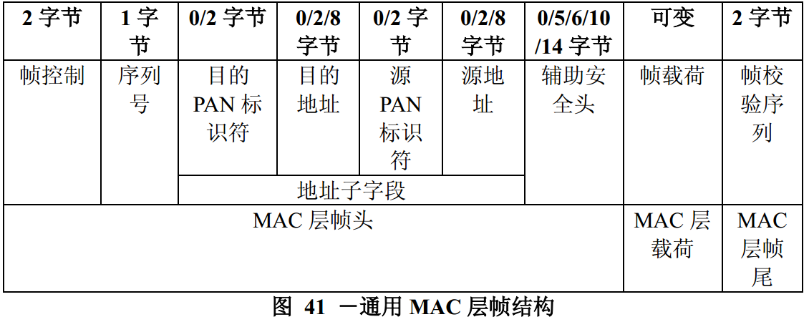
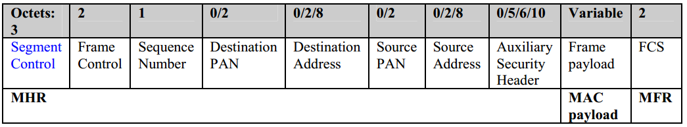
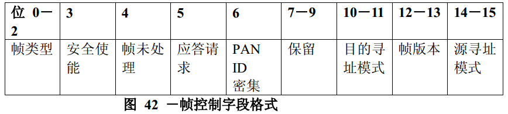

# 7.2.1 通用 MAC 帧格式
>在G3标准中该部分进行了修改
 段控制字段被添加到MHR 见表G3_2.1
 段控制字段的详细说明 表G3_2.2所示

　　MAC层帧结构由MAC层帧头，MAC层载荷和MAC层帧尾组成。MAC层帧头的子字段顺序是固定的，然而，在所有的帧中，可以不应包含地址子字段。通用MAC层帧结构在图41中描述。

图41. 通用MAC层帧结构 

 
 
表G3_2.1

 
表G3_2.1

Field|Byte|Bit number|Bits|Definition
----|----|----|----|----
RES|0|7-4|4|Reserved
TMR|0|3|1|Tone map request 1:Tone map is requested 0:Tone map is not requested
CC|0|2|1|Contention Control: 0:contention is allowed in next contention state 1:contention free access
CAP|0|1|1|Channel access priority: 0:Normal 1:High
LSF|0|0|1|Last Segment Flag 0:Not last segment 1:Last segment
SC|1|7-2|6|Segment Count
SL[9-8]|1|1-0|2|Segment Length of MAC frame
SL[7-0]|2|7-0|8|Segment Length of MAC frame
 
 

## 7.2.1.1帧控制字段
>在G3标准中该部分作为规范

　　帧控制字段位长为16比特，包括帧类型的定义，地址子字段和其他控制标志。帧控制字段格式在图42中描述。

图42. 帧控制字段格式 

### 7.2.1.1.1 帧类型子字段
>在G3标准中该部分进行了修改
 G3不使用MAC确认帧类型值。但是在文件的附件6相关联的PHY规范中描述了详细的ACK实现。也可以通过调用PDACK.request原语来发送ACK。

　　帧类型子字段位长度为3个比特位，并应设置为表79中列出的一个非保留值。

表79 帧类型子字段值

帧类型值b2b1b0|描述

----|----
000|信标帧

001|数据帧
010|确认帧
011|MAC命令
100－111|保留

### 7.2.1.1.2 安全使能子字段
>在G3标准中该部分作为规范

　　安全使能子字段位长度为1个比特位，如果帧被MAC层保护，安全使能子字段应设置为1，否则应设置为0。只有安全使能子字段应设置为1时，辅助安全头字段才生效。

### 7.2.1.1.3 帧未处理子字段
>在G3标准中该部分进行了修改
 G3标准中不支持间接传输，所以该字段应该一直为0.

　　帧未处理子字段位长度为1个比特位，如果发送帧的设备有更多的数据要发送到接收方，该字段应设置为1。否则，该字段应设置为0。（见7.5.6.3节）
帧未处理子字段仅在下面两种情况下使用，（1）在支持信标的PAN中，设备传输帧的竞争接入期间，（2）在不支持信标的PAN中，设备传输帧的任何时期。
在其他的时间，在传输时此位为0，在接收时忽略此位。

### 7.2.1.1.4 应答请求子字段
>在G3标准中该部分进行了修改
 G3标准中将确认请求子字段转换为帧控制报头的适当定界符类型。

　　应答请求子字段位长度为1个比特位，表示当接收到数据帧或MAC层命令帧时，接收方是否需要发送确认信息。如果该字段应设置为1，则接收方在接收到有效帧后，将发送确认帧，除非该帧已经通过三级过滤（见7.5.6.2节）。如果该字段应设置为0，接收方不需向发送方发送确认帧。

### 7.2.1.1.5 PANID压缩子字段
>在G3标准中该部分作为规范

　　PANID压缩子字段位长度为1个比特位，表示当目的地址和源地址两者都出现时，要发送的MAC层帧是否只应包含一个PAN标识符字段。当目的地址和源地址两者都出现时，如果该子字段应设置为1，那么该帧只应包含目的PAN标识符字段，并且假定源PAN标识符字段与目的PAN标识符字段；如果该子字段应设置为0，那么该帧将应包含目的PAN标识符字段和源PAN标识符字段。如果目的地址和源地址只有一个出现，该子字段应设置为0，并且该帧只应包含与地址相对应的PAN标识符。如果一个地址都不出现，该子字段应设置为0，并且不应包含PAN标识符字段。

### 7.2.1.1.6 目的寻址模式子字段
>在G3标准中该部分作为规范

　　目的寻址模式子字段位长度为2个比特位，并应设置为表80中列出的一个非保留值。

表80 目的/源寻址模式子字段可能的值

寻址模式值b1b0|描述
----|----
00|PAN标识符和地址子字段不出现
01|保留
10|地址子字段应包含16位，短地址码
11|地址子字段应包含64位，扩展地址码

　　如果该子字段等于0，而帧类型子字段又不指定该帧为确认帧还是信标帧，那么源寻址模式子字段必须为非0值，表明该帧指向在源PAN标识符字段中指定的PAN的协调器。

### 7.2.1.1.7 帧版本子字段
>在G3标准中该部分进行了修改
 G3中保留该字段，暂时设置为全0.

　　帧版本子字段位长度为2个比特位，指定帧相应的版本号。
该子字段应设置为0x00时，表明该帧与IEEEStd802.15.4_2003版本兼容；该子字段应设置为0x01时，表明该帧为IEEEStd802.15.4_2006版本。其它的值留作以后用，帧兼容性的详细资料见7.2.3节。

### 7.2.1.1.8 源寻址模式子字段
>在G3标准中该部分作为规范

　　源寻址模式子字段位长度为2个比特位，并应设置为表80中列出的一个非保留值。
如果该子字段等于0，而帧类型子字段又不指定该帧为确认帧，那么目的寻址模式子字段必须为非0值，表明该帧来自在目的PAN标识符字段中指定的PAN的协调器。

## 7.2.1.2 序列号字段
>在G3标准中该部分作为规范

　　序列号字段长度为8个比特位，为MAC层帧的唯一的序列标识符。
　　对于信标帧，此字段应设置为信标帧序列号（BSN）值。对于数据帧，确认帧或MAC层命令帧，该字段指定了一个数据序列号（DSN），用来使确认帧与数据帧或MAC层命令帧相匹配。

## 7.2.1.3 目的PAN标识符字段
>在G3标准中该部分作为规范

　　当目的PAN标识符字段出现时，它长度为16个比特位，指定接收该帧信息的唯一的PAN的标识符。PAN的标识符值为0xffff代表以广播方式传播，这时，对当前监听该信道的所有设备都有效。
　　只有在帧控制字段的目的寻址模式字段应设置为非0时，此字段才存在于MAC层帧中。

## 7.2.1.4 目的地址子字段
>在G3标准中该部分作为规范

　　当目的地址子字段出现时，它长度为16个比特位或64个比特位，其长度由帧控制字段的目的寻址模式子字段的值来限定，该地址为接收设备的地址（见7.2.1.1.6节）。该值为0xffff时，代表短的广播地址，此广播地址对所有当前监听该信道的设备都有效。
　　只有在帧控制字段的目的寻址模式字段应设置为非0时，此字段才存在于MAC层帧中。

## 7.2.1.5 源PAN标识符子字段
>在G3标准中该部分作为规范

　　当源PAN标识符字段出现时，它长度为16个比特位，代表帧发送方的唯一的PAN标识符。只有在帧控制字段的源寻址模式字段应设置为非0和PANID密集子字段应设置为0时，此字段才存在于MAC层帧中。
　　设备的PAN标识符在个域网建立时确定，若在个域网中PAN标识符发生冲突后，可对它进行改变。（见7.5.2.2节）。

## 7.2.1.6 源地址子字段
>在G3标准中该部分作为规范

　　当源地址子字段出现时，它长度为16个比特位或64个比特位，其长度由帧控制字段的源寻址模式子字段的值来限定，该地址为发送方的设备地址（见7.2.1.1.8节）。只有在帧控制字段的源寻址模式字段应设置为非0时，此字段才存在于MAC层帧中。

## 7.2.1.7 辅助安全头字段
>在G3标准中该部分进行了修改
 G3中辅助安全头字段长度为1或者5.

　　辅助安全头子字段的长度是可变的，表明安全处理所必需的信息，包括帧是如何被保护的（安全等级）和使用MAC安全个域网信息数据库中的何种密钥材料（见7.6.1节）。只有在安全使能子字段应设置为1时，此字段才存在于MAC层帧中。该字段格式的详细资料见7.6.2节。

## 7.2.1.8 帧载荷字段
>在G3标准中该部分作为规范

　　帧载荷字段长度是可变的，不同的帧类型应包含不同的信息。如果帧控制字段的安全使能子字段应设置为1，则将采用相应的安全加密方案对帧载荷进行保护。

## 7.2.1.9 帧校验序列子字段
>在G3标准中该部分作为规范

　　帧校验序列（FCS）字段长度为16个比特位，应包含16位的ITU-T循环冗余码（CRC）。FCS由MAC层帧头和MAC层帧的载荷部分计算得到。
　　FCS由下面的16次多项式标准发生器生成：

\(G_{16}(x)=x^{16}+x^{12}+x^{5}+1\)

FCS生成算法如下：

----令\(M(x)=b_0x^{k-1}+b_1x^{k-2}+...+b_{k-2}x+b_{k-1}\) 表示待计算校验和的序列

----\(M(x)\) 乘以 \(x^{16}\) 得到多项式\(x^{16} \times M(x)\)

----对发生器多项式\(G_{16}(x)\) 进行模\(2\) 除以 \(x^{16} \times M(x)\) 的运算，得到余式 \(R(x)=r_0x^{15}+r_1x^{14}+...+r_{14}x+r_{15}\)

----余式 \(R(x)\) 的系数即是FCS字段的值。
