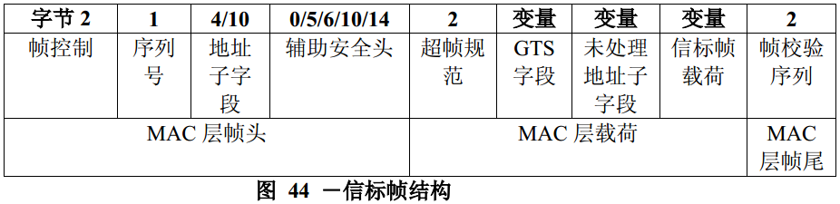
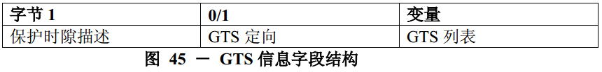
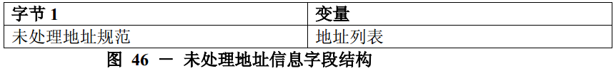
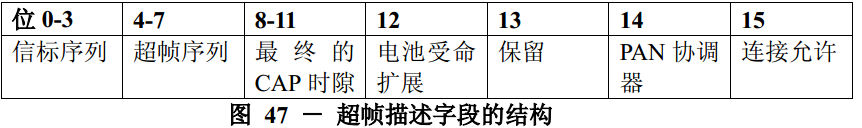
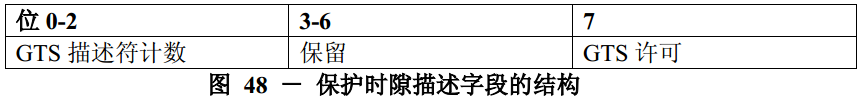
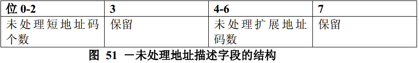
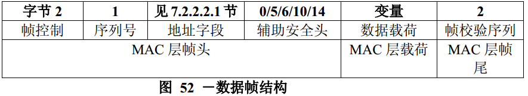
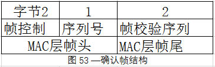
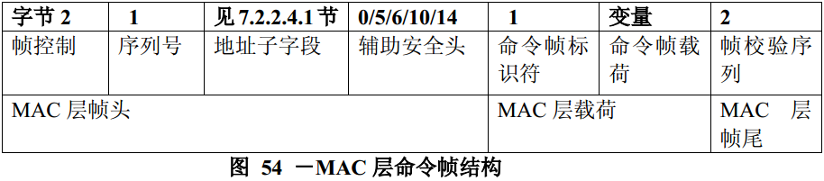

# 7.2.2 不同类型帧格式
>在G3标准中该部分作为规范

　　本标准定义了4种帧类型：信标帧，数据帧，确认帧和MAC层命令帧。这4种帧分别在7.2.2.1至7.2.2.4中讨论。

##7.2.2.1 信标帧结构
>在G3标准中该部分作为规范

　　信标帧结构，如图44。

　　GTS字段格式，如图45；

　　未处理地址子字段格式，如图46。

　　信标帧字段的结构次序和图41中的通用MAC层帧相一致。

###7.2.2.1.1 信标帧MAC层帧头字段
>在G3标准中该部分作为规范

　　信标帧的MAC层帧头字段应包含帧控制字段，序列号子字段，源PAN标识符子字段和源地址子字段。

　　在帧控制字段中，帧类型字段取表79所列的值，和源寻址模式子字段应设置为相应的发送信标帧的协调器地址。如果信标帧使用安全机制，安全使能子字段应设置为1。如果安全使能子字段应设置为1，帧版本子字段应设置为1。如果有一个广播方式的数据帧或命令帧是未处理的，帧未处理子字段应设置为1。所有其他子字段应设置为0，在接收时忽略。
　　序列号字段应包含macBSN值，即为当前MAC层的信标序号。

　　地址子字段仅应包含源地址子字段。源PAN标识符和源地址子字段分别应包含发送信标帧设备的PAN标识符和地址。

　　如果辅助安全头字段出现，它将应包含7.2.1.7节中指定的信标帧安全处理的必需信息。

### 7.2.2.1.2 超帧描述字段
>在G3标准中该部分进行了修改
 信标不以规则的时间间隔（无网络网络）传输。 因此，不使用超帧规范字段的超帧序列，并且必须始终设置为0。
 接收器在不发送时始终处于活动状态。因此，不使用超帧规范字段的超帧序列，并且必须始终设置为0。
 没有超帧结构用于通信，因此不使用超帧规范字段的最终CAP时隙参数，并且必须始终设置为0。
 设备将不使用电池操作，因此不使用超帧规格字段的电池寿命扩展子字段，并且必须始终设置为0。
 G3中描述的6LoWPAN PLC简档的情况下，通过上层中的LoWPAN引导协议来执行关联，因此超帧规范字段的关联允许参数在这里是无意义的，并且应当总是被设置为1。如果使用另一个配置文件，则应按照[802.15.4-2004]第7.2.2.1.2节中所述设置此字段，

　　超帧规范子字段长度为16个比特位，格式如图47所示。

　　信标帧序列子字段长度为4个比特位，用来指定信标帧的传输间隔。信标帧序列和帧间间隔之间的关系在7.5.1.1节描述。

　　超帧序列子字段长度为4个比特位，指定了超帧为激活状态的时间段（如接收机接收期间），该时段包括信标帧的传输时间。超帧序列和帧间间隔之间的关系在7.5.1.1节描述。

　　最终的CAP时隙子字段长度为4个比特位，指定了竞争接入期（CAP）所使用的最终超帧时隙。此子字段所暗示的竞争接入期的持续时间，大于或等于aMinCAPLength所指定的值。在为了满足执行保护时隙维护需要的情况下，可适当地暂时增加信标帧的长度。（见7.2.2.1.3节）。

　　电池寿命扩展子字段长度为1个比特位，在信标的帧间隔期（IFS）后，如果要求在竞争接入期中传输的信标帧在第macBattLifeExtPeriods个完整退避期时活该时间之前开始传输的话，那么此子字段应设置为1。否则，此子字段应设置为0。PAN协调器子字段长度为1个比特位，如果信标帧由PAN协调器传输，则此职应设置为1。否则，PAN协调器子字段应设置为0。

　　连接允许子字段长度为1个比特位，如果macAssocaitionOermit为TRUE（即协调器接受PAN范围内设备的连接），则此子字段应设置为1。如果协调器当前不接收受自身网络内的连接请求，则此子字段应设置为0。

###7.2.2.1.3 保护时隙描述字段
>在G3标准中该部分进行了修改
 GTS描述符计数必须始终设置为0（不支持GTS）。
 PAN协调器从不接受GTS请求，因此GTS规范字段的GTS许可参数必须始终设置为0。

　　保护时隙描述字段应设置为8比特，其格式如图48所示。

　　GTS描述符计数子字段长度为3个比特位，指定了应包含在信标帧内的GTS列表字段中3字节的GTS描述符的个数。如果该子字段的值大于0，则允许竞争接入期的大小可临时调到低于aMinCAPLength值，以便适应信标帧的长度暂时地增大。如果该子字段值为0，则GTS定向字段和GTS列表字段不存在。

　　GTS允许子字段长度为1个比特位，如果macGTSPermit为TRUE（PAN协调器接收GTS请求），则此子字段应设置为1，否则，应设置为0。
###7.2.2.1.4 GTS定向字段
>在G3标准中该部分不相关，也就是未使用

　　GTS定向字段长度为8个比特位，其格式如图49所示。

　　GTS定向掩码子字段长度为7个比特位，用来指定超帧中GTS的方向。掩码的最低位对应于信标帧GTS列表字段中的第一个GTS的方向，掩码其余位依次与列表其他GTS相对应。如果仅接收保护时隙，则相应的位置1；或如果GTS仅发送保护时隙，则相应的位置0。GTS的定向与设备传输数据帧的方向有关。

###7.2.2.1.5 GTS列表字段
>在G3标准中该部分不相关，也就是未使用

　　GTS列表字段的大小由信标帧的保护时隙描述字段所给定的值来决定，它应包含了GTS描述符列表，该表说明了要维护的保护时隙，GTS描述符的最大数为7个。
　　每个GTS描述符长度为24个比特位，其格式如图50所示。

　　设备短地址码子字段长度为16个比特位，为设备的短地址码，该短地址码为GTS描述符所使用的地址。

　　GTS起始时隙子字段长度为4个比特位，指定了在超帧内GTS的起始时隙位置。

　　GTS长度子字段长度为4个比特位，该子字段指定了连续超帧时隙的数目，在这期间，保护时隙处于激活状态。

### 7.2.2.1.6 未处理地址描述字段
>在G3标准中该部分进行了修改
 G3不支持间接传输。 因此，待处理的短地址的数量始终为0，并且待处理的扩展地址的数量也为0。

　　未处理地址描述字段格式如图51所示。

　　未处理短地址码个数子字段长度为3个比特位，指示应包含在信标帧的地址列表字段内的短地址码个数。

　　未处理扩展地址码子字段长度为3个比特位，指示应包含在信标帧的地址列表字段内的64位扩展地址码个数。

### 7.2.2.1.7 地址列表字段
>在G3标准中该部分不相关，也就是未使用

　　地址列表字段的大小由信标帧内未处理地址描述字段的值指定。它应包含了当前那些需要与协调器传输未处理或等待消息的设备的地址列表。地址列表不包括广播短地址码0xffff。

　　未处理地址的最大数量为7个，包括短地址码和扩展地址码。在地址列表中，所有的短地址码排在扩展地址码之前。如果协调器能存储多达7个事务，那么它将遵循先到先服务三原则，确保信标帧应包含最多7个地址。

### 7.2.2.1.8 信标帧载荷字段
>在G3标准中该部分进行了修改
 在当前规范中，信标帧载荷为空

　　信标帧载荷字段是一个可变序列，其最大长度为aMaxBeaconPayloadLength个字节，其内容来源于MAC层的上层。应包含aMaxBeaconPayloadLength中的一组字节信息存入该子字段。

## 7.2.2.2 数据帧结构
>在G3标准中该部分作为规范

　　数据帧格式，如图52。

　　数据帧的结构顺序与图41所示的通用MAC层帧结构一致。

### 7.2.2.2.1 数据帧MAC层帧头字段
>在G3标准中该部分作为规范

　　数据帧的MAC层帧头字段包括帧控制字段，序列号子字段，目的PAN标识符/地址子字段和/或源PAN标识符/地址子字段。

　　在帧控制字段中，帧类型子字段取表79所列的值，用来表明该帧为数据帧。如果该数据帧使用安全机制，安全使能子字段应设置为1。如果帧安全使能子字段应设置为1或MAC层载荷字段大于aMaxMACSafePayloadSize，那么帧版本子字段将置1。其他所有子字段应设置为与数据帧配置相对应的值。所有保留子字段应设置为0，在接收时忽略。

　　序列号字段应包含当前macDSN的值。

　　地址子字段应包含目的地址子字段和/或源地址子字段，它们取决于帧控制字段的设置。

　　如果辅助安全头字段出现，它将应包含7.2.1.7节中指定的数据帧安全处理的必需信息。

### 7.2.2.2.2 数据载荷字段
>在G3标准中该部分作为规范

　　数据帧载荷字段应包含有上层要求MAC层传输的一组数据字节。

##7.2.2.3 确认帧结构
>在G3标准中该部分进行了修改
 G3中未使用该确认帧，使用物理层确认或者应用层实现。

　　确认帧结构如图53所示。

　　确认帧的结构顺序与图41所示的通用MAC层帧结构一致。

### 7.2.2.3.1 确认帧MAC层帧头字段
　　确认帧的MAC层帧头字段仅包括帧控制字段和序列号字段。

　　在帧控制字段中，帧类型子字段取表79所列的值，用来表明该帧为确认帧。如果设备为了一个接收到的数据请求命令而发送确认帧，则该设备便可确定是否有给接收设备的未处理数据。如果设备在发送确认帧之前能够确定是否有未处理数据（见7.5.6.4.2节），那么就可根据其结果设置帧未处理子字段。否则，将帧未处理子字段应设置为1。如果确认帧是为了响应数据帧或其他类型的MAC层命令帧，则未处理子字段应设置为0。所有其他子字段均应设置为0，在接收时忽略这些子字段。

　　序列号字段应设置为接收到的有确认要求的帧序列号。

## 7.2.2.4 MAC层命令帧结构
>在G3标准中该部分作为规范

　　MAC层命令帧格式，如图54。

　　MAC层命令帧序列表字段和通用MAC层帧序列一致，在图41给出。
### 7.2.2.4.1 MAC层命令帧MAC层帧头字段
>在G3标准中该部分作为规范

　　MAC层命令帧的MAC层帧头字段应包含帧控制字段，序列号字段，目的PAN标识符/地址子字段和/或源PAN标识符/地址子字段。
　　在帧控制字段中，帧类型子字段取表79所列的值，用来表明该帧为命令帧。如果该帧要求使用安全机制，则帧控制字段的安全使能子字段应设置为1，并且按照7.5.8.1.3节中描述的方法进行安全处理。否则，安全使能子字段应设置为0。其他所有的子字段应设置为与MAC层命令帧所使用的配置相应的值。所有保留子字段应设置为0，在接受时忽略这些子字段。

　　序列号字段应设置为当前macDSN的值。

　　地址子字段应包含目的地址子字段和/或源地址子字段，其取值由帧控制字段的配置所确定。

　　如果辅助安全头字段出现，它将应包含7.2.1.7节中指定的命令帧安全处理的必需信息。

### 7.2.2.4.2 命令帧标识符字段
>在G3标准中该部分作为规范

　　命令帧标识符字段表示所用到的MAC命令。其值为表82中所示的一个非保留值。

### 7.2.2.4.3 命令载荷字段
>在G3标准中该部分作为规范

　　命令载荷字段应包含MAC命令自身。单独的命令帧格式将在7.3节中详细描述。
