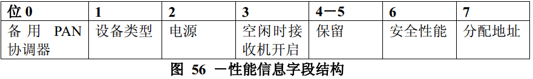

# 7.3.1 关联请求命令
>在G3标准中该部分不相关，也就是未使用

　　连接请求命令允许设备通过PAN协调器或协调器请求和PAN连接。

　　该命令只能由没有连接，但希望连接到个域网的设备发出。设备只能连接到所允许连接的个域网中，是否允许连接，将在扫描过程中决定。

　　尽管不需要简化功能设备能够接收这一命令，但所有的设备都应该能够发送该命令。

　　连接请求命令的格式如图55所示。

## 7.3.1.1 MAC层帧头字段
　　帧控制字段的源寻址模式子字段应设置为3（即为64位扩展寻址）。目的寻址模式子字段应设置为与连接请求命令中所指的信标帧中的寻址模式相同。

　　帧控制字段的帧未处理子字段应设置为0，在接收帧时将忽略该子字段信息，应答请求子字段应设置为1。

　　目的PAN标识符子字段应包含欲接入的PAN标识符。目的地址子字段应包含从协调器发送的信标帧中得到的地址，该协调器就是发送连接请求命令的目标协调器。源PAN标识符子字段应包含广播PAN标识符（0xffff）。源地址子字段应包含aExtendedAddress的值。

## 7.3.1.2 性能信息字段
　　性能信息字段的格式如图56所示。

　　备用PAN协调器子字段长度为1个比特位，如果设备有成为PAN协调器的能力，则该位应设置为1；否则，该位应设置为0。

　　设备类型子字段长度为1个比特位，如果该设备是完整功能设备，则该位应设置为1。否则，该位应设置为0，表示该设备为简化功能设备。

　　电源子字段长度为1个比特位，如果设备采用交流电源，则该位应设置为1；否则，该位应设置为0。

　　空闲时接收机开启子字段长度为1个比特位，如果设备不打算在空闲期间关闭接收机来节省能量，则该位应设置为1；否则，该位应设置为0。

　　安全性能子字段长度为1个比特位，如果该设备有能力采用如7.5.8.2节中所介绍的安全方案发送和接收MAC层帧，则该位应设置为1；否则，则该位应设置为0。

　　分配地址子字段长度为1个比特位，如果该设备希望在接入过程中由协调器分配一个短地址码，则该位应设置为1。否则，该位应设置为0。
