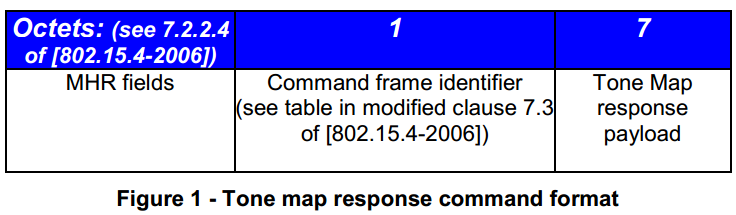

# 7.3.10 Tone Map响应
>该部分仅对G3适用。

　　如果MAC子层接收到的数据中TMR位被置1，那么就要做出Tone Map响应。这意味着发起者请求目标设备的Tone Map信息。目的地设备必须估计两点之间的特定通信链路并选择最佳PHY参数。Tone Map信息包括与PHY参数相关联的索引：使用的Tone数量和分配（Tone Map），调制模式和TX功率控制参数。 Tone Map响应消息参数在表3.1中描述。

<

表 3.1- Tone Map 响应载荷

Field|Byte|Bit number|Bits|Definition
----|----|----|----|----
TXRES|0|7|1|Tx Gain resolution corresponding to one gain step. 0:6dB 1:3dB
TXGAIN|0|6-3|4|Desired Transmitter gain specifying how many gain steps are requested.
MOD|0|2-1|2|Modulation type: 0–ROBO; 1–DBPSK 2-DQPSK
TM[8]|0|0|1|Tone Map [8]
TM[0:7]|1|7-0|8|Tone Map [7:0]
LQI|2|7-0|8|Link Quality Indicator
TXCOEF[3:0]|3|7-4|4|Specifies number of gain steps requested for 10kHz-20kHz spectrum
TXCOEF[7:4]|3|3-0|4|Specifies number of gain steps requested for 20kHz-30kHz spectrum
TXCOEF[11:8]|4|7-4|4|Specifies number of gain steps requested for 30kHz-40kHz spectrum
TXCOEF[15:12]|4|3-0|4|Specifies number of gain steps requested for 40kHz-50kHz spectrum
TXCOEF[19:16]|5|7-4|4|Specifies number of gain steps requested for 50kHz-60kHz spectrum
TXCOEF[23:20]|5|3-0|4|Specifies number of gain steps requested for 60kHz-70kHz spectrum
TXCOEF[27:24]|6|7-4|4|Specifies number of gain steps requested for 70kHz-80kHz spectrum
TXCOEF[31:28]|6|3-0|4|Specifies number of gain steps requested for 80kHz-90kHz spectrum

　　在接收到TMR命令帧时，MAC层用与该设备相关的Tone Map及通信参数更新邻居表。如果该设备在邻居表中不存在，则应该基于具体实现的相关限制进行添加。

　　邻居表的相关定义位于本文档的clause 4.5.1。

　　以下过程将用于执行自适应Tone Map功能

1.当设备准备好发送数据时，它将首先检查邻居表是否已经具有与目的地设备地址相关的记录。如果记录不存在或老化（Age计数器为0），MAC子层设置输出分组片段控制字段的TMR位并请求新的Tone Map信息。在这种情况下，MAC数据应该以ROBO模式发送。

2.如果邻居表记录存在并且其未老化，则MAC子层不需要发送Tone Map请求消息。在这种情况下，MAC子层使用来自邻居表的信息来正确地配置PHY TX并且构造输出帧的帧控制报头。

3.当目的节点接收到数据帧时，它将检查在段控制字段中的TMR请求位。如果该比特被设置，则目的节点将测量每一个信道的信道质量，构造并发送Tone Map响应命令消息回始发节点。 如果未设置TMR请求位，则目的站不发送TMR响应消息。TMR响应信息将始终使用默认ROBO调制来发送。目的地设备PHY使用来自帧控制报头的参数来解码MAC数据字段。

4.在从源站接收到TMR请求消息之后，目的地站应尽快尝试发送TMR响应消息。

5.如果源站接收到TMR响应消息，则其将使用新的Tone Map，调制和TX增益参数来更新与目的地地址相关的邻居表记录。 如果记录不存在，MAC子层将创建一个新的记录。 Age计数器应设置为所需的值。 在接收到TMR响应消息之后，节点应开始对到相关联的目的地的所有传输使用更新的邻居表信息。

6.如果源节点在向某个目的节点发送了TMR请求消息之后没有接收到TMR响应消息，则它应该将其想要发送的下一个相同目的地节点的MAC数据帧的分段映射请求位置位。换句话说，MAC子层将继续向相同目的地发送Tone Map请求消息。

7.如果没有数据发送到该设备，则MAC子层不向目的地设备发送Tone Map请求消息。

Tone Map请求/响应消息序列图在本文件的图5中示出
