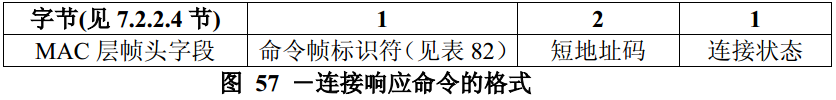

# 7.3.2 关联响应命令
>在G3标准中该部分不相关，也就是未使用

　　作为对连接请求的应答，允许PAN协调器或协调器通过连接响应命令与发送连接请求命令的设备进行通信。

　　该命令只能由PAN协调器或协调器发送给当前试图连接的设备。

　　尽管简化功能设备不能发送这个命令，但所有的设备都应该能够接收该命令。

　　连接响应命令的格式如图57所示。

## 7.3.2.1 MAC层帧头字段
　　帧控制字段中的目的寻址模式和源寻址模式子字段均应设置为3（即64位扩展寻址）。
帧控制字段的帧未处理子字段应设置为0，在接收时忽略该子字段；同时应答请求子字段应设置为1。

　　帧控制字段的PANID密集子字段应设置为1。与PANID密集子字段的值一致，目的PAN标识符字段应包含macPANId的值，而省略源地址PAN标识符字段。目的地址子字段应包含设备请求连接的扩展地址码。源地址子字段应包含aExtendedAddress的值。

## 7.3.2.2 短地址码子字段
　　如果协调器不能将发送请求的设备接入个域网，则该子字段应设置为0xffff,并在连接状态子字段中应包含失败原因的信息。如果协调器能够将设备接入其个域网，则该子字段应包含该设备在个域网中通信所使用的短地址码，该设备将一直使用这个短地址码，直到该设备与所连接的个域网断连接。

　　如短地址码子字段值等于0xfffe，则表示设备已经成功地接入了个域网；但是还没有给该设备分配一个短地址码。在这种情况下，该设备在个域网中的通信，需要使用64位扩展地址码。

## 7.3.2.3 连接状态字段
　　连接状态字段取值为表83中所示的非保留值之一。

表83 连接状态字段的有效值

连接状态|描述
----|----
0x00|连接成功
0x01|PAN正在接受
0x02|PAN拒绝访问
0x03－0x7f|保留
0x80－0xff|为MAC原语枚举值保留

