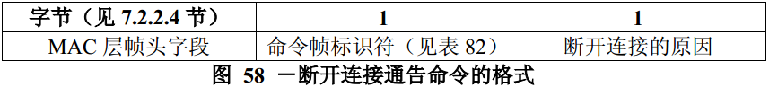

# 7.3.3 解关联通知命令
>在G3标准中该部分不相关，也就是未使用

　　PAN协调器、协调器或连接设备都可发送断开连接通告命令。所有设备将执行该命令。

　　断开连接通告命令格式，在图58描述。

## 7.3.3.1 MAC层帧头字段
　　帧控制字段的目的寻址模式子字段按照相应的原语指定的寻址模式设置。源寻址模式子字段应设置为3（即64位扩展寻址）。

　　帧控制字段的帧未处理子字段应设置为0，在接收时忽略该子字段；应答请求子字段应设置为1。

　　帧控制字段的PANID密集子字段应设置为1。为了与PANID密集子字段相一致，目的PAN标识符子字段应包含macPANId的值，而忽略源PAN标识符字段。如果协调器需要让已连接的设备与PAN断开，目的地址子字段应包含正在从PAN断开连接的设备的扩展地址码。如果已经连接的设备想要与PAN断开，若目的寻址模式子字段应设置为2，则目的地址子字段应包含macCoordExtendedAddress的值；若目的寻址模式子字段应设置为3，则目的地址子字段应包含macCoordExtendedAddress的值。两种情况下，源地址子字段都应包含aExtendedAddressd的值。

## 7.3.3.2 断开连接原因字段
　　断开连接原因字段应包含如表84中列出的非保留值之一。

表84 断开连接原因的有效值

断开原因|描述
----|----
0x00|保留
0x01|协调器希望设备与PAN断开
0x02|设备希望与PAN断开
0x03－0x7f|保留
0x80－0xff|为MAC原语枚举值保留

