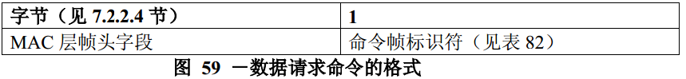

# 7.3.4 数据请求命令
>在G3标准中该部分不相关，也就是未使用

　　数据请求命令由设备发送，用于从PAN协调器或协调器请求数据。

　　数据请求命令的发送有三种情况。（1）在一个支持信标帧的PAN中，当acAutoRequest为TRUE，并且从PAN的协调器发出的信标帧中，设备收到表示协调器中有自己的未处理数据时，发出该请求命令。协调器通过在信标帧地址列表字段中加入接收此数据的设备的地址来表示该设备的未处理数据；（2）当设备的MAC层接收到上层发送来的MLME-POLL.request原语时，设备的MAC层也发送该请求命令；（3）设备对一个请求命令确认应答后，再等待aReponseWaitTime符号后，也可能向协调器发送该请求命令。

　　尽管简化功能设备不需要能够接收这个命令，但所有的设备都应该能够发送该命令。

　　数据请求命令格式如图59所示。

　　如果数据请求命令是用来响应接收的一个信标帧，在这个信标帧中表明有该设备的未处理的数据，那么帧控制字段的目的寻址模式子字段应设置为0（即目的地址信息不存在）。 如果信标帧在其超帧描述字段（见7.2.2.1.2节）中指出信标帧来自PAN协调器（见7.2.1.1.6节），那么根据数据请求命令的目的协调器进行设置。 如果目的地址信息应包含在内，目的寻址模式子字段将根据macCoordShortAddres的值设置：如果macCoordShortAddres的值等于0xfffe，则使用扩展地址码：目的寻址模式子字段应设置为3，并且目的地址子字段应包含macCoordExtendedAddress的值。否则，使用短地址码：目的寻址模式子字段应设置为2，并且目的地址子字段应包含macCoordShortAddres的值。

　　如果数据请求命令是用来响应接收的一个信标帧，在这个信标帧中表明有该设备的未处理的数据，那么源寻址模式子字段将根据未处理数据地址的寻址模式设置。如果源寻址模式子字段应设置为2，则使用短地址码：源地址字段应包含macShortAddres的值。否则， 将使用扩展地址码： 源寻址模式子字段应设置为3，源地址字段应包含aExtendedAddress的值。

　　如果由于接收到来自上层的MLME-POLL.request原语而发送数据请求命令，目的地址信息应与该原语中的地址信息相同。源寻址模式子字段根据macShortAddres的值设置，如果macShortAddres的值小于0xfffe， 则使用短地址码；否则，将用扩展地址码。
如果在连接请求命令确认之后发送数据请求命令，帧控制字段的目的寻址模式子字段根据数据请求命令的目的协调器设置。如果macCoordShortAddres的值等于0xfffe，则使用扩展地址码，否则使用短地址码。源寻址模式子字段都将使用扩展地址码。

　　如果目的寻址模式子字段应设置为0（即目的地址信息不存在），帧控制字段的PAN ID密集子字段应设置为0，源PAN标识符应包含macPANId的值。否则，PAN密集子字段应设置为1。这种情况下，为了与PAN ID密集子字段相一致，目的PAN标识符字段应包含macPANId的值，而源PAN标识符字段省略。
　　帧控制字段的未处理子字段应设置为0，在接收时忽略此子字段，应答请求子字段应设置为0。
