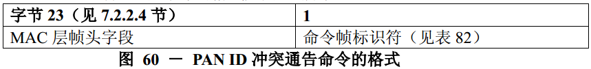

# 7.3.5 PAN ID 冲突通知命令
>在G3标准中该部分不相关，也就是未使用
 由适配层完成

　　当设备检测到PAN标识符冲突时，将向PAN协调器发送PANID冲突通告命令。

　　尽管简化功能设备不需要能够接收这个命令，但所有的设备都应该能够发送该命令。

　　PANID冲突通告命令的格式如图60所示。

　　帧控制字段的目的寻址模式和源寻址模式子字段都应设置为3（即64位扩展寻址）。

　　帧控制字段的帧未处理子字段应设置为0，在接收时忽略该子字段，应答请求子字段应设置为1。

　　帧控制字段的PANID密集子字段应设置为1。为了与PANID密集子字段的值相一致，目的PAN标识符字段应包含macPANId的值，而源PAN标识符字段将省略。目的地址子字段应包含macCoordExtendedAddress值。源地址子字段应包含aExtendedAddress值。
