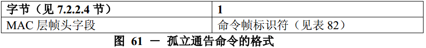

# 7.3.6 孤立通知命令
>在G3标准中该部分不相关，也就是未使用

　　当已经与PAN连接的设备发现与协调器失去同步时，将立即发送孤立通告命令。

　　尽管简化功能设备不需要能够接收这个命令，但所有的设备都应该能够发送该命令。

　　孤立通告命令的格式如图61所示。

　　帧控制字段的源寻址模式子字段应设置为3（即64位扩展寻址）。目的寻址模式子字段应设置为2（即16位短寻址）。

　　帧控制字段的帧未处理和应答请求子字段应设置为0，在接收时将忽略它们。

　　帧控制字段的PANID密集子字段应设置为1。为了与PANID密集子字段的值相一致，目的PAN标识符字段应包含广播PAN标识符的值（0xffff），而源PAN标识符字段将省略。目的地址子字段应包含广播短地址码（0xffff），源地址子字段应包含aExtendedAddress值。
