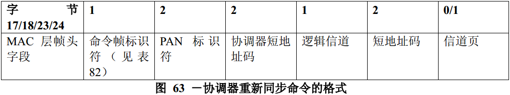

# 7.3.8 协调器重组命令
>在G3标准中该部分不相关，也就是未使用

　　在PAN协调器或协调器接收到来自设备发送的孤立通告命令，或者当收到MLME-START.request原语后这个协调器的配置属性发生任何改变时，协调器将发送重新同步命令。

　　如果协调器接收到一个孤立通告命令，它将直接发送重新同步命令给孤立设备。如果在PAN配置属性（如，PAN标识符或逻辑信道）发生变化时，协调器将以广播方式向目前具有接收能力的所有设备发送该命令。

　　尽管简化功能设备不需要能够发送这个命令，但所有的设备都应该能够接收该命令。

　　协调器重新同步命令的格式如图63所示。

## 7.3.8.1 MAC层帧头字段
　　如果该命令是直接发送给孤立设备的，则目的寻址模式子字段应设置为3（即64位扩展寻址）；如果以广播方式发送给PAN的所有设备，则此子字段应设置为2（即16位短寻址）。帧控制字段的源寻址模式子字段应设置为3（即64位扩展寻址）。

　　帧控制字段的帧未处理子字段应设置为0，并在接收时忽略该子字段。

　　如果该命令是直接发送给孤立设备的，则帧控制字段的应答请求子字段应设置为1；如果以广播方式发送给PAN的所有设备，则此子字段应设置为0。

　　如果信道页子字段存在，则帧版本子字段应设置为0x01。否则按7.2.3节中的描述设置。

　　目的PAN标识符字段应包含广播PAN标识符（0xffff）。如果该命令是直接发送给孤立设备的，则目的地址子字段应包含孤立设备的扩展地址码。否则，目的地址子字段应包含广播短地址码（0xffff）。源PAN标识符字段应包含macPANId值，同时源地址子字段应包含aExtenedAddress值。

## 7.3.8.2 PAN标识符字段
　　PAN标识符字段应包含协调器在未来通信中所使用的PAN标识符。

## 7.3.8.3 协调器短地址码子字段
　　协调器短地址码子字段应包含macShortAddress值。

## 7.3.8.4 逻辑信道字段
　　逻辑信道字段应包含协调器在未来通信中所使用的逻辑信道。

## 7.3.8.5 短地址码子字段
　　如果协调器以广播方式向PAN设备发送重新同步命令，则该子字段应设置为0xffff在接收时忽略该子字段。

　　如果协调器直接向孤立设备发送重新同步命令，则该子字段应包含该孤立设备在PAN中工作时所使用的短地址码。如果由于该设备总是使用64位扩展地址码，则该设备没有短地址码，则此子字段应包含值0xfffe。

## 7.3.8.9 信道页字段
　　信道页字段应包含协调器在未来通信中所使用的的信道页。如果信道页与先前的信道页相同，则省略该字段。
