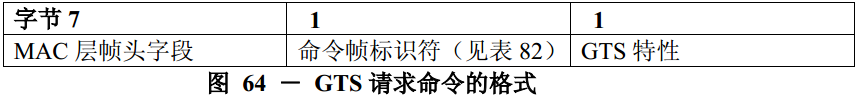
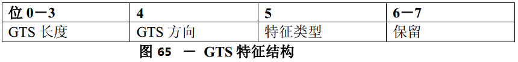

# 7.3.9 GTS 请求命令
>在G3标准中该部分不相关，也就是未使用

　　GTS请求命令用来管理保护时隙。设备可以使用该命令请求分配一个新的保护时隙或者解除已经存在的保护时隙。只有使用小于0xfffe的16位短地址码的设备能够发送该命令。

　　此命令是可选的。

　　GTS请求命令的格式如图64所示。

## 7.3.9.1 MAC层帧头字段
　　帧控制字段的目的寻址模式子字段应设置为0（即目的地址信息不存在），源寻址模式子字段应设置为2（即16位短寻址）。

　　帧控制字段的帧未处理子字段应设置为0并在接收时忽略，应答请求子字段应设置为1。

　　源PAN标识符应包含macPANId值，源地址子字段应包含macShortAddress值。

## 7.3.9.2 GTS特征字段
　　GTS特征字段的格式在图65给出。

　　GTS长度子字段应包含正在为GTS请求的超帧时隙的数目。

　　如果GTS是一个只接收的GTS，GTS方向子字段应设置为1。相反，如果GTS是一个只发送的GTS，则此子字段应设置为0。GTS的方向与设备发送数据帧的方向有关。

　　如果特性涉及GTS分配，则特性类型字段应设置为1；或如果特性涉及清除GTS分配，则设置为0。
