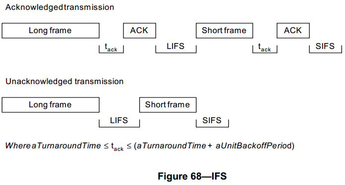

# 7.5.1.3 帧间间隔
>在G3标准中该部分进行了修改
 - 有关帧间间隔的说明，请参见本文件附件4

MAC层需要一定的时间来处理由物理层接收到的数据。为实现此目的，设备发送的两个连续帧之间应该至少留有一个信标间隔期；如果第一个帧发送之后需要确认，确认帧信标间隔期应在确认帧之后。信标帧间隔期的长度决定于已发送帧的大小。长度为 *aMaxSIFSFrameSize* 的帧（即MPDU）应该跟随一个持续至少 *aMinSIFPeriod* 符号的短帧间隔。长度大于 *aMaxSIFSFrameSize* 的帧（即MPDU）应该跟随一个持续至少 *aMinLIFSPeriod* 符号的长帧间隔，如图68所示。

在CAP中，CSMA-CA算法应该将这些传输的具体要求考虑在内。

----
