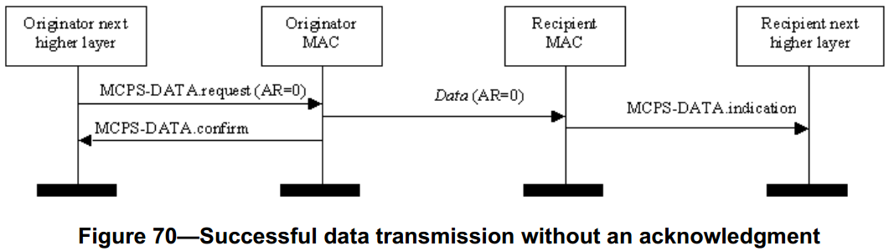
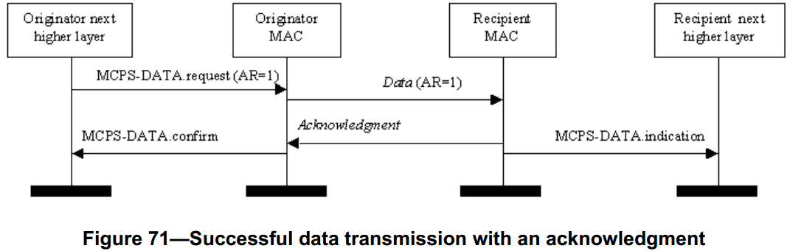

# 7.5.6.4 确认和转发的使用
>在G3标准中该部分作为规范

　　在帧控制字段的确认请求子字段设置适当时才能发送数据帧或者MAC命令帧。通常在确认请求子字段设置为0时发送信标帧和确认帧。同样地，在确认请求子字段设置为0时发送广播帧。

## 7.5.6.4.1 无确认
>在G3标准中该部分作为规范

　　当所发送帧的确认请求子字段设置为0时，发送帧的设备不会得到目标接收设备的确认，因此，发送设备认为该帧发送成功。

　　图70所示的消息时序图，描述了发送设备发送一个不需要确认的数据帧给接收设备的情况。在这种情况下，发送设备所发送数据帧的确认请求子字段（AR）为0。

## 7.5.6.4.2 确认
>在G3标准中该部分进行了修改
 - 本说明书不同地实现确认。 在与本说明书和本文件的附件6相关联的PHY规范中描述了详细的ACK实现。 可以通过调用PD-ACK.request原语来发送ACK。

　　帧控制字段的确认请求子字段设置为1时，接收设备将对发送帧进行确认。如果目标接收设备正确的接收到该帧，它将产生并发送一个确认帧，该确认帧中的数据顺序编号（DSN）与所确认的数据帧或MAC命令帧相同。

　　在不支持信标的PAN中或者在CFP中，将在接收到数据帧或MAC命令帧最后一个符号后的aTurnaroundTime符号时间之后开始发送确认帧。在CAP中，将在接收到数据帧或MAC命令帧最后一个符号后的aTurnaroundTime符号时间之后或者在退避时隙边界开始发送确认帧。在后一种情况下，将在接收到数据帧或MAC命令帧最后一个符号后，在aTurnaroundTime到（aTurnaroundTime+aUnitBackoffPeriod）个符号之间开始发送确认帧。表22（见6.4.1节）中定义了常量aTurnaroundTime。

　　图71中的消息时序图描述了在具有确认的情况下，从发送设备向接收设备发送一个数据帧的流程图。这时，发送设备将把发送数据帧的帧控制字段中的确认请求（AR）子字段设置为1，向接收设备表明要求得到确认。

## 7.5.6.4.3 重传
>在G3标准中该部分作为规范

　　发送帧控制字段中的确认请求（AR）子字段设置为0时，发送帧的设备将认为发送帧已经成功被接收，因此不对帧进行重传。

　　发送确认请求（AR）子字段设置为1的数据帧或MAC命令帧后，发送设备将等待最多macAckWaitDuration符号时间以获得相应的确认帧。如果在macAckWaitDuration符号时间内收到确认帧的DSN与原始发送帧的相同，则认为发送成功，设备不需采取进一步措施。如果在macAckWaitDuration符号时间内没有收到确认帧，或者该确认帧的DSN与原始发送帧的不相同时，设备将认为发送失败。

　　如果发送失败并且以间接的方式发送，协调器将不会重传该数据帧或MAC命令帧。该帧将保留在协调器的事务处理队列中，并只能在收到新的数据请求命令后才能被提取。如果收到了新的数据请求命令，发送设备将使用与原始发送所用相同的DSN发送该帧。

　　如果发送失败并且以直接方式发送，设备将重复发送该数据帧或MAC命令帧，并等待确认，重传次数最多为macMaxFrameRetries次。被发送帧将包含与原始发送所使用的相同的DSN。如果重传能够在原始发送的竞争期或者保护时隙内完成时，才能进行重传，如果时间不够，重传将延时到下一次超帧的相同位置。如果在macMaxFrameRetries次重传之后仍然没有收到确认帧，MAC层将认为发送失败并通知上层。
