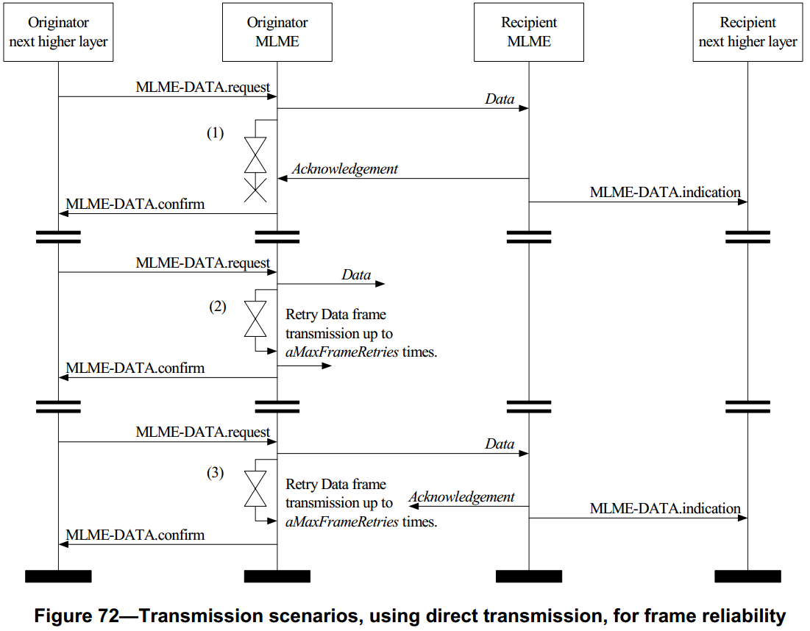

# 7.5.6.6 发送情况
>在G3标准中该部分作为规范

　　由于无线媒介的不完美性，发送的帧不可能总能到达目的地。图72描述了三种数据发送的情况：

　　(1)数据成功发送。发送设备的MAC层通过物理层数据服务将数据帧发送给接收设备。在等待确认时，发送设备的MAC层启动计时器，并且在等待macAckWaitDuration符号时间之后指出超时。接受设备的MAC层接收到数据帧之后将发送一个确认帧给发送设备，并将该数据帧发送给上层。发送设备的MAC层在计时器超时之前接收到来自接收设备的确认后，将关闭并复位计时器。此时数据发送结束，发送设备的MAC层向上层发送成功确认信息。

　　(2)数据帧丢失。发送设备的MAC层通过物理层数据服务将数据帧发送给接收设备。在等待确认时，发送设备的MAC层启动计时器，并且在等待macAckWaitDuration符号时间之后指出超时。如接受设备的MAC层没有接收到数据帧，则不进行确认响应。若发送设备的MAC层计时器在接收到确认之前超时，则数据发送失败。如果是直接发送，发送设备将重传数据，整个序列可最多重传macMaxFrameRetries次。如果该数据发送失败次数达到（1+macMaxFrameRetries），则发送设备的MAC层将向上层发送失败确认信息。如果是间接发送，数据帧将留在事务处理队列中直到收到新的对该数据的请求并正确确认，或者直到macTransactionPersistenceTime时间到。如果该时间到，将丢弃该发送消息，MAC层将向上层发送失败确认信息。

　　(3)确认帧丢失。发送设备的MAC层通过物理层数据服务将数据帧发送给接收设备。在等待确认时，发送设备的MAC层启动计时器，并且在等待macAckWaitDuration符号时间之后指出超时。接受设备的MAC层接收到数据帧之后将发送一个确认帧给发送设备，并将该数据帧发送给上层。发送设备的MAC层没有接收到确认帧，并且计时器超时，则数据发送失败。如果是直接发送，发送设备将重传数据，整个序列可最多重传macMaxFrameRetries次。如果该数据发送失败次数达到（1+macMaxFrameRetries），则发送设备的MAC层将向上层发送失败确认信息。如果是间接发送，数据帧将留在事务处理队列中直到收到新的对该数据的请求并正确确认，或者直到macTransactionPersistenceTime时间到。如果该时间到，将丢弃该发送消息，MAC层将向上层发送失败确认信息。

