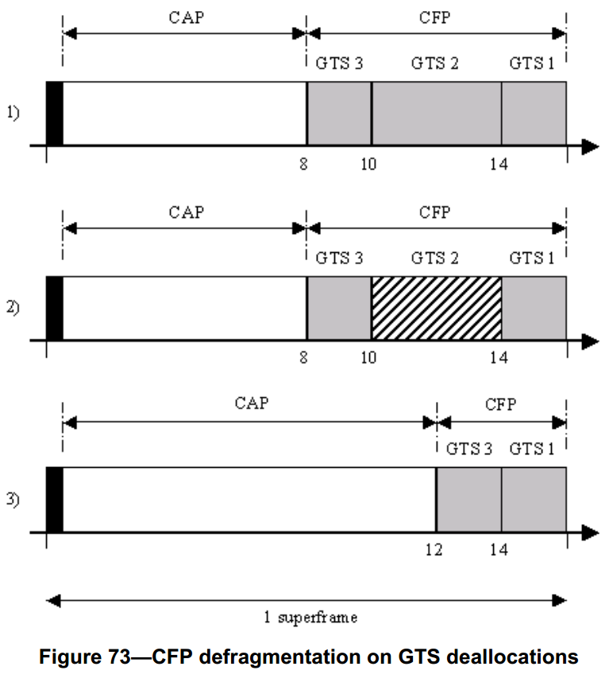

#7.5.7.5 GTS的重新分配
>在G3标准中该部分不相关，也就是未使用

　　保护时隙的释放可能导致超帧变得破碎。例如，图73所示描述了分配保护时隙的3个阶段。在第1阶段，分别在14，10和8时隙，分配3个保护时隙。在第2阶段，如果释放GTS2，则在超帧中存在一个时隙，不会进行任何事务的处理。为了解决这个问题，在第3阶段，必须移动GTS3来弥补这个间隙，因此，加了CAP的长度。

　　PAN协调器将确保删除由于释放GTS在CFP中所产生的间隙，以保持CAP长度最大。

　　当PAN协调器释放一个GTS时，它将在信标帧中加一个GTS描述符，表示已经释放GTS。如果设备执行了GTS的释放，PAN协调器将不会在信标帧中加GTS描述符来表明该GTS的释放。对于每一个所分配的GTS比起始时隙所释放的GTS的起始时隙更晚的设备来说，PAN协调器将用新的起始时隙来更新GTS，并在信标帧中加所调整的GTS对应的描述符。如果GTS出现在CFP的末端或者CFP中的下一个GTS的开始，将计算新的起始时隙，以便在该GTS和CFP的两个端点之间没有空余。

　　在同一时间内，如果发生多个重新分配GTS的情况，PAN协调器可能选择分步骤的方式来进行重新分配。PAN协调器将在它的信标中保留每一个描述符，时间为aGTSDescPersistenceTime个超帧。

　　一旦设备收到的信标帧包含有一个与macShortAddress相应的描述符，并且方向和长度与它的一个GTS相对应时，将根据该GTS描述符来调节GTS的起始时隙，并立即开始使用该GTS。

　　对于PAN协调器，如果在信标中包括GTS描述符是必需的，它将允许PAN协调器将其竞争期降低至aMinCAPLength以下，以便用来容纳信标帧长度的暂时增加。在aGTSDescPersistenceTime个超帧时间之后，PAN协调器将从信标中删除GTS描述符。
