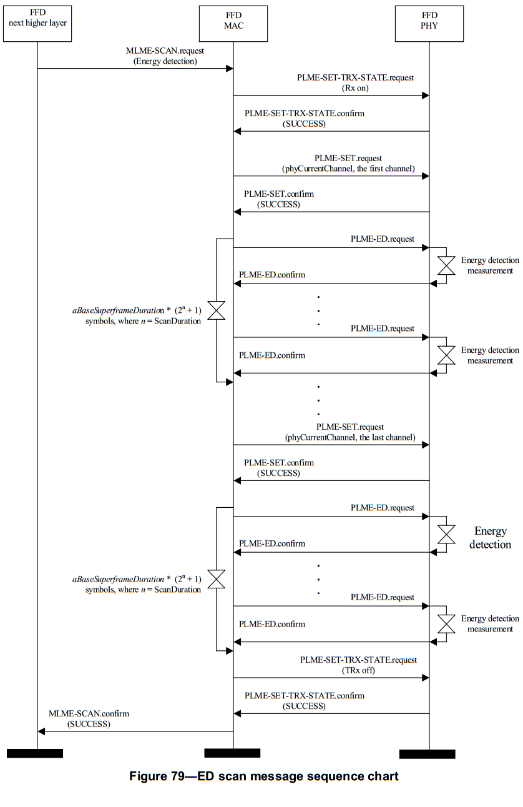
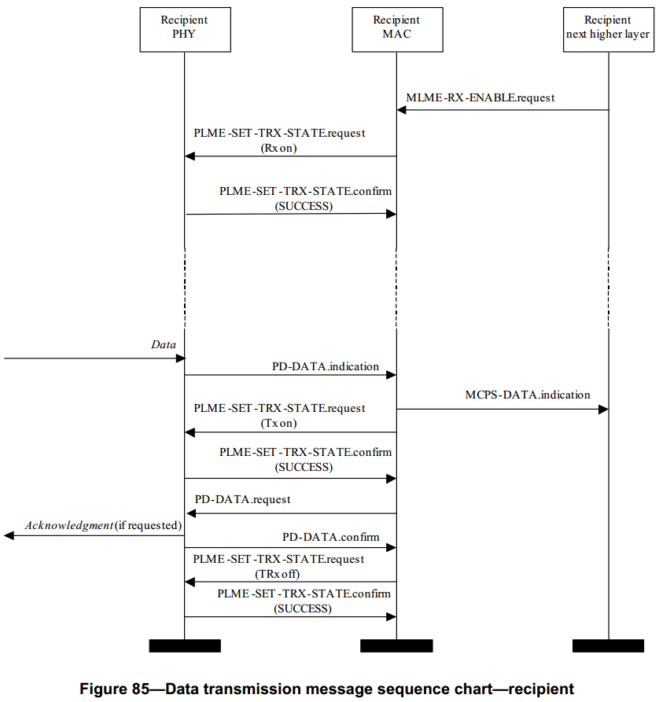

# 7.7 消息队列图表
>在G3标准中该部分进行了修改
 图78：由本文档的第4.7.1节替换
 图79：N / R
 图80：N / R
 图81：N / R
 图82：N / R
 图83：由本文档第4.7.2节替换
 图84和 图85：由本文档的第4.7.3节替换
 图86：N / R
本文档第4.7.4节中关于信道估计的附加图

G3应用图1－PAN开始消息序列表
 
 

G3应用图3－主动扫描消息序列表
 
 

G3应用图4－数据发送消息序列表
 
 

G3应用图5－TMR消息序列表

----

　　本节描述本标准指定的主要任务。每个任务使用一个消息序列表来描述命令出现的顺序，而不是描述每个原语请求的准确时间。

　　PAN协调器开始一个新的PAN所需的原语，在图78给出。在MAC层复位之后，上层任务的第一个动作就是初始化扫描来搜索本地区中其他的PAN。要求主动扫描，能量检测扫描可选择执行。执行主动扫描和能量检测扫描的步骤分别在图83和79中给出。

　　一旦一个新的PAN建立，PAN协调器准备接收来自其他设备加入PAN的请求。图80显示了设备发送请求连接的原语，同时在图81描述了协调器允许连接的步骤。在加入PAN的过程中，设备请求连接首先执行主动或被动扫描，决定网络内的哪些PANs允许连接；图82和图83分别详述了完成主动扫描和被动扫描所需的原语。

　　接下来给出了发送和接收一个数据包所需的原语。数据包发送者承担的动作在图84中给出，同时接收器承担的动作在图85中给出。

　　当一个设备不能再跟它的协调器通信的时候，设备能可以使用孤立扫瞄重新发现协调器。孤立设备重新组网所需的原语在图86中给出.

图78－PAN开始消息序列表－PAN协调器

图79－能量发现扫描消息序列表

图80－连接消息序列表－设备

图81－连接消息序列表－协调器

图82－被动扫描消息序列表

图83－主动扫描消息序列表

图84－数据发送消息序列表－发送者

图85－数据发送消息序列表－接收者

图86－孤立设备重新连接消息序列表

