# 7.8.4 Data Frame Format, Datagram Transmission and Addressing 数据帧格式，数据报传输和寻址
　　本节内容完全是对比RFC4944。

## 7.8.4.T1 简介
>在G3标准中该部分作为规范

　　IEEE802.15.4标准[ieee802.15.4]的目标是低功耗个人局域网。本文定义了　　在IEEE802.15.4网路上传送IPv6[RFC2460]报文的帧格式和IPv6链路地址和无状态自动配置地址等信息。由于IPv6的报文长度比IEEE802.15.4最大帧长还要大得多，所以这里定义了一个适配层。为了使IPv6能在IEEE802.15.4网路上运行和在IEEE802.15.4meshs上进行报文传送，本文还定义了报文压缩机制。然而，一个完整的mesh路由定义（使用特定的协议，集成邻居发现等）不在本文的讨论范围内。

### 7.8.4.T1.1符号说明
>在G3标准中该部分作为规范

　　本文使用的关键词“MUST”、“MUSTNOT”、“REQUIRED”、“SHALL”、“SHALLNOT”、“SHOULD”、“SHOULDNOT”、“MAY”和“OPTIONAL”请参考[RFC2119]的描述。

### 7.8.4.T1.1.2术语使用
>在G3标准中该部分作为规范

AES - Advanced Encryption Scheme
高级加密标准
CSMA/CA - Carrier Sense Multiple Access / Collision Avoidance
载波侦听多路访问/冲突避免
FFD - Full Function Device
全功能设备
GTS - Guaranteed Time Service
保护时隙
MTU - Maximum Transmission Unit
最大传输单元
MAC - Media Access Control
介质访问控制
PAN - Personal Area Network
个人局域网
RFD - Reduced Function Device
简化功能设备

## 7.8.4.T2 IP的IEEE802.15.4形式
>在G3标准中该部分进行了修改
 所有数据帧都需要确认
 仅在无信标网络上使用

　　IEEE802.15.4定义了4种帧：信标帧、MAC指令帧、确认帧和数据帧。IPv6报文必须放在数据帧里。数据帧要求进行确认是可选的。为了符合[RFC3819]，为了帮助链路恢复，建议IPv6报文放在需要确认的帧上进行传送。

　　IEEE802.15.4网路可以是非信标使能或信标使能的[ieee802.15.4]。后者是设备被叫作协调器信标同步的一个可选方式。这使得在一个非竞争的时间保证服务（GTS）内使用超级帧成为可能。本文并没要求IEEE网路运行在信标使能模式。在非信标使能网路中，数据帧（包括运载IPv6报文的）是通过基于竞争的无槽CSMA/CA通道访问方法来传送的。

　　在非信标使能网路中，同步过程不使用信标。然而，它们仍然对事件的关联和解除关联上的链路层设备发现是有用的。本文建议配置信标以实现这些功能。另一个建议是为了使这些事件在IPv6层的可用以便于检测网路附件，一个IETF正在研究的问题。

　　标准里允许帧省略源地址或目标地址（或两者）。本文定义的机制要求IEEE802.15.4帧头里包含源地址和目标地址。同样包含源和目标的PANID域。

## 7.8.4.T3编址模式
>在G3标准中该部分进行了修改
 不支持通过路由器通告的IPv6前缀学习

　　IEEE802.15.4定义了两种编址模式：64位扩展地址模式和（在设备与网络关联后）16位地址模式（这个地址在PAN网络中是唯一的）。本文档既支持64位扩展地址，又支持
16位短地址。本文对16位短地址的格式增加了一些限制（除了IEEE802.15.4要求的之
外），具体描述见第12章。短地址实质上是瞬态的，需要注意的是：由于短地址是由PAN协调器在进行关联操作时分配的，所以它们只在此次关联的生命周期内是有效的、唯一的。当关联周期到期，或者PAN协调器发生灾难时，短地址的生命周期就结束了。由于集中分配和PAN协调器的单点故障而产生的可伸缩问题，开发者在使用短地址部署网络时必须仔细权衡网络的增长（并实行必要的机制）。当然，IEEE64位扩展地址就不会有这样的缺点，但仍然会有一些可伸缩问题，比如路由、设备发现、配置等。

　　本文假定一个PAN映射到一个特定的IPv6连接。这符合共享网络支持链路层子网广播
的建议[RFC3819]。严格来说，在IPv6里存在多播而不存在广播。而IEEE802.15.4不支持多播，所以IPv6层多播报文必须放在IEEE802.15.4网路的链路层广播帧里。这是强制要求的，因为广播帧只被特定链路的PAN里的设备所接收。安装[ieee802.15.4]第.5.6.2的要求，必须要实现如下两点：  
　　1.帧里包含一个目的PAN标识符，它必须与链路层的PANID相匹配。  
　　2.帧里包含一个目的短地址，它必须与广播地址（0xffff）相匹配。  

　　另外，第9章的IPv6多播地址映射的支持必须只用在一个mesh配置里。本文对这个功
能不做更具体的描述。

　　通常，主机从路由器广告里学习IPv6前缀[RFC4861]。

## 7.8.4.T4最大传输单元MTU
>在G3标准中该部分作为规范

　　在IEEE802.15.4上的IPv6报文最大传送单元是1280字节。然而，一个IEEE802.15.4帧
里容不下一个完整的IPv6报文。802.15.4协议数据单元的大小取决于报文头的大小[ieee802.15.4]。由于一个物理层的最大帧长是127字节（aMaxPHYPacketSize）且一个最大帧头长度是25字节（aMaxFrameOverhead），所以MAC层的最大帧长是102字节。链路安全协议还需要增加报头长度，最大的情况（对于AES-CCM-128来说是21字节，AESCCM-32和AES-CCM-64分别是9和13字节），只剩下81字节可用。这明显远不够IPv6报文的最小长度1280字节，为了和第5章的IPv6规范[RFC2460]一致，IP层下必须提供一个分片和重组的适配层。适配层在第5节定义。

　　另外，由于IPv6报头长度是40字节，这就只剩下41字节给上层协议，如UDP。UDP使用
8字节的报头，那应用数据就只剩下33字节了。并且，如上面提到的，还需要一个分片和重组的适配层，这将消耗更多的报头字节。

　　上述问题引起了如下两点：
- 1.适配层必须满足IPv6对于最小MTU的要求。然而
   * (a)多数IEEE802.15.4应用并不会使用这么大的报文
   * (b)小量的应用数据和使用合理的报头压缩可以产生适合于一个IEEE802.15.4帧的报文。
   使用适配层的理由不仅是为了满足IPv6报文，极有可能一些应用交换（如配置或服务）产生的报文也需要少量的分片。
- 2.即使上述计算显示的是最坏情况的场景，它的确显示出了事实上报文压缩几乎是不可避免的。我们希望多数（如果不是全部）IEEE802.15.4使用IP的应用会用到报头压缩，这第10章定义。

-----
* aMaxPHYPacketSize，aMaxFrameOverhead是IEEE802.15.4中定义的两个常量，其值分别是127和25。
-----

## 7.8.4.T5 LoWPAN适配层和帧格式
>在G3标准中该部分进行了修改
 当在同一分组中使用多个LoWPAN报头时，它们必须按以下顺序出现：
 mesh寻址头
 广播头
 分段头
 命令帧头（稍后定义）

　　本章所说的封装格式（在后面也叫做“LoWPAN封装”）是IEEE802.15.4协议数据单元
（PDU）的负载。这个封装头的后面是LoWPAN的负载（比如IPv6报文）。

　　所有通过IEEE802.15.4传输的LoWPAN封装报文的前缀都来自于封装头部栈。封装头部栈中的每个头部都由头部类型和紧跟在头部类型后的零个或多个头部字段组成。对于IPv6的报文头部，其栈依次包含地址、逐跳选项、路由、分片、目的选项和负载[RFC2460]；对于LoWPAN的报文头部，类似的序列是mesh（L2）地址、逐跳选项（包括L2广播/多播）、分配和负载。以下的例子展示了在LoWPAN网络中可能用到的典型的报头栈结构。

一个LoWPAN封装的IPv6报文：
  +---------------+-------------+---------+
  | IPv6 Dispatch | IPv6 Header | Payload |
  +---------------+-------------+---------+

一个LoWPAN封装的LOWPAN_HC1压缩IPv6报文
 +--------------+------------+---------+
 | HC1 Dispatch | HC1 Header | Payload |
 +--------------+------------+---------+

一个LoWPAN封装的采用LOWPAN_HC1压缩的、需要mesh寻址的IPv6报文：
 +-----------+-------------+--------------+------------+---------+
 | Mesh Type | Mesh Header | HC1 Dispatch | HC1 Header | Payload |
 +-----------+-------------+--------------+------------+---------+

一个LoWPAN封装的采用LOWPAN_HC1压缩的、需要分片的IPv6报文:
 +-----------+-------------+--------------+------------+---------+
 | Frag Type | Frag Header | HC1 Dispatch | HC1 Header | Payload |
 +-----------+-------------+--------------+------------+---------+

一个LoWPAN封装的采用LOWPAN_HC1压缩的、需要mesh寻址的、需要分片的IPv6报
文：
 +-------+-------+-------+-------+---------+---------+---------+
 | M Typ | M Hdr | F Typ | F Hdr | HC1 Dsp | HC1 Hdr | Payload |
 +-------+-------+-------+-------+---------+---------+---------+

　　当一个报文里出现多个报头时它们必须以以下的顺序出现：
　　 mesh 寻址头
　　 广播头
　　 分片头

　　如上面所给出的例子中那样，所以的协议头（比如IPv6、压缩的IPv6头等）都应该在一个有效的 LoWPAN 封装报头后面。这可以统一软件对报文的处理而不管传送方式是什么。

### 7.8.4.T5.1 分派类型和报头

　　分派类型定义为第1位为0第2位为1。分派类型和报头如下图所示：

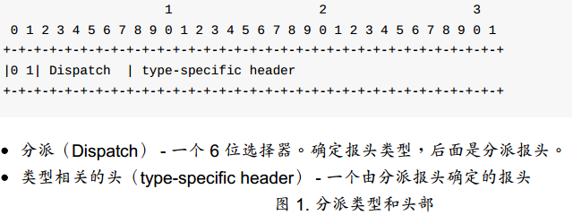

　　分派值可以看作一个非正式的命名空间，我们只需要少量的符号就可以表示当前LoWPAN的功能。尽管将附件功能编码到分派类型中可以节省空间，但这种方法可能对未来扩展功能有所限制。

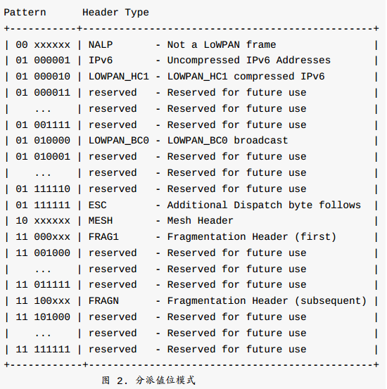

* NALP：指明接下来的比特位不是LoWPAN封装的一部分，所有的LoWPAN节点应该丢弃收到的分派值为00xxxxxx的报文。其它想要与LoWPAN节点兼容的非LoWPAN协议应该使802.15.4头部后面的第一个字节与这种模式相匹配。
* IPv6：指明接下来的头是无压缩的IPv6报头[RFC2460]。
* LOWPAN_HC1：指明接下来的报头是一个LOWPAN_HC1压缩的IPv6报头。这个报头格式定义如图9所示。
* LOWPAN_BC0：指明接下来的报头是一个LOWPAN_BC0报头，它支持mesh广播/多播，在11.1节进行描述。
* ESC：指明接下来的报头是一个用于分派值的单独的8位字段。它允许支持分派值大于
127。

### 7.8.4.T5.2 Mesh寻址类型和报头
>在G3标准中该部分进行了修改
 HopsLeft字段的值不得超过adpMaxHops

　　前两位为10表示Mesh类型。Mesh类型和报头如下图所示：

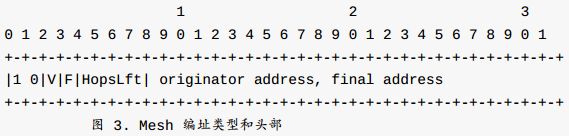

　　各字段定义如下：
* V：如果源地址（最初始节点的地址）是一个IEEE扩展64位地址（EUI－64），这位就是0；如果是16位短地址，这位就为1。
* F：如果最终目标地址是一个IEEE扩展64位地址（EUI－64），这位就是0；如果是16位短地址，这位就为1。
* 剩余跳数（HopsLeft）：该字段占4位。转发节点将报文转发给下一跳之前将该字段减1。如果值减至0，报文将不会被转发。值0xF是保留的，表示接下来的一个字节是一个8位剩余跳数字段，这允许源节点指定一个大于14的跳数限制。
* 原始地址（OriginatorAddress）：原始节点的链路层地址。
* 最终目的地址（FinalDestinationAddress）：最终目的节点的链路层地址。

　　注意到‘V’和‘F’位允许16位和64位地址的混合。这至少对于允许mesh层“广播”是有用的，因为802.15.4广播地址定义的是16位短地址。

　　关于在mesh网路中传送帧的内容将会在第11节进行具体的讨论。

### 7.8.4.T5.3 分片类型和报头

　　如果一个完整的负载（如IPv6）数据报装在一个单独的802.15.4帧里，它就是不分片的，那么LoWPAN封装就不必包含一个分片报头。如果数据报无法封装在一个单独的EEE802.15.4帧内，它应该在链路层进行分片。因为碎片偏移量只能表示为8字节的倍数，所以除了最后一片外的所有分片大小都必须为8字节的整数倍。第一个链路分片应该包含第一个分片报头，其定义如下图所示：

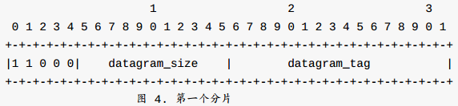

　　第二个和以后的链路分片（直到包含最后一个）应该包含的分片报头，如下图所示：

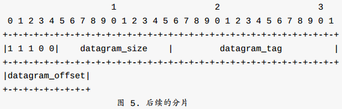

* 数据报大小（datagram_size）：该字段占11字节，表示在链路分片之前（但在IP层分片之后）的整个IP报文的大小。对于一个IP报文来说，所有分片的datagram_size的值都应该是相同的。对于IPv6，这个值应该是比报文里IPv6报头[RFC2460]的负载长度多40字节（无压缩的IPv6报头的长度）。注意，这个报文可能已经由参与通信的主机进行分片了，也就是说，这个字段需要设置最大长度是1280字节（IEEE802.15.4链路MTU，如在本文所定义的那样）。
 **注意：不是每个报文都需要这个字段。如第一个分片里含有这个字段，后面分片就可以省略该字段。然而，如果每个链路分片都包含这个字段，能简化当第二个分片（或更后面的分片）比第一个分片早达到时进行重组的过程。在这种情况下，接收端在收到任一个分片后就可以知道datagram_size的值，可以更早地知道需要设置多大的缓存空间。**

* 数据报标签：一个负载（比如IPv6）数据报的所有链路分片的数据报标签的值是相同的。发送者应该对连续的分片数据报递增datagram_tag的值。当datagram_tag的值递增到大于65535时应该变为0。这个字段占16位，它的初始值没有定义。

* 数据报偏移（datagram_offset）：这个字段只出现在第二个和之后的链路分片里，表示从负载数据报开始的以8字节为增量的分片偏移量。数据报的第一个字节（例如IPv6报头的开始）的偏移量是0；第一个链路分片的datagram_offset隐含值是0。这个字段占8位

　　链路分片的接收者应该使用（1）发送者的802.15.4源地址（或Originator Address如果出现了Mesh Addressing字段），（2）目标的802.15.4地址（或Fina lDestination Address如果出现了Mesh Addressing字段），（3）datagram_size和（4）datagram_tag来确定一个给定数据报的所有链路分片。

　　在收到一个链路分片后，接收者开始构造大小为datagram_size的未分片的原始报文。它使用datagram_offset字段来确定每一个分片在原始报文中的位置。例如，它把数据载荷（ 除了封装报头） 放在一个位置由datagram_offset确定的载荷数据报重组缓存里。重组缓存的大小应该由datagram_size来确定。

　　在检测到一个IEEE802.15.4分裂事件时，分片接收者必须丢弃所有部分重组的载荷数据报所有的链路分片，分片发送者必须丢弃部分发送的载荷（如IPv6）数据报的未发送的链路分片。类似地，当一个节点接收到第一个给定datagram_tag的分片，它开始一个重组定时器。当定时时间到，如果整个报文没有重组完成，现有的分片必须丢弃，并且重组状态必须重设。重组超时的最大时间必须为60秒（这也是IPv6重组程序的最大超时[RFC2460]）。

## 7.8.4.T6 无状态地址自动配置
>在G3标准中该部分进行了修改
 - IEEE 802.15.4接口的接口标识符[RFC4291]必须基于分配给IEEE 802.15.4设备的EUI-64标识符[EUI64]，最新的标识符本身基于EUI-48。
 - 选择PAN标识符时必须额外注意，以免干扰接口标识符的I / G和U / L位。 如果随机选择PAN标识符，则应该与0xFCFF逻辑AND。

　　本章定义如何获得IPv6接口标识符。

　　IEEE802.15.4接口的接口标识符[RFC4291]可能是基于分配给IEEE802.15.4设备的UI-64标识符[EUI64]生成的。在这种情况下，先按照“以太网上的IPv6”规范[RFC2464]生成一个EUI-64，然后根据这个EUI-64构成一个接口标识符。

　　所有的802.15.4设备都有一个IEEEEUI－64地址，同时也可能有一个16位短地址（第3章和第12章）。在这种情况下，一个“假的48位地址”的产生过程如下：首先，左32位由16位0和16位PANID（可选，如果不知道PANID，就用16位0）组成。这样产生的32位字段如下所示：

>16位PANID:16位0

　　然后，将这这生成的32位和16位短地址串接在一起，就产生了48位地址：

>如上所示的32位:16位短地址

　　由这48位则构成了类似于“以太网上的IPv6”规范[RFC2464]中规定的接口标识符。不过，这样形成的接口标识符并不是全球唯一的，所以要将“全局/本地”（U/L）位置为0。

　　也可以使用由人工或者软件设置的MAC地址来构成接口标识符。在这种情形下，它的全
局唯一性应该反映到“全局/本地”（U/L）位上。

　　IEEE802.15.4接口上用于无状态自动配置[RFC4862]的IPv6地址前缀长度必须是64
位。

## 7.8.4.T7 IPv6链路本地地址
>在G3标准中该部分作为规范

　　前缀FE80::/64与IEEE802.15.4接口标识符共同构成IPv6链路本地地址[RFC4291]，如下所示:

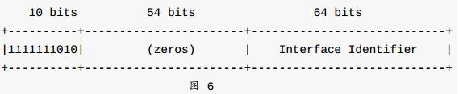

## 7.8.4.T8 单播地址映射
>在G3标准中该部分作为规范

　　除非特别说明，用于将IPv6非多播地址映射到IEEE802.15.4链路层地址的地址解析程序（ARP）遵循[RFC4861]7.2节的通用描述。

　　当链路层是IEEE802.15.4，地址是EUI-64或16位短地址时，源/目标链路层地址选项分别有以下的形式：

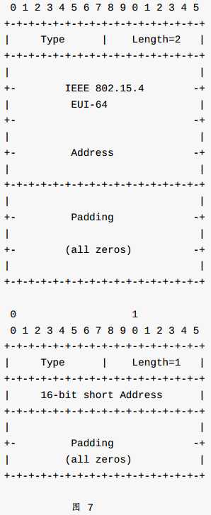

　　可选字段：  

* 类型（Type）： 1：源链路层地址。 2：目的链路层地址。
* 长度（Length）：这是这个选项（包含type和length字段）的长度，单位是字节。如果使用EUI-64地址，这个字段的值为2，如果使用16位短地址，这个字段的值为1。
* IEEE802.15.4地址：64位的IEEE802.15.4地址，或16位短地址（如第9章所描述的格式），使用正则位顺序。这是接口可响应的地址。缘于隐私或安全（如邻居发现）的考虑，这个地址可能与用于产生接口标识符的内建的地址不同。

## 7.8.4.T9 多播地址映射
>在G3标准中该部分作为规范

　　这一节里的功能必须在一个mesh使能的LoWPAN里使用。一个有多播目标地址（DST）的IPv6报文，将会传输到以下802.15.4的16位多播地址：

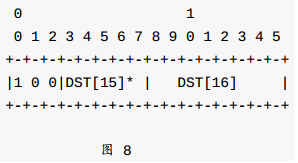

　　这里，DST[15]\*表示DST[15]的后5位，那就是，DST[15]里的3－7位。开始的3位序列“100”紧跟在16位短地址格式后面用于多播地址（节12）。

　　这允许在6LoWPAN网路中支持多播，但具体的多播方式不在本文的描述范围内。机制示例是：泛洪、受控泛洪、单播到PAN协调器等。这应该由不同的mesh路由机制来描述。

## 7.8.4.T10 报头压缩
>在G3标准中该部分作为规范

　　尽管存在很多已被发行和正在制定的头部压缩标准，但是我们可以将对运行在IEEE802.15.4之上的IPv6进行头部压缩时面临的各种限制总结如下：

* 现有标准都假设在任何两个设备之间存在很多流量。我们假设存在一个简单的、与上下文不太相关的报头压缩。这种压缩与流量无关，不使用与任何流量相关的任何上下文，因此其压缩效果没有为每个流量构建独立上下文的效果好。

* 由于报文尺寸极其有限，所以非常有必要对第2层和第3层进行压缩。这是传统压缩没有做的事（尽管现在有了ROHC（RObust报头压缩）工作组而正在改变）。

* 尽管IEEE802.15.4设备应该部署在多跳网路中，但是在传统的点对点链路场景下，压缩者和解压缩者是直接与对方通信并独占链路的。在IEEE802.15.4网络中，设备最好能（使用尽量少的初始化工作）通过它的任何邻居发送头部压缩过的报文。

　　通过使用不同的分派值，报头压缩所需要的任何新报文格式都可以重用第5章中所定义
的基本报文格式。

　　报头压缩可能导致不能字节边界对齐。由于硬件通常不能传输小于一个字节的数据单
元，所以必须使用填充位。填充的步骤：首先，将所有连续的压缩报头按位排序（本文只定义了IPv6和UDP报头压缩机制，但其它的可能在别处定义）。然后，用若干位0进行填以与字节边界对齐。这消除了所有由报头压缩产生的不对齐，所以后续字段（例如非压缩报头、数据载荷）就从正常的字节边界开始了。

### 7.8.4.T10.1 IPv6报头字段压缩
　　由于加入到同一个6LoWPAN网络，所以设备间可以共享一些状态。这使得在压缩报头时可以不用明确创建任何内容状态。因此，6LoWPAN报头压缩并不保留任何流量状态，反而依赖于与整个链路相关的信息。以下的IPv6报头值对于6LoWPAN网络是通用的，所以
HC1报头从一开始用于高效压缩：
* 版本是IPv6；
* IPv6源和目标地址都是链路本地地址；
* 源地址和目标地址的IPv6接口标识符（后64位）可以从第二层的源和目标地址（当然，这是只能由一个802.15.4MAC地址来产生接口标识符）推断出；报文长度可以从第二层（IEEE802.15.4 PPDU里的“帧长”）或分片报头（如果有）的“datagram_size”字段来获得；
* 业务类型字段和流量标签字段都是0；
* 下一个报头是UDP，ICMP或TCP；

　　IPv6头部字段中唯一一个不需要压缩的字段是跳数限制字段（8位）。依赖于报文与这种通用情形的匹配程序，一些字段可能不需要压缩而直接内嵌传输（第10.3.1节）。通用IPv6头部（如上面提到的）可以被压缩到2字节（1字节的HC1编码和1字节的跳数限制），而不是40字节。这样的报文可通过LOWPAN_HC1格式来进行压缩，即通过使用LOWPAN_HC1的分派值以及后面的LOWPAN_HC1报头里“HC1编码”字段（8位）来编码不同的组合，如下图所示。这个报头前面可能是一个分片报头，再前面可能是一个mesh报头。

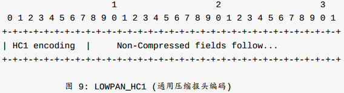

　　如下面所示（比特7），一个HC2编码后面可能是一个HC1字节。在这种情况下，HC2编码字段后面是一个非压缩字段（节10.3）。

　　由“HC1编码”产生的地址字段解释如下所示：
* PI：内嵌的前缀(第10.3.1节)。
* PC：压缩的前缀（假定是链路本地前缀）。
* II：内嵌的接口标识符（第10.3.1节）。
* IC：省略的接口标识符（从相应的链路层地址获得的）。如果在一个mesh路由中使用源或目标地址的接口标识符（第11章），相应的链路层地址是“Mesh Addressing”字段里的地址（第5.2节）。

“HC1编码”如下所示（比特0到比特7）：

* IPv6源地址（比特0和1）：
  - 00：PI，II
  - 01：PI，IC
  - 10：PC，II
  - 11：PC，IC
* IPv6目标地址（比特2和3）：
  - 00：PI，II
  - 01：PI，IC
  - 10：PC，II
  - 11：PC，IC
* 交通等级和流量标签（比特4）：
  - 0：非压缩的；全8位的交通等级和20位的流量标签都会发送
  - 1：交通等级和流量标签都为0
* 下一报头（比特5和6）：
  - 00：非压缩的；全8位都会发送
  - 01：UDP
  - 10：ICMP
  - 11：TCP
* HC2编码（比特7）：
  - 0：没有更多的报头压缩位
  - 1：HC1编码后面有更多HC2编码格式的报头压缩位。位5和6确定了HC2编码的用途（例如，UDP，ICMP或TCP编码）。

### 7.8.4.T10.2 UDP报头字段编码
　　LOWPAN_CH1的比特5和比特6允许对IPv6头部（UDP,TCP和ICMP）中的下一个头部字段进行压缩。对这些协议的头部进行进一步压缩也是可能的，但是在本节主要解释UDP头部本身是如何进行压缩的。在本节中，LOWPAN_CH2编码就是HC_UDP编码，且只在HC1中的比特5和比特6表示IPv6头部后的协议是UDP时才有效。HC_UDP编码（图10）允许压缩UDP头部中的如下字段：源端口、目的端口和长度。UDP头部的检验和字段不能被压缩，因此它必须被完全传输。下面定义的机制可以让UDP的头部由原始的8字节压缩到4字节。

　　在UDP头部中，唯一一个能出其它地方推断出的字段是长度字段。其它的字段必须被完全嵌入或者部分压缩的方式嵌入。

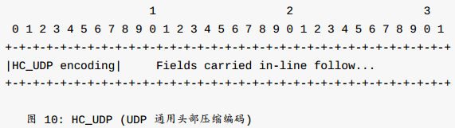

　　UDP的“HC_UDP”编码如下所示（从比特0到比特7）：
* UDP源端口（比特0）：
  - 0:非压缩的，“内嵌”运载（第10.3.2节）。
  - 1:压缩到4位。实际的16位源端口通过计算得到：P+short_port。P的值是61616（0xF0B0）。short_port是一个“内嵌传输的4位值（第10.3.2节）。
* UDP目标端口（比特1）：
  - 0:非压缩的，“内嵌”运载（第10.3.2节）。
  - 1:压缩到4位。实际的16位目的端口通过计算得到：P+short_port。P的值是61616（0xF0B0）。short_port是一个“内嵌传输的4位值（第10.3.2节）。
* 长度（比特2）：
  - 0:非压缩的，“内嵌”运载（第10.3.2节）.
  - 1:压缩的，长度从IPv6报头长度信息来计算而来。UDP长度字段的值等于IPv6报头的载荷长度减去出现在IPv6报头和UDP报头之间的任何扩展报头的长度。
* 保留（比特3到7）

### 7.8.4.T10.3 非压缩字段
#### 7.8.4.T10.3.1 非压缩的IPv6域
　　这种方法允许把IPv6报头压缩到不同的程度。所以，只有非压缩域将会发送，而不是整个（标准）IPv6报头。紧接着的报头（如原始IPv6报头里的下一个报头所指定的）跟在IPv6非压缩域后面。

　　非压缩的IPv6寻址是由一个包含IPv6分派值的分派类型来描述的，后面接的是非压缩IPv6报头。这个分派类型前面可能有附加的LoWPAN报头。

　　非压缩IPv6域里必须总是出现的是跳数限制（8位）。这个域必须总是跟在编码域后面（如图9的“HC1编码”），还可能包含其他未来的编码域）。其他非压缩域必须跟在跳数限制后面，如前面（节10.1）所述的“HC1编码”的顺序一样：源地址前缀（64位）和/或接口标识符（64位），交通等级（8位），流量标签（20位）和下一报头（8位）。实际的下一报头（如UDP，TCP，ICMP，等）跟在非压缩域后面。

#### 7.8.4.T10.3.2 非压缩的和部分压缩的UDP域
　　这个方法允许对UDP报头压缩到不同程度。因此，只有非压缩的或部分压缩的域需要发送，而不是整个（标准）UDP报头。

　　UDP报头里的非压缩或部分压缩域必须总是跟在IPv6报头和任何相关的内嵌域后面。任何UDP报头内嵌域必须和一个通用UDP报头[RFC0768]里的顺序一样，那就是，源端口，目标端口，长度和校验和。如果源或目标端口是“short_port”格式的（如压缩UDP报头里指定的），内端口号只占4位，而不是占16位。

## 7.8.4.T11 链路层Mesh的帧传送
>在G3标准中该部分进行了修改
 所有的设备都必须是FFD

　　即使802.15.4网路应该尽量使用mesh路由，但是IEEE802.15.4－2003标准[ieee802.15.4]并没有定义这种功能。在这种情况下，全功能设备（FFDs）以ad hoc或mesh路由协议方式运行，形成自己的路由表（不在本文讨论范围内）。在这样的mesh场景下，两个设备不需要直接连接才能进行通信。对于这些设备，发送者表示为“发起端”，接收都表示为“目标端”。一个发起端设备可能通过其他中间设备来转发数据到目标端。为了使用单播完成这样的帧传送，除了跳与跳的源地址和目标地址外，还有必要包括发起端和目标端的链路层地址。

　　本节定义如何有效地在一个mesh中传送第二层帧，使用一个目标“目标端”链路层地址。Mesh传送成为可能要达到以下条件，一个LoWPAN封装（节5）里的在其他报头之前的Mesh寻址报头，一个非分片的和分片的报头；一个完整的IPv6报头；或一个压缩的IPv6报头如节10或其他地方定义的那样。

　　如果一个节点希望使用一个默认的mesh转发节点来传送报文（也就是，它不能与目标节点直接通信），它必须包含一个Mesh寻址报头，报头发起端链路层地址是它自己，目标端链路层地址是报文的最终目标。它设置IEEE802.15.4报头里源地址为自己的链路层地址，目标地址为转发节点的链路层地址。最后就可传送报文。

　　类似地，如果一个节点接收到一个包含Mesh寻址报头的帧，它必须检查Mesh寻址报头里的“目标端”域来确定真正的目标。如果节点是最终目标，它如正常传送那样处理报文。如果它不是最终目标，节点会对“HopsLeft”域减1，如果结果是0，丢弃报文。否则，节点查询自己的链路层路由表，以确定到达最终目标的下一跳节点是什么，然后把下一跳地址放到802.15.4报头的目标地址域里。最后，节点把802.15.4报头的源地址变成自己的链路层地址然后发送报文。

　　鉴于节点必须在一个mesh路由协议里充当转发者，不是所有节点都要求进行mesh转发。只有“全功能设备”（FFDs）才需要在mesh网路中充当路由器。“简化功能设备”（RFDs）只限于发现FFDs然后使用它们进行转发，形式上类似于IP主机通常使用默认路由来转发所有的无连接数据包。对于一个使用mesh传送的RFD，“转发者”总是某一个恰当的FFD。

### 7.8.4.T11.1 LoWPAN广播
>在G3标准中该部分作为规范

　　在mesh报头后是一个具有mesh路由功能的路由报头。特别地，一个广播报头包含一个
LOWPAN_BC0分派和一个序列号。序列号用于检测重复报文（并抑制它们）。

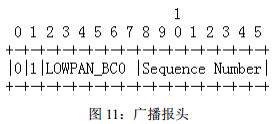

* 域定义如下所示：
  - SequenceNumber：这个8位域由发起端进行递增操作，不管是发送一个新的mesh广播或多播报文。具体的操作方法不在本文范围内。

　　这个mesh层广播的进一步描述，如映射到流量控制机制，拓扑发现等都不在本文的讨论范围内。

　　另外的mesh路由功能，如具体的mesh路由协议，源路由等可以在增加额外的路由报头来实现分片和寻址功能。具体的mesh路由功能不在本文的讨论范围内。

## 7.8.4.T12 IANA事项
>在G3标准中该部分作为规范

　　本文创建2个新的IANA注册，如下所示。这些注册的未来任务是与IANA协调，并遵守“必要说明”[RFC2434]里的规则。这些规则允许其他（非IETF）组织更容易得到任务分配。

　　本文为第5节定义的报头中分派类型域创建了一个新的IANA注册。本文定义了IPv6值，
LOWPAN_HC1报头压缩，BC0广播和两个逃脱模式（NALP指示不是一个LOWPAN帧，ESC允许额外的分派字节）。本文定义这个域为8位长。值00xxxxxx是保留的，总共有192个不同的值可用，这应该足够用了。如果定义了对于HC1报头压缩格式，或额外的TCP，ICMPHC2格式，那么这时候就应该在LOWPAN_HC1之后使用保留的分派值。如果定义了额外的mesh传送格式，这就会使用LOWPAN_BC0后的保留值。

　　本文为6LoWPAN报文中的16位短地址域创建了一个新的IANA注册。

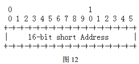

　　这个注册必须包含地址0xffff（目前当监听通道时所有设备都接受的16位广播地址）和在[ieee802.15.4]中定义的0xfffe。另外，在6LoWPAN网路中，16位短地址必须使用这种格式（从0到7的位序列），这里“x”是一位未指定的值：

　　范围1，0xxxxxxxxxxxxxxx：第一位（位0）应该为0如果16位短地址是一个单播地址。这样有15位用于真实地址。

　　范围2，100xxxxxxxxxxxxx：位0，1和2应该使用这个格式如果16位短地址是一个多播地址（见节9）。这样有13位用于真实多播地址。

　　范围3，101xxxxxxxxxxxxx：这个格式的位0，1和2是保留的。任何未来的分配应该遵守上面提到的规则。

　　范围4，110xxxxxxxxxxxxx：这个格式的位0，1和2是保留的。任何未来的分配应该遵守上面提到的规则。

　　范围5，111xxxxxxxxxxxxx：这个格式的位0，1和2是保留的。任何未来的分配应该遵守上面提到的规则。

## 7.8.4.T13 安全事项
>在G3标准中该部分作为规范

　　从EUI-64MAC地址生成的接口标识符的方法是为了保留一个全局唯一的地址当有需要的时候使用。然而，没有方法来预防故障或伪装产生的重复。

　　在IEEE802.15.4链路的邻居发现可能容易受到[RFC3756]里所描述的一些威胁。在IEEE802.15.4网路中mesh路由是很常用的。这意味着会有另外的威胁因为使用adhoc路由[KW03]。IEEE802.15.4提供了一些链路层的安全功能。用户应该尽可能的使用这些安全功能。这样有助于减少上面提到的威胁。

　　IEEE802.15.4设备大多数都应该在一个PAN进行通信（既是，在自己的链路内，用IPv6的方式来说）。考虑到成本和功耗问题，并保持IEEE802.15.4模型的“简化功能设备”（RFDs），这些设备通常只有最小部分必需的功能。因此，这些设备的安全性能很大程度上依赖于IEEE802.15.4链路层的安全机制。后者，然而，只在IEEE802.15.4帧上定义了高级加密算法（AES）用于认证或加密，但不提供密钥管理（大概是基于组的）。其他部署上的问题涉及到安全配置和管理。然而，一个完整的描述已经超出了本文的范围了，部署IEEE802.15.4网路还是需要认真考虑安全问题的。当然，对于一些IEEE802.15.4设备（被称为“全功能设备”，或“FFDs”）还是要有相应的安全功能。这些通常是使用非连接的IPv6进行通信的（相对于更通用的在连接的交换）。这些IPv6设备使用平常的机制（如IPsec,TLS,等）来确保端到端的通信安全。

## 7.8.4.1 Adaptation Layer Command Frames 适配层命令帧
　　使用ESC报头类型来标识ADP层命令帧，随后是指示ADP命令的类型的8位分派字段。 此命令头必须始终位于最后一个位置。 命令头完全定义如下图所示：

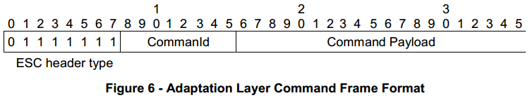

　　ADP层命令帧在下表中指定：

Table 12- Adaptation Layer Command Frames

Command|CommandId|Comments|Specified in…
----|----|----|----
Route Request (RREQ)|0x01|Additional TYPE field set to 0x01 in command payload|Clause 5.2 of the present document
Route Reply (RREP)|0x01|Additional TYPE field set to 0x02 in command payload|Clause 5.2 of the present document
Route Error (RERR)|0x01|Additional TYPE field set to 0x03 in command payload|Clause 5.2 of the present document
Path Request (PREQ)|0x01|Additional TYPE field set to 0x04 in command payload|
Path Reply (PREP)|0x01|Additional TYPE field set to 0x05 in command payload
LoWPAN Bootstrapping Protocol message |0x02|Additional code in command payload|Clause 5.5.1 of the present document
Contention Free Access Command|0x03|-|

### 7.8.4.1.1 Contention Free Access command 无竞争访问命令
　　如果适配层接收到QualityOfService = 2的ADPD-DATA.request原语（参见7.5.1.1），则生成CFA（无竞争接入）命令，

　　无竞争访问命令格式化如下：

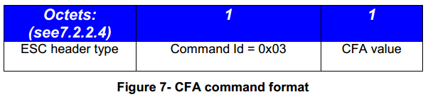

Table 13- CFA value field description

CFA value|Description|翻译
----|----|----
0|Request to allow a transmission during contention free slot|请求在无争用时隙期间允许传输
1|Request to stop a transmission during contention free slot|在无争用时隙期间请求停止传输
2|Response with SUCCESS|回应成功(SUCCESS)
3|Response with FAIL|回应失败(FAIL)

　　如果不允许其它设备在相同时间使用网络协调器，则网络协调器可以总是使用无竞争时隙用于传输。 其他设备必须通过发送带有请求的CFA命令来要求网络协调器允许使用无争用时隙（CFS）（见7.4.4）进行传输。 网络协调器可以允许所请求的设备通过发送确认响应来使用CFS进行传输。 在从网络协调器接收到成功响应之后，所请求的设备可以在CFS期间开始传输。 如果网络协调器拒绝请求，则设备不应使用CFS进行传输。 当无争用传输完成时，请求的设备必须发送停止使用CFS的请求。

　　无竞争访问是本规范的可选功能，目前未实现。 可以使用MCPS-DATA.request原语的QOS参数的“正常”和“高”优先级值执行优先级管理。
