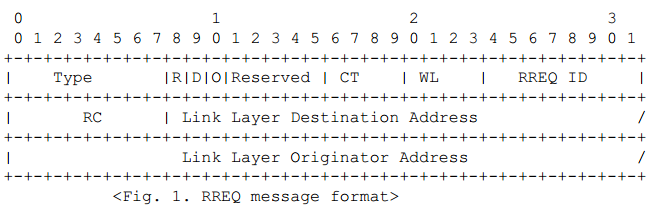

# 7.8.5 Mesh Routing Mesh路由
本节参考文件为[draft-daniel-6lowpan-load-adhoc-routing-03]

## 7.8.5.T1 Introduction 介绍
>在G3标准中该部分作为规范

　　The IEEE 802.15.4 standard [ieee802.15.4] targets low power personal area networks. The "IPv6 over IEEE 802.15.4" document [I-D.montenegro-lowpan-ipv6-over-802.15.4] defines basic functionality required to carry IPv6 packets over IEEE 802.15.4 networks (including an adaptation layer, header compression, etc). Likewise, the functionality required for packet delivery in IEEE 802.15.4 meshes is defined, as mesh topologies are expected to be common in LoWPAN networks. However, neither the IEEE 802.15.4 standard nor the "IPv6 over IEEE 802.15.4" specification provide any information as to how such a mesh topology could be obtained and maintained.  
　　IEEE 802.15.4标准[ieee802.15.4]针对低功率个域网。 “基于IEEE 802.15.4的IPv6”文档定义了在IEEE 802.15.4网络上携带IPv6分组所需的基本功能（包括适应层，报头压缩等）。同样，定义IEEE 802.15.4网格中的分组递送所需的功能，因为网络拓扑预期在LoWPAN网络中是常见的。 然而，IEEE 802.15.4标准和“基于IEEE 802.15.4的IPv6”规范都没有提供关于如何获得和维持这样的网格拓扑的任何信息。

　　The 6LoWPAN Ad hoc Routing Protocol (LOAD) is a simplified on-demand routing protocol based on AODV[RFC3561] for 6LoWPAN. Besides the main AODV specification [RFC3561], several efforts aim at simplifications of the protocol, as in the AODVjr proposal [AODVjr] or the TinyAODV implementation [TinyAODV]. Similarly, DyMO allows for minimalist implementation leaving non-essential functionality as optional [I-D.ietf-manet-dymo]. LOAD enables multihop routing between IEEE802.15.4 devices to establish and maintain routing routes in 6LoWPAN.  
　　6LoWPAN Ad hoc路由协议（LOAD）是基于6LoWPAN的AODV [RFC3561]的简化的按需路由协议。 除了主要的AODV规范[RFC3561]，几个努力的目的是简化协议，如在AODVjr提议[AODVjr]或TinyAODV实现[TinyAODV]。 类似地，DyMO允许极简主义的实现，而将非必要的功能作为可选的[I-D.ietf-manet-dymo]。 LOAD使IEEE802.15.4设备之间的多跳路由能够在6LoWPAN中建立和维护路由路由。  

　　This document defines the message formats, the data structures, and the operations of LOAD.  
　　本文档定义了LOAD的消息格式，数据结构和操作。

## 7.8.5.T2 Requirements notation 要求的符号
>在G3标准中该部分作为规范

　　本文使用的关键词“MUST”、“MUSTNOT”、“REQUIRED”、“SHALL”、“SHALLNOT”、“SHOULD”、“SHOULDNOT”、“MAY”和“OPTIONAL”请参考[RFC2119]的描述。

## 7.8.5.T3 Overview  概述
>在G3标准中该部分进行了修改
 - Routing is only permitted with 16-bit addresses  
路由仅允许使用16位地址
 - LOAD uses the route cost described in annex 2 as a metric of routing  
LOAD使用附件2中描述的路由成本作为路由的度量

　　This section describes the distinctive features of LOAD compared to AODV. LOAD is defined to be operating on top of the adaptation layer instead of the transport layer. That is, it creates a mesh network topology underneath and unbeknownst to IPv6 network layer. IPv6 sees a 6LoWPAN as a single link. This is similar to how other technologies regularly create complex structures underneath IP (e.g.,ethernet spanning tree bridges, token ring source routing, ATM, etc). LOAD control packets use the encapsulation defined in [I-D.montenegro-lowpan-ipv6-over-802.15.4]. All LOAD control packets shall use the prot_type value TBD (suggested value of 4).  
　　本节描述LOAD与AODV相比的显著特征。 LOAD被定义为在适配层而不是传输层的顶部上操作。 也就是说，它为IPv6网络层下面和未知的地方创建网状网络拓扑。 IPv6将6LoWPAN看作单个链路。 这类似于其他技术如何定期在IP下创建复杂结构（例如，以太网生成树桥，令牌环源路由，ATM等）.LOAD控制分组使用[ID.montenegro-lowpan-ipv6-over- 802.15.4]。 所有LOAD控制分组应使用prot_type值TBD（建议值为4）。

　　LOAD assumes the use of either one of the two different addresses for routing: the EUI-64 address and the 16 bit short address of the 6LoWPAN device.  
　　LOAD假定使用两个不同地址中的一个进行路由：EUI-64地址和6LoWPAN设备的16位短地址。

　　LOAD makes use of broadcast in its route discovery. It does so in order to propagate the Route Request (RREQ) messages. In this specification, such broadcast packets are obtained by setting the PAN id to the broadcast PAN (0xffff) and by setting the destination address to the broadcast short address (0xffff).  
　　LOAD在其路由发现中使用广播。这样做是为了传播路由请求（RREQ）消息。在本说明书中，通过将PAN id设置为广播PAN（0xffff）并且通过将目的地地址设置为广播短地址（0xffff）来获得这种广播分组。

　　LOAD doesn’t use the destination sequence number in order to reduce the size of the control messages and simplify the route discovery process. For ensuring loop freedom, only the destination of a route SHOULD generate a RREP in reply. The intermediate nodes SHOULD not respond with a RREP. By the same reason, LOAD does not use the "Gratuitous RREP".  
　　LOAD不使用目的地序列号以便减少控制消息的大小并简化路由发现过程。为了确保循环收敛，只有路由的目的地应该生成RREP回复。中间节点不应该用RREP响应。基于同样的原因，LOAD不使用“Gratuitous RREP(无必要RREP)”。

　　LOAD MAY use the local repair for a link break during a data delivery. In a local repair, only the destination generates a RREP in reply because of no use of the destination sequence number.  
　　LOAD可以在数据传递期间使用本地修复进行链接断开。在本地修复中，由于没有使用目的序列号，只有目的地生成RREP回复。

　　If a local repair fails, LOAD MAY generate a Route Error (RERR) message toward the originator of the data delivery to notify that the destination is no longer reachable by way of the broken link. The format of RERR is simplified to include only one unreachable destination while the RERR of AODV MAY include multiple ones.  
　　如果本地修复失败，则LOAD可以向数据传递的发起者生成路由错误（RERR）消息，以通知通过断开的链路不再可达到目的地。 RERR的格式被简化为仅包括一个不可达目的地，而AODV的RERR可以包括多个。

　　LOAD does not use the "precursor list" of AODV to simplify the routing table structure. Notice that AODV uses the precursors for forwarding RERR messages in the event of detection of the loss of the next hop link. In LOAD, RERR is forwarded only to the originator of the failed data delivery, thus no requiring to use the precursor list.  
　　LOAD不使用AODV的“前级列表”来简化路由表结构。注意，在检测到下一跳链路丢失的情况下，AODV使用前级来转发RERR消息。在LOAD中，RERR仅被转发到失败的数据传递的发起者，因此不需要使用前体列表。

　　LOAD MAY use the route cost, which is the accumulated link cost from the originator to the destination, as a metric of routing. For this, LOAD utilizes the Link Quality Indicator (LQI) of the 6LoWPAN PHY layer in the routing decision in addition to the hop distance. There are many ways to include LQI in the routing metric. The approach taken by LOAD avoids a route which contains weak links whose LQI is below certain threshold value (i.e. WEAK_LQI_VALUE).  
　　LOAD MAY可以使用路由成本作为路由的度量，路由成本是从始发者到目的地的累积链路成本。为此，除了跳距离之外，LOAD还在路由决策中利用6LoWPAN PHY层的链路质量指示符（LQI）。有很多方法可以在路由度量中包括LQI。 LOAD采用的方法避免了包含其LQI为的弱链路的路由低于某一阈值（即WEAK_LQI_VALUE）。

　　LOAD SHOULD utilize the acknowledged transmission option at the 6LoWPAN MAC layer for keeping track of the connectivity of a route. LOAD uses neither the passive acknowledgements nor the HELLO messages of AODV.  
　　负载应该利用6LoWPAN MAC层上的确认传输选项来保持跟踪路由的连接性。 LOAD既不使用AODV的被动确认也不使用HELLO消息。

　　The basic operations of LOAD are route discovery, managing data structures and maintaining local connections. For these operations, LOAD maintains the following two tables: the routing table and the route request table. The routing table stores route information such as destination, next hop node, and status. The route request table stores the temporary route information used in the route discovery
process.  
　　LOAD的基本操作是路由发现，管理数据结构和维护本地连接。 对于这些操作，LOAD维护以下两个表：路由表和路由请求表。 路由表存储路由信息，例如目的地，下一跳节点和状态。 路由请求表存储在路由发现处理中使用的临时路由信息。

　　There are two different types of 6LoWPAN devices: the reduced function device(RFD) and the full function device (FFD). LOAD SHOULD utilize only FFD for mesh routing. Thus, A FFD SHOULD implement the operations of LOAD and maintain the data structures of LOAD.  
　　有2种不同类型的6LoWPAN设备：简化功能设备（RFD）和全功能设备（FFD）。 LOAD应该只使用FFD进行网格路由。 因此，FFD应当实现LOAD的操作并维护LOAD的数据结构。

## 7.8.5.T4 Terminology 术语
>在G3标准中该部分作为规范

**destination** -- A node to which data packets are to be transmitted. Same as "destination node".  
**目标** -- 数据传送的目的只，同“目的节点”

**forward route** -- A route set up to send data packets from the originator to its destination.  
**路径** -- 从发起者到目标的数据传输路径

**link cost** -- The link Quality (LQ) between a node and its neighbor node.  
**链路花费** -- 一个节点与其邻居节点之间的链路质量

**link quality indicator (LQI)** -- A mechanism to measure the Link Quality (LQ) in IEEE 802.15.4 PHY layer [ieee802.15.4]. It measures LQ by receiving the signal energy level. A high LQ value implies the good quality of communication (i.e. low link cost).  
**链路质量指标** -- 不同的物理连接方式有不同的定义

**weak link** -- A link of which the LQI falls below WEAK_LQI_VALUE.  
**弱连接** -- 链接的质量低于WEAK_LQI_VALUE

**originator** -- A node that initiates a route discovery process. Same as "originating node"  
**发起者** -- 一个发起路由发现进程的节点，同“协调者”

**route cost** -- An accumulated link cost as a LOAD control message (RREQ or RREP) passes through the nodes on the route.  
**路由花费** -- 一个LOAD控制消息通过该路径的所有节点的路径花费之和

**reverse route** -- A route set up to forward a RREP back to the originator from the destination. Same as "reverse route" in [RFC3561].  
**反向路径** -- 一个返回目标节点RREP到发起者的路径。同[RFC3561]里面的反向路由。

## 7.8.5.T5 Data Structures 数据结构
>在G3标准中该部分作为规范

　　A FFD in 6LoWPAN SHOULD maintain a routing table and a route request table. This section describes the tables and the message formats.  
　　在6LoWPAN中一个全功能设备(FFD)应该包含路由表及路由请求表，本节描述表及信息的格式。
### 7.8.5.T5.1 Routing Table Entry 路由表条目
>在G3标准中该部分进行了修改
 - The destination address must be a 16-bit address  
目标地址必须是一个16位地址
 - The next hop address must be a 16-bit address  
下一跳地址必须是一个16位地址
 - The routing table is stored in the IB under the attribute adpRoutingTable  
路由表存储于基础信息下的adpRoutingTable

　　The routing table of LOAD includes the following fields:  
　　LOAD中的路由表包含以下内容  

　　destination address -- The 16 bit short or EUI-64 link layer address of the final destination of a route  
　　目标地址 -- 路由的最终目的地的16位短或EUI-64链路层地址   

　　next hop address -- The 16 bit short or EUI-64 link layer addresses of the next hop node to the destination.  
　　下一跳地址 -- 到目标地址的下一跳的16位短或EUI-64链路层地址  

　　status -- The status of a route. It includes the following states: VALID,INVALID, ROUTE_DISCOVERY, etc.  
　　状态 -- 路由的状态，包含以下的状态：VALID(有效),INVALID(无效), ROUTE_DISCOVERY(路由发现)等  

　　life time -- The valid time in milliseconds before the expiration or the deletion of a route.  
　　生存时间 --用毫秒表示的该路由的到期或者删除的有效时间

### 7.8.5.T5.2 Route Request Table Entry 路由请求表条目
>在G3标准中该部分进行了修改
 - The originator address must be a 16-bit address 协调者地址必须是一个16位地址
 - The reverse route address must be a 16-bit address 反向路由地址必须是16位地址

　　Route request table is used for discovering routes. It stores the following route request information until a route is discovered.  
　　路由请求表条目用于发现路由，它包含一下一些请求信息直到一条路由被发现。

　　route request ID -- a sequence number uniquely identifying the particular RREQ when taken in conjunction with the originator  
　　路由请求的ID -- 当与发起者结合时唯一地标识特定RREQ的序列号  

　　originator address -- The 16 bit short or EUI-64 link layer address of the node which originates a RREQ.  
　　发起者地址 -- 组织RREQ的16位短地址或者链路层EUI-64地址  

　　reverse route address -- The 16 bit short or EUI-64 link layer address of the next hop node on the reverse route to the originator.  
　　反向路由地址 -- 在到发起者的反向路由上的下一跳节点的16位短或EUI-64链路层地址  

　　forward route cost -- The accumulated link cost along the forward route from the originator to the current node through which a RREQ is forwarded.  
　　转发路由花费 -- 沿着从发起者到转发RREQ的当前节点的转发路由的累积链路成本

　　reverse route cost -- The accumulated link cost along the reverse route from the final destination to the current node through which a RREP is forwarded.  
　　反向路由花费 -- 沿着从最终目的地到RREP通过其转发的当前节点的反向路由的累积链路成本

　　valid time -- The time of the expiration or deletion of a route in milliseconds.  
　　 有效时间 -- 路由到期或删除的时间（以毫秒为单位）  

### 7.8.5.T5.3 Message Format 消息格式
>在G3标准中该部分作为规范

#### 7.8.5.T5.3.1 Route Request (RREQ)
>在G3标准中该部分进行了修改
 - The CT field must be equal to 0x0F, to specify the use of the route cost described in annex 2
 - The D bit must be set to 1
 - The O bit must be set to 1
 - The link layer destination and originator address must be 16-bit addresses

名称|说明|翻译
----|----|----
Type|1 for indicating a RREQ message.|0x01是用来指示RREQ
CT|Type of route cost. The followings are the current route cost types known: 0 : Hop count while avoiding weak links 1-0xf: TBD|路由花费格式，0跳数即便是包含弱连接，1-0xf其它表示方法
WL|The total number of weak links on the routing path from the originator to the sender of the RREQ.|从发起方到RREQ发送方的路由路径上的弱链路总数
R|1 Local Repair.|1本地修复
D|1 for the 16 bit address of the destination, 0 for the EUI-64 address of the destination.|目标的地址格式，1表示16为短地址，0表示EUI-64地址
O|1 for the 16 bit address of the originator, 0 for the EUI-64 address of the originator.|发起者地址格式，1表示16为短地址，0表示EUI-64地址
RC(Route cost)|The accumulated link cost of the reverse route from the originator to the sender of the RREQ. The type of link cost is specified by CT.|从始发者到RREQ的发送者的反向路由的累积链路成本。 链路成本的类型由CT指定。
RREQ ID|A sequence number uniquely identifying the particular RREQ when taken in conjunction with the originator.|当与发起者结合使用时唯一标识特定RREQ的序列号。
Reserved|0; ignored on reception.
Link layer Destination Address|The 16 bit short or EUI-64 link layer address of the destination for which a route is supplied.|提供路由的目的地的16位短地址或EUI-64链路层地址
Link layer Originator Address|The 16 bit short or EUI-64 link layer address of the node which originated the Route Request.|提供路由的发起者地的16位短地址或EUI-64链路层地址

#### 7.8.5.T5.3.2 Route Reply (RREP)
>在G3标准中该部分进行了修改
 - The CT field must be equal to 0x0F, to specify the use of the route cost described in annex 2
 - The D bit must be set to 1
 - The O bit must be set to 1
 - The link layer destination and originator address must be 16-bit addresses

名称|说明|翻译
----|----|----
Type|2 2 for indicating a RREP message.|0x02是用来指示RREP
CT|Type of route cost. The followings are the current route cost types known: 0 : Hop count while avoiding weak links 1-0xf: TBD|路由花费格式，0跳数即便是包含弱连接，1-0xf其它表示方法
WL|The total number of weak links on the routing path from the originator to the sender of the RREQ.|从发起方到RREQ发送方的路由路径上的弱链路总数
R|1 Local Repair.|1本地修复
D|1 for the 16 bit address of the destination, 0 for the EUI-64 address of the destination.|目标的地址格式，1表示16为短地址，0表示EUI-64地址
O|1 for the 16 bit address of the originator, 0 for the EUI-64 address of the originator.|发起者地址格式，1表示16为短地址，0表示EUI-64地址
RC(Route cost)|The accumulated link cost of the reverse route from the originator to the sender of the RREQ. The type of link cost is specified by CT.|从始发者到RREQ的发送者的反向路由的累积链路成本。 链路成本的类型由CT指定。
RREQ ID|A sequence number uniquely identifying the particular RREQ when taken in conjunction with the originator.|当与发起者结合使用时唯一标识特定RREQ的序列号。
Reserved|0; ignored on reception.
Link layer Destination Address|The 16 bit short or EUI-64 link layer address of the destination for which a route is supplied.|提供路由的目的地的16位短地址或EUI-64链路层地址
Link layer Originator Address|The 16 bit short or EUI-64 link layer address of the node which originated the Route Request.|提供路由的发起者地的16位短地址或EUI-64链路层地址

#### 7.8.5.T5.3.3 Route Error (RERR)
>在G3标准中该部分进行了修改
 - The D bit must be set to 1
 - The O bit must be set to 1
 - The unreachable address must be 16-bit addresses

名称|说明|翻译
----|----|----
Type|3 for indicating a RERR message.|0x03是用来指示RERR
Reserved|0; ignored on reception.
Error Code|Numeric value for describing error. 0x00 = No available route 0x01 = Low battery 0x02 = routing cost not supported 0x03 - 0xff = reserved (TBD)|发生的错误代码 0x00 无可达路由 0x01低电 0x02 = 路由花费不被支持 0x03 - 0xff 保留
Unreachable Link Layer Destination Address|The 16 bit short or EUI-64 link layer address of the final destination that has become unreachable due to a link break.|不可达设备的的16位短地址或EUI-64链路层地址

## 7.8.5.T6 Operation
>在G3标准中该部分作为规范

### 7.8.5.T6.1 Generating Route Request 生成路由请求
>在G3标准中该部分作为规范

　　The basic operations of LOAD include route discovery, managing data structures and maintaining local connections.  A node maintains the following two tables for routing: the routing table and the routing request table.  
　　LOAD的基本操作包括路由发现，数据结构管理和维护本地连接。 节点需要为路由维护下面两个表：路由表和路由请求表。

　　During the discovery period, an originator, a node that requests a route discovery, generates a Route Request (RREQ) message with the RREQ ID which was incremented by one from the previous RREQ ID value.  
　　在发现期间，源发起者，请求一个节点路由发现，根据RREQ ID生成一个路由请求（RREQ）消息，RREQ ID是从以前的RREQ ID值加一而来。

　　A node SHOULD NOT originate more than RREQ_RATELIMIT RREQs per second. After brocasting a RREQ, a node waits for a RREP. If a route is not discovered within NET_TRAVERSAL_TIME milliseconds, the node MAY try again the discovery process a maximum of RREQ_RETRIES times.  
　　一个节点每一秒不应该发起超过RREQ_RATELIMIT RREQ包。在广播一个RREQ之后，节点等待RREP。 如果路由在NET_TRAVERSAL_TIME毫秒内没有发现，节点再尝试发现过程最多RREQ_RETRIES次。

### 7.8.5.T6.2 Processing and Forwarding Route Request 处理和转发路由请求
>在G3标准中该部分作为规范

　　Upon receiving a RREQ, an intermediate FFD node tries to find the entry of the same originator address and RREQ ID pair in the route request table.  If the entry is found, the node just discards the RREQ. Otherwise, the node creates a reverse route to the originator in the routing table and a RREQ entry in the route request table. It then checks whether the link through which the RREQ is received is a weak link or not. If the link is a weak link, the node adds 1 to the WL field of the RREQ.  Then, the node forwards the RREQ.  
　　一旦接收到RREQ，中间FFD节点试图在路由请求表中找到条目与RREQ相同的源地址及RREQ ID对。如果发现条目，节点只是丢弃该RREQ。 否则，该节点在路由表中创建一个反向路由到始发，并在路由请求表中记录一个RREQ条目。然后检查通过其接收所述RREQ的链路是否是一个薄弱环节。如果链接是一个薄弱环节，节点添加1到在RREQ的WL领域。然后节点转发RREQ。

### 7.8.5.T6.3 Generating Route Reply 生成路由应答
>在G3标准中该部分作为规范

　　When the destination receives a RREQ, it tries to find the entry of the same originator address and RREQ ID pair in the route request table. If the entry is found, the destination compares the route cost of the RREQ with the forward route cost of the entry. If the cost of the RREQ is better than(i.e. less than) that of the entry, the desti-nation updates the reverse route to the originator in the routing table and generates a RREP in reply. If the cost of the RREQ is not less than that of the entry, the destination just discards the RREQ.  
　　当目的地接收到RREQ，它试图找到的进入相同的源地址和RREQ ID对中的路由请求表。如果找到该条目，目的地比较RREQ路由开销与路由表中的路由成本。 如果RREQ成本优于（即小于）找到的，目的地更新路由反向路由到源地址并生成回复一个RREP。 如果RREQ的成本不小于已经存在的路由表，目的地只是丢弃RREQ。

　　If the CT field of the RREQ is 0 (i.e. hop count while avoiding weak links), the route cost becomes a tuple of (WL, RC) and is ordered lexicographically. That is, the route cost (WL,RC) is said to be better (or smaller) than or equal to (WL',RC') if the following condition holds.  
　　如果RREQ的CT领域为0（即跳数，同时避免弱链接），路由开销变（WL，RC）的元组，并下令字典顺序。 即，路线成本（WL，RC）被说成是更好（或更小）大于或等于（WL'，RC'）如果满足以下条件成立。  
(WL,RC) <= (WL',RC') if and only if WL < WL', or WL == WL' and RC <= RC'

### 7.8.5.T6.4 Receiving and Forwarding Route Reply 接收和转发路由应答
>在G3标准中该部分作为规范

　　Upon receiving a RREP, an intermediate node checks whether the link through which the RREP is received is a weak link or not. If the link is a weak link, the node add 1 to the WL field of the RREP.  
　　在接收到RREP后，中间节点检查接收到RREP的链路是否是一个薄弱链路​​。如果链路是一个薄弱环节，节点在RREP的WL领域加1。

　　The node then checks whether it has a route entry for the destination of the RREP (i.e. the originator of the corresponding RREQ). If it does not have the route entry, it just discards the RREP.  Otherwise, it also checks for the existence of the corresponding RREQ entry (which has the same RREQ ID and originator address pair as that of the RREP) in the route request table. If there is no such entry, then it just discards the RREP.  
　　该节点然后检查是否有目的地RREP的路由条目（即相应RREQ的源）。 如果它不具有路由条目，它只是丢弃该RREP。 除此以外，它还检查相应的RREQ项是否存在（其具有相同的RREQ ID及发起者地址对的RREP）在路由请求表。 如果不存在这样的条目，那么它只是丢弃RREP。

　　If there is such an entry and the entry has worse reverse route cost (i.e. higher value) than the route cost of the RREP, the node updates the entry with the information of the RREP and forwards it to the previous hop node toward the destination of the RREP.  If the entry  has better reverse route cost (i.e. lower value) than that of the RREP, the node just discards the RREP.  
　　如果有这样一个条目，该条目有更糟糕的反向路由成本（即更高开销）比RREP的路由开销，节点使用RREP的信息更新条目，并将其转发到朝向RREP的目的地的前一跳节点。 如果该条目具有更好的反向路由成本（即较低开销）比的RREP，该节点只是丢弃RREP。

　　If the CT field of the RREP is 0 (i.e. hop count while avoiding weak links), the route cost becomes a tuple of (WL,RC) and is ordered lexicographically.  
　　如果RREP的CT领域为0（即跳数，同时避免弱链接），路由开销变（WL，RC）的元组，并下令字典顺序。

　　During the delivery of the RREP to the originator, the route cost value of the RREP is accumulated on the reverse route from the destination to the originator.  
　　在运输RREP给发端的过程中，该RREP的路由开销值累计从路由表的目的地到源。

### 7.8.5.T6.5 Local Repair and RERR 本地修复和路线错误（RERR）信息
>在G3标准中该部分进行了修改
 - If a link break occurs or a device fails during the delivery of data packets, the upstream node of the link break MUST repair the route locally, and execute the repairing procedure described in the present clause.

　　If a link break occurs or a device fails during the delivery of data packets, the upstream node of the link break MAY repair the route locally.  To repair a route, the node disseminates a RREQ with the originator address set to its own address and the destination address set to the data packet's destination address.  In this case, the 'R flag' of the RREQ is set to 1.  The data packet is buffered during the route discovery period.  If the destination node receives the RREQ for a route repair, it responds with a RREP of which the 'R flag' is also set to 1.  
　　如果发生链接中断或数据的传送过程中一个设备发生故障，链路中断的上游节点可能在本地修复理由。为了修复路由，节点发起一个发起者地址设置为它自己的地址和目的地址设置为数据包的目的地址的RREQ。在这种情况下，RREQ的‘R标志’设置为1。在路由发现期间数据包被缓存。 如果目的地节点接收到路由修复的RREQ，其RREP响应的'R标志'也被设定为1。

　　If the repairing node cannot receive a RREP from the final destination until the end of the route discovery period, it unicasts a RERR with an error code that indicates the reason of the repair failure to the originator.  A repairing node SHOULD NOT generate more than RERR_RATELIMIT RERRs per second. Then, the buffered data packet is discarded. If the originator that sends a data packet receives the RERR, it MAY try to reinitiate route discovery.  
　　如果发起修复的节点在路由发现期间结束都不能接收到目的地地址的RREP，它单播一个RERR包含一个错误代码用于指示维修失败的原因到源。 修复节点不应该产生超过每秒RERR_RATELIMIT个RERRs。 然后，将缓存数据包丢弃。 如果源发送数据包时接收到一个RERR，可以尝试重新发起路由发现。

　　When the repairing node receives a RREP from the destination during the route discovery period, it updates the routing table entry information from the RREP.  Then the node transmits the buffered data packet to the destination through the new route.  
　　当修复节点在路由发现器件收到来至目标节点的RREP，它从RREP信息中更新路由表条目。 然后该节点通过新的路由发送的缓存的数据包到目标节点。

## 7.8.5.T7 Configuration Parameters
>在G3标准中该部分进行了修改
 - The values of the configuration parameters must be:   NET_TRAVERSAL_TIME = 4000 (to be tuned later after lab experimentation)  
RREQ_RETRIES = 3  
RREQ_RERR_WAIT = 2s (to be tuned later after lab experimentation)  
WEAK_LQI_VALUE = 63

This section describes the default values for some important parameters associated with LOAD operations.

Parameter Name|Value
-----|----
NET_TRAVERSAL_TIME|TBD
RREQ_RETRIES|3
RREQ_RATELIMIT|2
RERR_RATELIMIT|2
WEAK_LQI_VALUE|8

## 7.8.5.T8 IANA Consideration
>在G3标准中该部分作为规范

## 7.8.5.T9 Security Considerations
>在G3标准中该部分不相关，也就是未使用

## 7.8.5.T10 Acknowledgments
>在G3标准中该部分不相关，也就是未使用

## 7.8.5.T11 References
>在G3标准中该部分作为规范

## 7.8.5.T11.1 Normative Reference
>在G3标准中该部分作为规范

## 7.8.5.T11.2 Informative Reference
>在G3标准中该部分作为参考信息

## 7.8.5.1 Unicast Packet Routing 单播数据包路由
　　The routing of unicast packet is performed using the following algorithm on reception of a MCPS-DATA.indication from the MAC layer:    
　　在从MAC层接收到MCPS-DATA.indication时，使用以下算法来执行单播分组的路由：

## 7.8.5.2 Multicast / Broadcast 多播 / 广播
### 7.8.5.2.1 Packet Routing 数据包路由
　　This part is based on clause 11.1 of the [rfc4944]  document, and details more precisely the routing of broadcast and multicast packets.    
　　本部分基于[rfc4944]文档的第11.1节，并更准确地说明广播和组播数据包的路由。

　　As described in the above clause, each broadcast packet has a BC0 header containing a sequence number. Each time a node sends a broadcast packet, it must increment this sequence number.  
　　在上面的描述中可以得知，每一个广播数据包都包含一个队列计数的BC0头，每次当节点发送了一个广播数据包，这个计数必须自加。

　　Each node must have a Broadcast Log Table. This table is used for routing broadcast packets, and each entry in this table contains the following parameters:    
　　每个节点必须有一个广播日志表。 此表用于路由广播数据包，此表中的每个条目包含以下参数:  

Table 14 - Broadcast Log Table

Field Name|Size|Description|翻译
----|----|----|----
SrcAddr|2 bytes|The 16-bit source address of a broadcast packet. This is the address of the broadcast initiator.|广播报文的16位源地址。 这是广播发起方的地址。
SeqNumber|Integer, 1byte|The sequence number contained in the BC0 header|队列计数，包含在BC0头中
TimeToLive|Integer|The remaining time to live of this entry in the broadcast Log Table, in milliseconds.|广播日志表中此条目的剩余时间，以毫秒为单位。

　　Each time a device receives a broadcast address with a HopsLft field strictly greater than 0, it must check if an entry already exists in the Broadcast Log Table having the same SrcAddr and SeqNumber. If an entry exists, the received frame is silently discarded. Else, a new entry is added in the table, and the TimeToLive field is initialized with the value adpBroadcastLogTableEntryTTL. When this value reaches 0, the entry is removed from the Multicast Log Table.  
　　每次设备接收到HopsLft字段严格大于0的广播地址时，它必须检查在广播日志表中是否已存在具有相同SrcAddr和SeqNumber的条目。 如果存在条目，则默认丢弃所接收的帧。 否则，将在表中添加一个新条目，并使用值adpBroadcastLogTableEntryTTL初始化TimeToLive字段。 当此值达到0时，将从组播日志表中删除该条目。  

　　When a device receives a broadcast frame, so that it has to create an entry in the Broadcast Log Table, it must decrement its HopsLft field and trigger the emission of the broadcast frame using CSMA/CA. The frame will then be sent as if it were a standard unicast frame using CSMA/CA.  
　　当设备接收到广播帧，使得它必须在广播日志表中创建条目时，它必须递减其HopsLft字段并且使用CSMA / CA触发广播帧的发射。 然后将使用CSMA / CA将该帧作为标准单播帧来发送。  

　　Note that in case of a multicast address, the broadcast address 0xFFFF is used at the MAC level as mentioned in clause 3 of [rfc4944]. Multicast frames are routed using the same algorithm as broadcast frames.   
　　注意，在多播地址的情况下，广播地址0xFFFF在[rfc4944]第3节中提到的MAC级别使用。 组播帧使用与广播帧相同的算法进行路由。(简单理解应该就是说多播也遵循广播的处理流程)  

　　The Broadcast Log Table is available in the Information Base with the attribute adpBroadcastLogTable  
　　广播列表位于基础信息库里面的adpBroadcastLogTable中

### 7.8.5.2.2 Groups 组
　　Each device can belong to one or more group of devices. The IB attribute adpGroupTable stores a list of 16-bit group addresses; when the device receives a MAC broadcast message, and if the final destination address in the 6LoWPAN mesh header is equal to one of the 16-bit group addresses in adpGroupTable, then an ADPD-DATA.indication primitive is generated (see clause 5.4.2.1 of the present document).  
　　每个设备可以属于一个或多个设备组。 IB属性adpGroupTable存储16位组地址的列表; 当设备接收到MAC广播消息，并且如果6LoWPAN网格报头中的最终目的地地址等于adpGroupTable中的16位组地址之一，则生成ADPD-DATA.indication原语（见第5.4.2.1节 ）。  

　　Groups can be added or removed from the adpGroupTable using ADPMSET.request primitives. The size of this table is implementation specific, and must have at least one entry. The way groups are managed by upper layers is beyond the scope of this document.  
　　可以使用ADPMSET.request原语从adpGroupTable添加或删除组。 此表的大小是特定实现的，并且必须至少有一个条目。 组由上层管理的方式超出了本文档的范围。  

## 7.8.5.3 Route Discovery 路由发现
Route discovery can be done in 2 ways:  
路由发现有两种方式：

### 7.8.5.3.1 Manual Route Discovery 手动路由发现
　　A manual route discovery can be triggered by the upper layers, for maintenance or performance purposes. This is done through the invocation of the ADPM-ROUTEDISCOVERY.request primitive. The adaptation layer then generates a RREQ frame as described in clause 5.4 of the present document (modified clauses 5.3.1 and 6.1 of [draft-load]), and executes the algorithms described in clause 5.4 of the present document (all of the modified clauses 6.x of [draft-load]).  
　　出于维护或性能目的，手动路由发现可以由上层触发。 这是通过调用ADPM-ROUTEDISCOVERY.request原语完成的。 然后，适配层生成如本文档的条款5.4（[draft-load]的修改的条款5.3.1和6.1）中所述的RREQ帧，并且执行本文档的第5.4节中描述的算法（所有修改 [draft-load]的第6.x条）。  

　　After the algorithm completes, the adaptation layer generates an ADPM-ROUTEDISCOVERY.confirm primitive with the corresponding status code, and eventually modify its routing table.  
　　算法完成后，适配层生成具有相应状态码的ADPM-ROUTEDISCOVERY.confirm原语，并最终修改其路由表。  

　　Only one route discovery procedure can be processed in the same time. All other ADPM-ROUTE-DISCOVERY.request will be ignored.  
　　只能在同一时间处理一个路由发现过程。 所有其他ADPM-ROUTE-DISCOVERY.request将被忽略。  

　　All devices are required to handle RREQ, RREP and RERR frames as described in clause 5.4 of the present document (modified clauses 6.x of [draft-load]), and must modify their routing tables accordingly.  
　　所有设备都需要处理本文档的第5.4节（[draft-load]的修改的第6.x条）中描述的RREQ，RREP和RERR帧，并且必须相应地修改它们的路由表。  

### 7.8.5.3.2 Automatic Route Discovery 自动路由发现
　　If an ADPD.DATA.request primitive is invoked with its DiscoverRoute parameter set to TRUE, and if no entry is available in the routing table for the device designated by DstAddr, then the adaptation layer generates a RREQ and executes the algorithms described in clause 5.4 of the present document in order to find a route to the destination. If the route discovery succeeds, then the data frame is send to the destination according to the newly discovered route. If the route discovery fails, then the adaptation layer must generate an ADPD-DATA.confirm primitive with the status code ROUTE_ERROR.  
　　如果调用了ADPD.DATA.request原语并将其DiscoverRoute参数设置为TRUE，并且如果在由DstAddr指定的设备的路由表中没有可用条目，则适配层生成RREQ并执行在第5.4节中描述的算法以找到到达目的地的路线。如果路由发现成功，则根据新发现的路由将数据帧发送至目的地。如果路由发现失败，则适配层必须生成具有状态码ROUTE_ERROR的ADPD-DATA.confirm原语。  

　　If an ADPD.DATA.request primitive is invoked with its DiscoverRoute parameter set to FALSE, and if no entry is available in the routing table for the device designated by DstAddr, then the adaptation layer must generate an ADPD-DATA.confirm primitive with the status code ROUTE_ERROR.
Route repairing procedures are described in clause 5.4 of the present document (modified clause 6.5 of [draft-load]).  
　　如果调用ADPD.DATA.request原语并将其DiscoverRoute参数设置为FALSE，并且如果在由DstAddr指定的设备的路由表中没有可用的条目，则适配层必须生成具有状态代码ROUTE_ERROR的ADPD-DATA.confirm原语。路由修复程序在本文档的第5.4节（[draft-load]的修改的第6.5条）中描述。  

### 7.8.5.3.3 RREQ RERR Generation Frequency Limit (RREQ RERR)生成频次
　　A node must wait RREQ_RERR_WAIT second between two successive RREQ/RERR generations to limit the number of broadcast packet in the network.  
　　节点必须在两个连续RREQ/RERR生成之间等待RREQ_RERR_WAIT秒，以限制网络中广播数据包的数量。  

## 7.8.5.4 Path Discovery 路径发现
### 7.8.5.4.1 Operation 操作
　　A path discovery can be triggered by the upper layers, for maintenance or performance purposes. This is done through the invocation of the ADPM-PATHDISCOVERY.request primitive. The adaptation layer then generates a PREQ frame and executes the algorithms next.  
　　出于维护或性能目的，路径发现可以由上层触发。 这通过调用ADPM-PATHDISCOVERY.request原语来完成。 然后，适配层生成PREQ帧，并接着执行算法。  

　　After the algorithm completes (with the reception of a PREP frame), the adaptation layer generates an ADPM-PATH-DISCOVERY.confirm primitive.  
　　在算法完成（接收到PREP帧）之后，适配层生成ADPM-PATH-DISCOVERY.confirm原语。  

　　Only one path discovery procedure can be processed in the same time. All other ADPM-PATH-DISCOVERY.request will be ignored.  
　　只能在同一时间处理一个路径发现过程。 所有其他ADPM-PATH-DISCOVERY.request将被忽略。

#### 7.8.5.4.1.1 Generating a PREQ 生成一个PREQ
　　During the path discovery period, an originator, a node that requests a path discovery, generates a Path Request (PREQ) message.  
　　在路径发现期间，发起者，请求路径发现的节点生成路径请求（PREQ）消息。

　　A node waits for a PREP, else, and after Go_BACK_TIME milliseconds, the node generate a confirm to the upper layer containing a PREP with  set to 0.  
　　节点等待PREP，否则，在Go_BACK_TIME毫秒之后，节点生成一个将HOPS fileds设置为0的PREP对上层确认。  

#### 7.8.5.4.1.2 Processing and forwarding a PREQ 处理和转发PREQ
　　Upon receiving a PREQ, an intermediate FFD node tries to find entry of the same destination address in the routing table. If the entry is found, the node just forwards the PREQ to the next hop toward the destination. Else, the node just discards the PREQ.  
　　在接收到PREQ时，中间FFD节点尝试在路由表中找到相同目的地地址的条目。 如果找到条目，则节点仅将PREQ转发到朝向目的地的下一跳。 否则，节点丢弃该PREQ。

#### 7.8.5.4.1.3 Generating a PREP 产生PREP
　　A final node, on receiving PREQ, generate a PREP with R flag set to 0, hops to 1 and the Hops1 address set to its own address.  
　　最后一个节点在接收到PREQ时，生成一个PREP，R标志设置为0，hops设置到1，Hops 1地址设置为自己的地址。

　　If an intermediate node can’t find a route to the destination of the PREQ, it generates a PREP with R flag set to 1, the HOP to 1 and the Hops1 address to its own address then sends it to the source of the PREQ.  
　　如果中间节点找不到到PREQ的目的地的路由，则它生成PREP，其中R标志设置为1，HOP设置为1，Hops1地址设置为其自己的地址，然后将其发送到PREQ的源。

#### 7.8.5.4.1.4 Processing and forwarding a PREP 处理和转发PREP
　　Upon receiving a PREP, an intermediate FFD node set the HopN address field in the PREP to its own address, with N = HOPS+1, update the RC and increment the HOPS. If there’s no route to the destination, the node just discard the packet.  
　　在接收到PREP时，中间FFD节点将PREP中的HopN地址字段设置为其自己的地址，其中N = HOPS + 1，更新RC并增加HOPS。 如果没有到目的地的路由，则节点只丢弃该分组。  

### 7.8.5.4.2 Path Request Frame 路径请求帧

  

* Type (8bit) - 4 for indicating a PREQ message.  
* RC(Route cost) (8bit) - The accumulated link cost of the reverse route from the originator to the sender of the message.  
* Destination Address - The 16 bit short link layer address of the destination for which a route is supplied.  
* Originator Address - The 16 bit short link layer address of node which originated the packet.  

### 7.8.5.4.3 Path Reply Frame 路径应答帧

  

* Type (8bit) - = 4 for indicating a PREQ message.
* R (1bit) - 1 Success of path discovery；0 Failure of path discovery
* RC(Route cost) (8bit) - The accumulated link cost of the reverse route from the originator to the sender of the message.
* Hops (7bit) - The number of hops of the route.
* Originator Address - The 16 bit short link layer address of node which originated the packet.
* HopN Address - The 16 bit short link layer address of nodes constituting the path.
