# 7.8.6 Commissioning of New Devices 新设备调试
本节参考文件为[draft-daniel-6lowpan-commissioning-02]

## 7.8.6.T1 Introduction 简介
>在G3标准中该部分作为规范

　　6LoWPAN is a low-power wireless personal area network(LoWPAN) which is comprised of the IEEE 802.15.4-2006 standard [ieee802.15.4] devices. One of the design goal for 6LoWPAN architecture is to ensure minimum human intervention during provisioning a sensor device in a PAN. However, a 6LoWPAN device requires a set of pre-deployed information, called LoWPAN Information Base(LIB), to find the right PAN,to successfully join with the PAN, and to establish communication within the PAN. A device needs specific procedure, what we named as a Bootstrapping protocol for 6LoWPAN device, to collect those  information from LoWPAN Bootstrapping Server (LBS) and to start communication in a PAN. This procedure needs to be well defined for interoperability of devices from different vendors. This procedure involves extracting LIB, security credentials,becoming part of existing network, obtaining 16-bit short address, and IP settings.  
　　6LoWPAN是一种低功率无线个域网（LoWPAN），由IEEE 802.15.4-2006标准[ieee802.15.4]设备组成。 6LoWPAN架构的设计目标之一是确保在PAN中配置传感器设备期间的最小的人为干预。 然而，6LoWPAN设备需要一组预部署的信息，称为LoWPAN信息库（LIB），以找到正确的PAN，成功地与PAN结合，以及在PAN内建立通信。 设备需要特定的过程，我们称为6LoWPAN设备的引导协议，从LoWPAN引导服务器（LBS）收集这些信息并在PAN中开始通信。 此过程需要为不同供应商的设备的互操作性进行良好定义。 此过程涉及提取LIB，安全凭证，成为现有网络的一部分，获取16位短地址和IP设置。

## 7.8.6.T2 Terminology 术语
>在G3标准中该部分作为规范

**Active Scan** - An active scan is used by a device to locate all coordinators transmitting beacon frames within its personal operating space,which is provided by IEEE 802.15.4. It requests other devices to transmit the beacon frame.  
**主动扫描** - 设备使用主动扫描来定位所有协调器在其私有操作空间内发送信标帧，其由IEEE 802.15.4提供。它请求其他设备传输信标帧。  
**Association** - An IEEE 802.15.4 device can be assigned a dynamic 16 bit short address during an association operation with a neighbor device (or router) which is also called as the parent device. After getting the short address, a device can communicate with its parent or child by using only the assigned short address.  
**关联** - 在与也称为主设备的邻居设备（或路由器）的关联操作期间，可以向IEEE 802.15.4设备分配动态16位短地址。在获得短地址之后，设备可以通过仅使用所分配的短地址与其父代或子代进行通信。  
**Coordinator** - A full-function device (FFD) which is the principal controller of a 6LoWPAN. It is also called as PAN coordinator. It MAY
initiate the synchronization of the entire 6LoWPAN by transmitting beacons.  
**协调器** - 一个全功能设备（FFD），它是6LoWPAN的主要控制器。它也称为PAN协调器。它可能通过发送信标来启动整个6LoWPAN的同步。  
**ED Scan** - An ED scan allows a device to obtain a measure of the peak energy in each requested channel, which is provided by IEEE 802.15.4.  
**ED扫描** - ED扫描(能量扫描)允许设备获得IEEE 802.15.4提供的每个请求的信道中峰值能量的度量。  
**Full Function Device (FFD)** - A device implementing the complete protocol set of IEEE802.15.4. It is capable of operating as a router (multi-hop packet forwarding) for its associated neighbors.  
**全功能设备（FFD）** - 实现IEEE802.15.4的完整协议集的设备。它能够作为其相关联的邻居的路由器（多跳包转发）。  
**Neighbor Table** - A table which has the information of neighbor devices in a personal operating space.  
**邻居表** - 具有邻居设备信息的表私有操作空间。  
**LoWPAN Bootstrapping Information Base (LIB)** - A set of pre-deployed information that is necessary for a particular 6LoWPAN device to find the desired PAN and to successfully join with the PAN. We categorize this information into two groups; PAN Specific Information (PSI), which is the
same for every device in a PAN, (for example, PAN ID), and Device Specific Information(DSI), which is specific for each particular node (for example short address).  
**LoWPAN引导信息库（LIB）** - 特定6LoWPAN设备找到所需PAN并成功加入PAN所需的一组预部署信息。我们将这些信息分为两组： PAN特定信息（PSI），即对于PAN中的每个设备（例如，PAN ID）以及对于每个特定节点（例如短地址）特定的设备特定信息（DSI）是相同的。  
**PSI : PAN Specific Information** - Inside the LIB, a portion of information, called PSI, is the same for every device in the target PAN. For example, PAN_ID, PAN_Type, etc.  
**PSI：PAN特定信息** - 在LIB内，称为PSI的信息的一部分对于目标PAN中的每个设备是相同的。例如，PAN_ID，PAN_Type等  
**DSI : Device Specific Information** - Inside the LIB, other than PSI, there is some information that may vary from device to device. For example, Role_of_Device, Short_Addr, etc.  
**DSI：设备特定信息** - 除了PSI，在LIB内部，有一些信息可能因设备而异。例如，Role_of_Device，Short_Addr等  
**LoWPAN BootStrapping Device (LBD)** - LBD is a device that is needed to be deployed in the target network. LBD is assumed to have no priori information about the 6LoWPAN within which it is going to join. The only
information it has is the EUI-64 address and a "Join key" (in case of secured PAN).  
**LoWPAN 引导设备（LBD）** - LBD是需要部署在目标网络中的设备。假设LBD没有关于其将要加入的6LoWPAN的先验信息。唯一的信息是EUI-64地址和“加入密钥”（在安全PAN的情况下）。  
**LoWPAN BootStrapping Server (LBS)** - An entity that contains LIB of each device to be bootstrapped It indexes this information with the EUI-64 address of each 6LoWPAN device. LBS has two modules in it; Network management & Acccount Module (NAM) and Authentication Module (AM). NAM
keeps track of the LIB of each device indexed by EUI-64 address whereas AM participates in authentication process on behalf of LBD using LBD’s ’Authentication credentials’. Based on the ’LBP Message’, LBS varifies LBD with the help of Authentication server (in case of secured PAN) and sends ACCEPT message with necessary information otherwise it sends DECLINE message. In the case of secured PAN, LBS initiates authentication mechanism issuing Authentication request into appropriate format that is acceptable by particular authentication server. Any challenge or reply message from the Authentication server is encapsulated in the ’LIB message’ by LBS and is sent back to the LBD through LBA.  
**LoWPAN 引导服务器（LBS）** - 包含要引导的每个设备的LIB的实体。它将此信息与每个6LoWPAN设备的EUI-64地址建立索引。 LBS有两个模块：网络管理和计数模块（NAM）和认证模块（AM）。 NAM跟踪由EUI-64地址索引的每个设备的LIB，而AM使用LBD的“认证凭证”代表LBD参与认证过程。基于“LBP消息”，LBS在认证服务器（在安全PAN的情况下）的帮助下改变LBD，并且发送具有必要信息的ACCEPT消息，否则它发送拒绝消息。在安全PAN的情况下，LBS启动认证机制将认证请求发布为特定认证服务器可接受的适当格式。来自认证服务器的任何询问或应答消息被LBS封装在“LIB消息”中，并且通过LBA发送回LBD。  
**LoWPAN BootStrapping Agent (LBA)** - A FFD that has already joined in the PAN and thus, it is already a member of the PAN. It is also a neighbor of a new LBD, and thus it helps the bootstrapping LBD by receiving LBP message from LBD and forwarding it to LBS.  
**LoWPAN 引导代理（LBA）** - 已经加入PAN的FFD，因此，它已经是PAN的成员。它也是一个新的邻居LBD，因此通过从LBD接收LBP消息并将其转发到LBS来帮助自举LBD。  
**Open 6LoWPAN** - An open 6LoWPAN is a PAN where any device is welcomed.  
**开放的6LoWPAN** - 开放的6LoWPAN是一个PAN，欢迎任何设备。  
**Close 6LoWPAN** - A close 6LoWPAN is a PAN where only pre-defined set of devices are allowed to join based on their EUI-64 address. This account is managed by LBS. If close 6LoWPAN is secured, it is called secured 6LoWPAN.  
**封闭的6LoWPAN** - 封闭的6LoWPAN是一个PAN，其中只允许预定义的设备组根据其EUI-64地址加入。此帐户由LBS管理。如果关闭6LoWPAN是安全的，它被称为安全6LoWPAN。    
**Secured 6LoWPAN** - Secured 6LoWPAN is a Close 6LoWPAN that also maintains secured messange exchange in the PAN.  
**安全6LoWPAN** - 安全6LoWPAN是关闭6LoWPAN，也在PAN中维护安全信息交换。  
**PAN Id** - The 16 bit 6LoWPAN identifier which is administratively assigned to a 6LoWPAN and is unique within the PAN.  
**PAN Id** - 16位6LoWPAN标识符，其被管理地分配给6LoWPAN，并且在PAN内是唯一的。  
**Passive Scan** - A passive scan, like an active scan, is used by an FFD to
locate all coordinators transmitting beacon frames within its personal operating space, which is provided by IEEE 802.15.4.The difference is that the passive scan is a receive-only operation and does not request the beacon frame.  
**被动扫描** - 被动扫描（如主动扫描）由FFD使用定位在其个人操作空间内发射信标帧的所有协调器，其由IEEE 802.15.4提供。不同之处在于被动扫描是仅接收操作，并且不请求信标帧。  
**Personal Operating Space (POS)** - The area within the reception range of the wireless transmission of a IEEE 802.15.4 packet.  
**私有操作空间（POS）** - IEEE 802.15.4数据包的无线传输的接收范围内的区域。  
**Reduced Function Device (RFD)** - A IEEE 802.15.4 device of 6LoWPAN which does not have the functionality of the router. That is, it can not forward IPv6 packets to the next hop device. It can only be the end device of 6LoWPAN.  
**简化功能设备（RFD）** - 6LoWPAN的IEEE 802.15.4设备，不具有路由器的功能。也就是说，它不能将IPv6数据包转发到下一跳设备。它只能是6LoWPAN的终端设备。  
**Short Address** - A 16 bit address dynamically assigned to a device from the PAN.  
**短地址** - 从PAN动态分配给设备的16位地址。

### 7.8.6.T2.1 Requirements notation 符号要求
>在G3标准中该部分作为规范

　　本文使用的关键词“MUST”、“MUSTNOT”、“REQUIRED”、“SHALL”、“SHALLNOT”、“SHOULD”、“SHOULDNOT”、“MAY”和“OPTIONAL”请参考[RFC2119]的描述。

## 7.8.6.T3 Bootstrapping 引导
>在G3标准中该部分进行了修改
 - Obtaining a 16 - bit short address and security credentials are mandatory parts of the commissioning process  
获取16位短地址和安全凭证是调试过程的必需部分

　　Bootstrapping is defined as collecting LIB from LBS, obtaining security credentials (optional), associating with the right PAN, obtaining 16-bit short address (optional), and constructing IPv6 address using IPv6 prefix. Specifically, this includes the process of starting the network, associating with other nodes, obtaining the unique IPv6 address, and constructing security credentials for 6LoWPAN.  
　　引导定义为从LBS收集LIB，获得安全凭证（可选），与正确的PAN关联，获取16位短地址（可选）以及使用IPv6前缀构建IPv6地址。 具体来说，这包括启动网络，与其他节点关联，获取唯一的IPv6地址，以及构建6LoWPAN的安全凭证的过程。  

### 7.8.6.T3.1 Resetting the device 重置设备
>在G3标准中该部分作为规范

　　After the device is started, it first performs a MAC layer reset.  
　　在设备启动后，首先是重置MAC层。

### 7.8.6.T3.2 Scanning through channels 扫描信道
>在G3标准中该部分进行了修改
 -  For getting the information of other devices within POS, the device MUST perform an active scan.为了获得POS内的其他设备的信息，设备必须执行主动扫描。

　　During this phase, functions supported by 802.15.4 are used for scanning channels. Appendix (A.1) shows the scanning process in 802.15.4.  
　　在此阶段，802.15.4支持的功能用于扫描通道。 附录（A.1）显示了802.15.4中的扫描过程。

　　For getting the information of other devices within POS, the device should perform scan. The device can use either an active scan or a passive scan. During scanning procedure, the device receive beacon frames from other devices.  
　　为了获取POS内其他设备的信息，设备应该执行扫描。 设备可以使用主动扫描或被动扫描。 在扫描过程中，设备从其他设备接收信标帧。

### 7.8.6.T3.3 LoWPAN Bootstrapping Mechanism LoWPAN自举机制
>在G3标准中该部分进行了修改
 - 'LBA discovery phase' is described(描述) in section 3.3.3

　　This protocol defines mechanism to extract LIB from currently unknown  LBS and also defines a message format for LIB message exchange. In this protocol, LBD exchanges LBP message with LBS through its one hop neighbor LBA. So, at the beginning of LBP, it needs to find an LBA using ’LBA discovery phase’ that is described in section 3.3.2  
　　该协议定义从当前未知的LBS提取LIB的机制，并且还定义用于LIB消息交换的消息格式。 在这个协议中，LBD通过其一跳邻居LBA与LBS交换LBP消息。 因此，在LBP的开始，它需要使用在第3.3.2节中描述的“LBA发现阶段”来找到LBA

#### 7.8.6.T3.3.1 LoWPAN Bootstrapping Protocol message format LoWPAN引导消息格式
>在G3标准中该部分作为规范

　　In this section we define a message format which is necessary for LBP.  
　　在本节中，我们定义LBP所需的消息格式。  

##### 7.8.6.T3.3.1.1 LBP message LBP消息
>在G3标准中该部分进行了修改
 -  The following clause 5.5.1 of the present document proposes some enhancements and clarifications to LBP message format  
下面在本文档的5.5.1节提出了对LBP消息格式的一些增强和进一步说明

**5.5.1对应文档的3.6.1，在本记录中为7.8.6.1.1**

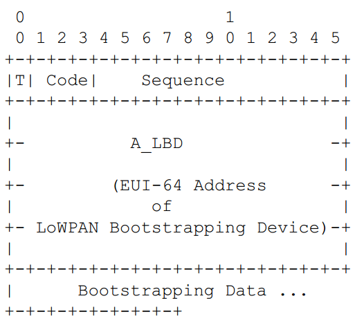
  

**T : Type of message**
- It defines message type. value ’0’ represents ’Message from LBD’ and ’1’ represents ’Message to LBD’.  

**Code :**
- 000, 1xx : Reserved.
- 001 : ACCEPTED. Authentication of LBD has been accepted.
- 010 : CHALLENGE. It indicates that authentication process has not been
finished. Authentication server has sent some challenge that has to be replied by LBD.
- 011 : DECLINE. In the case of unsecured 6LoWPAN, LBS may send this code to indicate that LBD’s EUI-64 address is not allowed to join the PAN.In case of secured 6LoWPAN, LBS may send this code to indicate that LBD’s
EUI-64 address is not allowed to join the PAN or the authentication of the LBD is failed.  

**Seq : Sequence Number**
- Seq identifies the number of messages transmitted  by LBD. Corresponding incomming message from LBS should also have the same Seq.

**A_LBD : Address of Bootstrapping Device (LBD)**
- 64-bit EUI-64 address of LBD.

**Bootstrapping Data: Format of bootstrapping data is given below.**

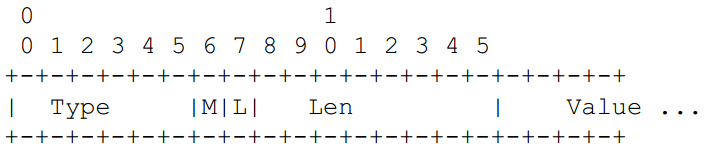
  

Type : 6-bit represents the ID of the attribute in LIB if ’L’ bit is set. Otherwise, this field defines particular authentication type.
- A list of authentication mechanism and their corresponding ’Type’ is TBD.

M : Type of the Attribute
- This field defines the type of the attribute in LIB; whether it is PAN Specific Information (PSI) or Device Specific Information (DSI).1 represents PSI and 0 represents DSI.

Len :8-bit represents the length of the value in octet.

Value : This field represents the corresponding data of the type.

#### 7.8.6.T3.3.2 LoWPAN Bootstrapping Information Base LoWPAN引导信息库
>在G3标准中该部分进行了修改
 -  PAN_type must always be Secured PAN_type始终要加密
 -  Address_of_LBS must be equal to the default address of the PAN coordinator, that is 0x0000  
Address_of_LBS地址必须和协调器的地址相等且为0
 -  Short_Addr_Distribution_Mechanism must be 0 for centralized address management  
用于集中式地址管理时Short_Addr_Distribution_Mechanism必须为0

　　One of the important goal of LBP is to receive a set of information from LBS by a joining LBD. This information comprises of PSI and DSI. Following table shows attribute name, attribute ID (attr_ID), purpose of the attribute and type of it.  
　　LBP的重要目标之一是通过加入LBD从LBS接收一组信息。 该信息包括PSI和DSI。 下表显示了属性名称，属性ID（attr_ID），属性的用途和类型。

Attribute Name|Attribute ID|Type(PSI/DSI)|Attribute Description
-----|----|----|----
PAN_ID|1|P|This is the network identification for the default network
PAN_type|2|P|Secured/closed/open
Address_of_LBS|3|P|Address of the LBS. 0x0000 in case of no LBS. For example in open 6LoWPAN.
Join_Time|4|P|It specifies the time when this node should start trying to join the target PAN.
Role_of_Device|5|D|Agent/No_Agent
Allow_LBA_To_Send_PSI|6|P|This attribute allows any SF to provide GI to CD after getting the positive reply from LBS.
Short_Addr|7|D|16-bit address for new device which is unique inside the PAN
Short_Addr_Distribution_Mechanism|8|P|Its Value is either 0 or 1 representing central or distributed respectively. If it is central, short address is provided by LBS itself otherwise assigning short address is
Other_Device_Specific_Info|15|D|Using this attribute, a device and LBS can exchange any types of data or security key required by the device.

#### 7.8.6.T3.3.3 LBA discovering phase LBA发现阶段
>在G3标准中该部分进行了修改
 -  The following clause 5.5.2 of the present document proposes some enhancements and clarifications to 6LoWPAN bootstrapping procedure  
本文档的以下第5.5.2节提出了对6LoWPAN自举过程的一些增强和修正
 -  The LBD must perform an active scan instead of broadcasting a LBA solicitation message.  
LBD必须执行主动扫描，而不是广播LBA请求消息。

　　LBD has to send LBP message to the LBS server under the support of a LBA. To find the LBA, it broadcasts a LBA solicitation message within its one hop neighbors and waits for a LBA advertisement. Any device capable of being LBS/LBA replies to the broadcast specifying its capability as LBS/LBA .If there is any LBS in its neighbor, LBD selects that LBS otherwise it selects one of the LBAs.  
　　LBD必须在LBA的支持下向LBS服务器发送LBP消息。 为了找到LBA，它在其一跳邻居中广播LBA请求消息并且等待LBA广告。 任何能够作为LBS/LBA的设备回复广播，指定其作为LBS / LBA的能力。如果在其邻居中存在任何LBS，则LBD选择该LBS，否则它选择一个LBA。

#### 7.8.6.T3.3.4 LoWPAN Bootstrapping Protocol (LBP) LoWPAN引导协议
>在G3标准中该部分进行了修改

　　LBD sends LBP message to LBA, as it doesn’t know the address or path to the LBS of the target PAN. LBA forwards the LBP message to LBS on behalf of LBD. LBS replies with one or multiple LBP messages destined to LBA as LBD still is not part of the network. If the network is secured 6LoWPAN and the LBD is an authentic node, we assume that LBD has necessary pre-deployed keys and the knowledge of the authentication mechanism necessary to authenticate in target PAN. In this case, LBD sends necessary information in the ’bootstrapping data’ field so that LBS can initiate the authentication process using that ’authentication credentials’. LBS converts the LBP message into appropriate authentication request for the particular authentication server and sends it. A reply/challenge from the authentication server, for example EAP authenticator or AAA server, is encapsulated in LBP message’s ’bootstrapping data’ field and is sent back to the LBD through LBA. LBA also keeps track of the successful authentication, failed authentication and incomplete conversation of the authentication process, and maintains a ’black list’ of malicious devices to avoid repeated attack. Detecting malicious device based on those 3 information and marking that node as ’Black listed’ belongs to the scope of security policy and out of the scope of this draft.  
　　LBD向LBA发送LBP消息，因为它不知道到目标PAN的LBS的地址或路径。 LBA代表LBD将LBP消息转发给LBS。 LBS回复一个或多个发往LBA的LBP消息，因为LBD仍然不是网络的一部分。如果网络是安全的6LoWPAN并且LBD是可信节点，则我们假定LBD具有必要的预先部署的密钥和在目标PAN中认证所需的认证机制的知识。在这种情况下，LBD在“引导数据”字段中发送必要的信息，以便LBS可以使用“认证凭证”发起认证过程。 LBS将LBP消息转换为针对特定认证服务器的适当认证请求并将其发送。来自认证服务器（例如EAP认证器或AAA服务器）的应答/质询被封装在LBP消息的“引导数据”字段中，并且通过LBA发送回LBD。 LBA还跟踪认证的成功认证，认证失败和认证过程的不完全对话，并保持恶意设备的“黑名单”，以避免重复攻击。基于这3个信息检测恶意设备并将该节点标记为“黑名单”属于安全策略的范围并且超出本草案的范围。  

　　Following figure shows a simple example of Bootstrapping mechanism.  
　　下图显示了Bootstrapping机制的一个简单示例。  

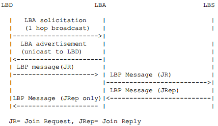

#### 7.8.6.T3.3.5 Bootstrapping in open 6LoWPAN
>在G3标准中该部分不相关，也就是未使用

#### 7.8.6.T3.3.6 LBP in secured 6LoWPAN 加密6LoWPAN的LoWPAN引导协议
>在G3标准中该部分进行了修改
 -  The LBP messages from the LBD to the LBA are sent by invocation of the ADPD-DATA.request primitive with the following attributes:
 -  DstAddrMode = 0x02
 -  DstAddr = The MAC address of the LBA passed as an argument to the ADPM-NETWORK-JOIN.request primitive
 -  NsduLength = the length of the LBP message
 -  Nsdu = the LBP message itself
 -  NsduHandle = random number
 -  MaxHops = 0
 -  DiscoverRoute = FALSE
 -  QualityOfService = 0
 -  SecurityEnabled = FALSE
Remark: The LBA is already present in the neighbor table because an active scan must have been performed prior to invoking the ADPMNETWORK-JOIN.request primitive Thus the routing algorithm will operates correctly as described in clause 5.4.1 of the present document.
 -  The LBP messages from the LBA relayed to the LBS are sent by invocation of the ADPD - DATA.request primitive with the following attributes:
 -  DstAddrMode = 0x02
 -  DstAddr = The MAC address of the LBS
 -  NsduLength = the length of the LBP message
 -  Nsdu = the LBP message itself
 -  NsduHandle = random number
 -  MaxHops = adpMaxHops
 -  DiscoverRoute = TRUE
 -  QualityOfService = 0
 -  SecurityEnabled = TRUE
 -  The LBP messages from the LBS to the LBD relayed to the LBA are
sent by invocation of the ADPD-DATA.request primitive with the following attributes:
 -  SrcAddrMode = 0x02
 -  DstAddrMode = 0x03
 -  DstPANId = the PAN ID
 -  DstAddr = 64 - bit address of the LBD
 -  msduLength = the length of msdu
 -  msdu = the msdu
 -  msduHandle = a random number
 -  TxOptions = 100b
 -  SecurityLevel = 0
 -  KeyIdMode = ignored
 -  KeySource = ignored
 -  KeyIndex = ignored

　　In secured 6LoWPAN, LBD must has to exchange authentication credentials using its join key. Apart from requesting network resources, in the case of secured network, this process may need to exchange several encrypted message between LBD and authentication server. LBA and LBS serves as ’secured tunnel’ for authentication message exchange process.Both LBA and LBS keep the account of the last LIB request/reply processed by themselves.  
　　在安全的6LoWPAN中，LBD必须使用其连接密钥交换认证证书。除了请求网络资源之外，在安全网络的情况下，该过程可能需要在LBD和认证服务器之间交换几个加密消息。 LBA和LBS用作认证消息交换过程的“安全隧道”.LBA和LBS保持自己处理的最后一个LIB请求/应答的帐户。  

　　Example: LBP with EAP  
　　示例：带EAP的LBP  

　　The following figure shows how LBP with other authentication protocol like EAP works. At first LBD broadcasts a LIB request(1 hop) to LBA. LBA already has a secured route to LBP so it just unicasts the LIB request to LBS. LBS sends an EAP packet prepared with LBD’s authentication credentials and sends it to authenticator. it is also possible that LBS entity and authenticator entity resides on a single system. As discussed earlier, LBS serves as translator between LBP and EAP message exchange in this authentication process and finally when AM indicates the success of authentication, it sends all network resources along with the ACCEPTED code. In the case of failure in authentication process, DECLINE code is sent to LBD.  
　　下图显示了LBP与其他认证协议（如EAP）的工作原理。首先，LBD向LBA广播LIB请求（1跳）。 LBA已经具有到LBP的安全路由，因此它只是将LIB请求单播到LBS。 LBS发送使用LBD的认证证书准备的EAP数据包并将其发送到认证器。但是LBS实体和认证器实体也可以驻留在单个系统上。如前所述，LBS在此认证过程中充当LBP和EAP消息交换之间的转换器，并且最后当AM指示认证成功时，它发送所有网络资源以及ACCEPTED代码。在认证过程失败的情况下，DECLINE代码被发送到LBD。  

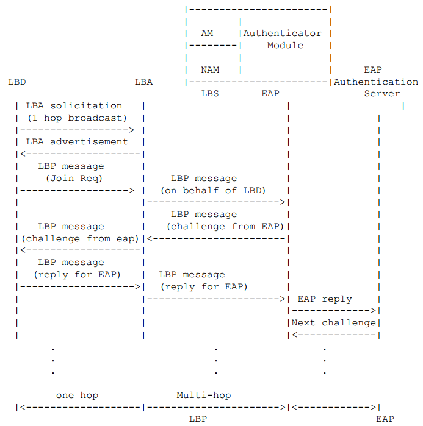

#### 7.8.6.T3.3.7 Role of Entities in LBP 在LBP中各实体的作用
>在G3标准中该部分进行了修改
 - If a LBD does not find any LBA during the LBA discovery phase, it must still perform LBA discoveries as long as it is not commissioned. Note that LBA discovery is done using active scans rather that broadcasting LBA solicitation messages.  
如果LBD在LBA发现阶段期间没有找到任何LBA，则它必须仍然执行LBA发现，只要它不拒绝。 注意，LBA发现是使用主动扫描而不是广播LBA请求消息。
 - Only secured networks are used  
只有安全的网络被使用

　　Role of LoWPAN Bootstrapping Device (LBD):LBD实体
1. It selects LBA using LBA discovery phase.   
选择一个LBA进入LBA发现阶段  
2. If it doesn’t find any LBA, it gives up after waiting for certain amount of time.  
如果没有找到任何LBA，它会在等待一定时间后放弃。  
4. if it receives any LBP message with code "CHALLENGE", it must endanother LBP message containing the appropriate value against the challenge/query in the bootstrapping data field.  
如果它接收到具有代码“CHALLENGE”的任何LBP消息，则它必须在引导数据字段中结束包含针对询问/查询的适当值的LBP消息。  
5. It MUST increment seq for every new LBP message. For retransmission seq should remain same.  
必须每次在新发LBP信息的时候增加序号，重传的时候保持不变。  

　　Role of LoWPAN Bootstrapping Agent (LBA):LBA实体  

　　When LBA receives LBP message from LBD.当LBA收到一个LBD信息    
1. If the LBD is already in the Black List, discard  
如果该LBD在黑名单则直接丢弃。  
2. If the LBD is new, and 6LoWPAN is open network,  
如果该LBD是新加入，并且6LoWPAN是开放的网络。  
a) Send ’LBP message’ with ACCEPTED along with all PSI from its own LIB.  
发送“LBP消息”与ACCEPTED以及来自其自己的LIB的所有PSI。  
b) If there is any LBS in the PAN, Forward the ’LBP message’ to LBS for DSI.  
如果在PAN中存在任何LBS，则将“LBP消息”转发到用于DSI的LBS。  
3. If the LBD is old, and 6LoWPAN is open network  
如果该LBD是旧的，并且6LoWPAN是个开放的网络  
a) if it matches with the last seq no. send the last reply.    
如果序号与最后一次序号一致则发送最后一次返回。  
b) otherwise discard.  
其它则丢弃  
4. If the LBD is new, and 6LoWPAN is secured network  
如果LBD是新入，并且6LoWPAN是一个安全的网络    
a) forward the LBP message to LBS  
转发该LBP信息至LBS  
5. If the LBD is old, and 6LoWPAN is secured network  
如果该LBD是旧的并且6LoWPAN是一个安全的网络  
a) if it matches with the last seq no. send the previously saved last LBP message ’for LBD’.  
如果序号与最后一次的序号相等，则发送之前保存的最后一次LBP信息  
b) if the LBP has completed, discard.  
如果LBP已经完成则丢弃  
c) if the LBP is ’CHALLENGE’ and new seq is right next of the last one, forward the message to LBS.  
如果LBP是“询问”并且新的序号是正确的最后一个，转发该消息到LBS  

　　When LBA receives LBP message from LBS (for LBD)  
当LBA接收到一个LBP信息来至LBS(为LBD)  
1. if it is ACCEPTED and 16-bit short address is the responsibility
of LBA, it calculates and appends the 16-bit short address with the LIB reply.  
如果它是ACCEPTED和16位短地址是LBA的回应，它计算并且附加16位短地址与LIB回复。  
2. Otherwise, if it is ACCEPTED, DECLINED or CHALLENGE, forward it to the corresponding LBD.  
否则，如果它是ACCEPTED，DECLINED或CHALLENGE，则将其转发到相应的LBD。  
3. if it is not ACCEPTED or DECLINED, delete previously saved LBP message and save this LBP message.  
如果它不是ACCEPTED或DECLINED，删除先前保存的LBP消息并保存此LBP消息。  
3. if it is DECLINED, based on the security policy, mark it as ’Black listed’  
如果是DECLINED，根据安全策略，将其标记为“黑名单”  
4. if there is no activity in some of the flow (LBD-LBS pair), mark the LBD and based on the security policy include it in ’Black list’.   
如果在一些流（LBD-LBS对）中没有活动，则标记LBD，并基于安全策略将其包括在“黑名单”中。  

　　Role of LoWPAN Bootstrapping Server (LBS):  
　　LBS实体  

　　In the case of open 6LoWPAN  
　　在开放的6LoWPAN  
1. if the LBD is ’valid’ that means its EUI-64 is in accepted list or not in the rejection list, it sends ACCEPTED code and necessary DSI and 16-bit short address(if the address should be assign centrally).  
如果LBD为“有效”，意味着其EUI-64在接受列表中或不在拒绝列表中，则它发送ACCEPTED代码和必要的DSI和16位短地址（如果地址应该集中分配）。  

　　In the case of secured 6LoWPAN  
　　在安全的6LoWPAN  
1. AM of LBS determines authentication server for particular EUI address and sends authentication mechanism initiation with the authentication credentials to that authentication server.  
LBS的AM确定用于特定EUI地址的认证服务器，并将具有认证凭证的认证机制发起发送到该认证服务器。  
2. when it gets reply from authentication server, if it is success, it prepares a success reply if it is failure, it prepares a failure reply f it is challenge/query, it prepares processing reply for LBD and sends to LBA.  
当它从认证服务器得到答复时，如果它是成功的，它准备一个成功答复，如果它是失败，它准备一个失败答复是挑战/查询，它准备LBD的处理答复并且发送到LBA。  
3. When AM module receives success from authentication server, it informs success to NAM module and sends the success response to NAM. NAM then, sends DSI along with the response in LBP message.  
当AM模块从认证服务器接收成功时，它通知NAM模块成功并将成功响应发送到NAM。 NAM然后，与LBP消息中的响应一起发送DSI。   

### 7.8.6.T3.4 Assigning the short address 分配短地址
>在G3标准中该部分进行了修改
 - Short addresses are assigned in a centralized fashion by the LBS  
短地址由LBS以集中方式分配

　　During LBP procedure, LBD may set a short address either by itself or receiving the address from the PAN. The short address must be unique in a PAN and may be given by a centralized or distributed way.   
　　在LBP过程期间，LBD可以自己设置短地址或从PAN接收地址。 短地址在PAN中必须是唯一的，并且可以通过集中式或分布式方式给出。

　　One of the approach to distribute the short address among the LBDs is centralized fashion where a centralized entity (eg. LBS) assigns 16-bit short address for LBD. Allocation of short address MAY be based on First-Available-Address-First or randomly choosen one or using any other algorithm.  
　　在LBD之间分配短地址的方法之一是集中式方式，其中集中式实体（例如LBS）为LBD分配16位短地址。 短地址的分配可以基于首先可用地址优先或随机选择一个或使用任何其它算法。  

　　Distributed approach is another way to assign 16-bit short address to LBDs. In this approach, LBA assigns short address to the joining device, LBD. A hierarhical addressing scheme could be used by LBA in this purpose. Following figure describes the address calculation scheme. This scheme requires one parameter MC, the maximum number of addresses a LBA can assign. If the present LBD is the first children, then it gets the short address by following formula,
FC = MC * AP + 1
, where FC is the LBD address, and AP is the address of the LBA.  
　　分布式方法是另一种为LBD分配16位短地址的方法。 在这种方法中，LBA为加入设备分配短地址LBD。 LBA可以在这个目的中使用层次寻址方案。 下图描述了地址计算方案。 该方案需要一个参数MC，即LBA可以分配的最大地址数。 如果当前LBD是第一个孩子，则它通过以下公式获得短地址，$FC = MC * AP + 1$其中FC是LBD的地址，AP是LBA的地址。  

　　If LBD is not the first child of this LBA, it receives the address which is next to the last address assigned by that LBA.   
　　如果LBD不是这个LBA的第一个子节点，则它接收该LBA分配的最后一个地址旁边的地址。  

　　For example, if LBA(1) assigned address 6 to its last LBD, it assigns address 7 to its next LBD.
　　例如，一个LBA(短地址为1)，分分配了地址6给它的最后一个LBD，他将分配地址7到下一个LBD  
　　在MC = 4时的分配图如下

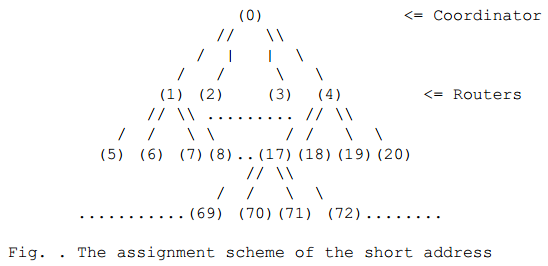

### 7.8.6.T3.5 Obtaining IPv6 address 获得IPv6地址
>在G3标准中该部分进行了修改
 - The devices do not need to obtain an IPv6 address prefix, and the procedures described in this clause as well as [rfc4862] must be ignored. Only the IPv6 Link Local Address generated as stated in clause 7 of [rfc4944] is used for communication.  
设备不需要获取IPv6地址前缀，必须忽略本节中描述的过程以及[rfc4862]。 只有使用[rfc4944]第7节中所述生成的IPv6链路本地地址进行通信。

　　The IPv6 interface identifier of a device can be obtained as described in Section 6 of [rfc4944].  
　　设备的IPv6接口标识符可以按照[rfc4944]的第6节中所述获取。

　　After having a unique IPv6 interface identifier, the device begins to obtain an IPv6 address prefix. The IPv6 address prefix for a particular 6LoWPAN is stored by the IPv6 router in the 6LoWPAN. ICMPv6 is used to share these parameters. Routers in 6LoWPAN are supposed to broadcast Router Advertisements(RA) messages periodically. The RA message must contain the prefix option which can be used in the 6LoWPAN. Devices wish to obtain IPv6 address prefix may wait for an RA message until RA_WAIT_TIME elapsed. After that, if no RA message is received, they may broadcast Router Solicitation(RS) message for requesting the RA message.  
　　在具有唯一的IPv6接口标识符之后，设备开始获得IPv6地址前缀。特定6LoWPAN的IPv6地址前缀由IPv6路由器存储在6LoWPAN中。 ICMPv6用于共享这些参数。 6LoWPAN中的路由器应周期性地广播路由器通告（RA）消息。 RA消息必须包含可在6LoWPAN中使用的前缀选项。希望获得IPv6地址前缀的设备可以等待RA消息，直到RA_WAIT_TIME过去。之后，如果没有接收到RA消息，则它们可以广播用于请求RA消息的路由器请求（RS）消息。  

　　The RS and RA messages can have additional option fields as described in [rfc4861]. Source/Target link-layer address option field should contain the EUI-64 address or the combined address with PAN ID and 16bit short address of the source or target device as below. The RS and RA messages can have additional option fields as described in [rfc4861]. Source/Target link-layer address option field should contain the EUI-64 address or the combined address with PAN ID and 16bit short address of the source or target device as below.  
　　RS和RA消息可以具有[rfc4861]中所述的附加选项字段。源/目标链路层地址选项字段应包含EUI-64地址或具有PAN ID的组合地址和源或目标设备的16位短地址，如下所示。 RS和RA消息可以具有[rfc4861]中所述的附加选项字段。源/目标链路层地址选项字段应包含EUI-64地址或具有PAN ID的组合地址和源或目标设备的16位短地址，如下所示。

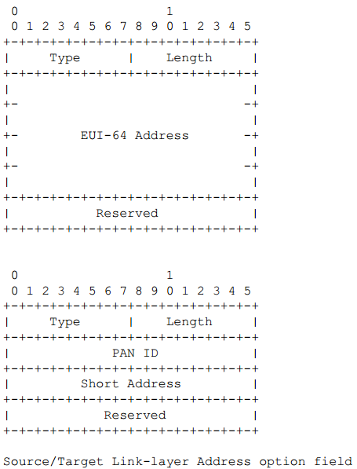

　　Multiple IPv6 routers could form a single or multiple 6lowpan(s). If there are multiple routers in a 6LoWPAN, the device should consider which one is to be selected as a default router. One possible way of selection is to compare the hop counts traveled of the RA message of each router. The detailed algorithm for the selection is TBD.   
　　多个IPv6路由器可以形成单个或多个6lowpan。如果6LoWPAN中有多个路由器，则设备应考虑选择哪一个作为默认路由器。一种可能的选择方式是比较每个路由器的RA消息的行进的跳数。用于选择的详细算法是TBD。  

### 7.8.6.T3.6 Configuration Parameters 参数配置
>在G3标准中该部分进行了修改
 - The values of the configuration parameters must be:
 CHANNEL_LIST = 0xFFFF800 (not used)
 SCAN_DURATION = adpActiveScanDuration
 SUPERFRAME_ORDER = 15
 BEACON_ORDER = 15
 START_RETRY_TIME = 0 (not used)
 JOIN_RETRY_TIME = 0 (not used)
 ASSOCIATION_RETRY_TIME = 0 (not used)

　　This section gives default values for some important parameters associated with the 6LoWPAN commissioning protocol. A particular node may wish to change certain of the parameters.  
　　本节给出了与6LoWPAN调试协议相关的一些重要参数的默认值。 特定节点可能希望改变某些参数。  

Parameter Name|Value
----|----
CHANNEL_LIST|0xFFFF800
SCAN_DURATION|3
SUPERFRAME_ORDER|15
BEACON_ORDER|15
START_RETRY_TIME|1000 msec
JOIN_RETRY_TIME|4000 msec
ASSOCIATION_RETRY_TIME|4000 msec

##7.8.6.T4 IANA Consideration
>在G3标准中该部分不相关，也就是未使用

##7.8.6.T5 Security Considerations
>在G3标准中该部分作为规范

　　IEEE 802.15.4 devices is required to support AES link-layer security. MAC layer also provides all keying material necessary to provide the security services.  
　　需要IEEE 802.15.4设备来支持AES链路层安全性。 MAC层还提供提供安全服务所需的所有密钥服务。

　　It isn’t defined, however, when security shall be used especially combining with Bootstrapping. After the device start and join the network, security services such as key management and device authentication should be done automatically. Detailed algorithm for security on Bootstrapping is TBD.   
　　即便是没有定义，当安全性应被使用，特别是与自举相结合。 设备启动并加入网络后，应自动进行密钥管理和设备认证等安全服务。 引导安全的详细算法是TBD。  

## 7.8.6.1 6LoWPAN Bootstrapping Protocol (LBP) messages format LBP消息格式
　　This clause proposes some enhancements and clarifications to LBP messages
format  
　　本节主要用于描述一些LBP消息格式的说明和增强  

### 7.8.6.1.1 LBP message

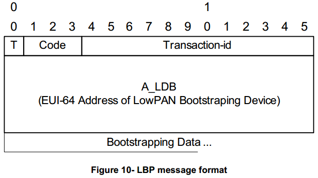

**T**  
The 1-bit T field identifies the type of message  
0 message from LDB  
1 message to LDB  
**Code**  
The 3-bit Code field identifies the message code. See Table 12.  
**Identifier**  
The 12-bit Identifier field aids in matching Responses with Request  
**A_LDB**   
The A_LDB field is 8 octets and indicates the EUI-64 address of the bootstrapping device (LBD)  
**Bootstrapping Data**  
The Bootstrapping Data field is of variable length and contains
additional information elements. Two types are defined:
- Embedded EAP messages
- Configuration parameters

Table 12 - T & Code Fields in LBP messages

T|Code|LDB message|Description
----|----|----|----
0|001|JOINING|The LDB requests joining a PAN and provides necessary authentication material
1|001|ACCEPTED|Authentication succeeded with delivery of Device Specific Information (DSI) to the LDB
1|010|CHALLANGE|Authentication in progress. PAN Specific Information (PSI) may be delivered to the LDB
1|011|DECLINE|Authentication failed
0/1|100|KICK|KICK frame: used by a PAN coordinator to force a device to loose its MAC address, or by any device to inform the coordinator that it left the PAN. On reception of this frame, a device must set its short address to the default value of 0xFFFF, disconnect itself from the network, and perform a reset of the MAC and adaptation layers. See clause 5.5.2.6 of the present document for details about kicking procedure. **5.5.2.6对应文档位置7.8.6.2.6**
0|101|CONFLICT|CONFLICT frame: used by a device to inform the PAN coordinator that it has detected another PAN operating in the same POS. See clause 5.7.2 of the present document for details about PAN ID conflict handling .**5.7.2对应文档位置7.8.9.2**

### 7.8.6.1.2 Embedded EAP messages 嵌入式EAP消息
　　LBP messages embed Extended Authentication messages (EAP) as defined by [rfc3748] with a minor modification to fit the generic LBP information element format.  
　　LBP消息嵌入由[rfc3748]定义的扩展认证消息（EAP），进行少量修改以适合通用LBP信息元素格式。  

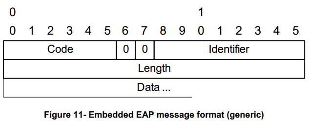

**Code**  
The 6-bit Code field identifies the Type of EAP packet. EAP Codes are assigned as follows:  
1 Request (sent to the peer = LDB)  
2 Response (sent by the peer)  
3 Success (sent to the peer)  
4 Failure (sent to the peer)  
The Code field is slightly different from a regular EAP Code field as specified in [rfc3748]. The conversion appears straightforward in both directions. The proper conversion must apply when the EAP message is propagated over another protocol (i.e. RADIUS) and in case of integrity protection covering the EAP header.

**Identifier**  
The Identifier field is one octet and aids in matching Responses with Requests  
**Length**  
The Length field is two octets and indicates the length, in octets, of the EAP packet including the Code, Identifier, Length, and Data fields. A message with the Length field set to a value larger than the number of received octets MUST be silently discarded.  
**Data**  
The Data field is zero or more octets. The format of the Data
field is determined by the Code field. Refer to [rfc3748] for
more details on:
- Specific format for Request / Response messages and the introduction of the Type field (Identity, Nak, etc.)
- Specific format for Success / Failure messages with an empty Data field.

### 7.8.6.1.3 Configuration parameters 配置参数

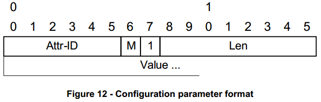

**Attr-ID**  
The 6-bit Attr-ID field represents the ID of the Attribute in LoWPAN Information Base (LIB)  
**M**  
The 1-bit M field identifies the type of the Attribute:  
0 Device Specific Information (DSI)  
1 PAN Specific Information (PSI)  
**Len**  
The Length field is one octet and indicates the length, in octets,of the Value field  
**Value**  
The Value field is zero or more octets and contains the value of the Attribute. Its format is defined by Attr-ID.

## 7.8.6.2 6LoWPAN bootstrapping procedure 6LoWPAN引导程序
　　This clause proposes some enhancements and clarifications to 6LoWPAN bootstrapping procedure. This procedure is executed when the  ADPM-NETWORKJOIN.request primitive is invoked.  
　　本条款对6LoWPAN自举过程提出了一些增强和澄清。 当调用ADPM-NETWORKJOIN.request原语时，将执行此过程。  

　　The following figure provides an overview of the messages exchanged between devices during the Bootstrapping procedure:  
　　下图提供了在引导过程中设备之间交换的消息的概述：

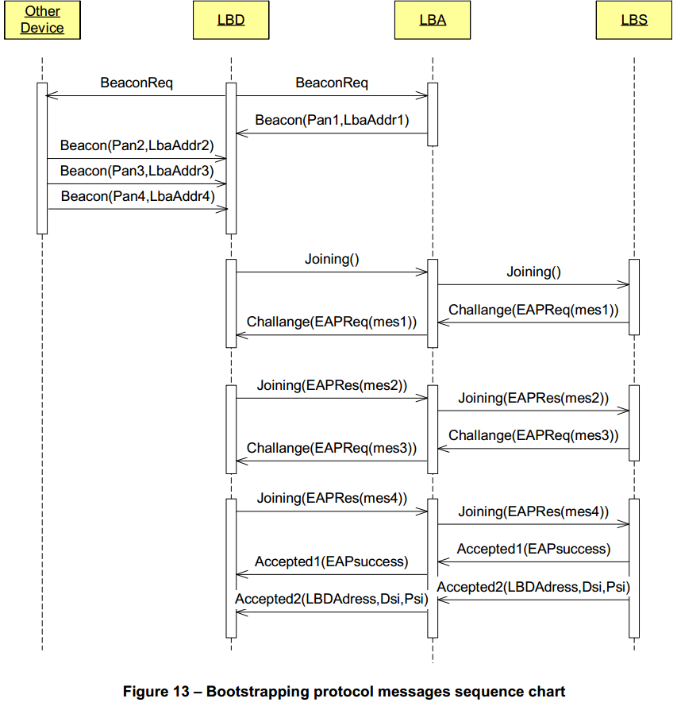

　　And the following sequence diagram summarizes the forwarded messages involved during a nominal association procedure on a PAN between different protocol layers of the devices, when a single LBP protocol message needs to be exchanged between the LBD and the LBS:  
　　并且以下序列图总结了当在LBD和LBS之间需要交换单个LBP协议消息时，在设备的不同协议层之间的PAN上的标称关联过程期间涉及的转发消息：

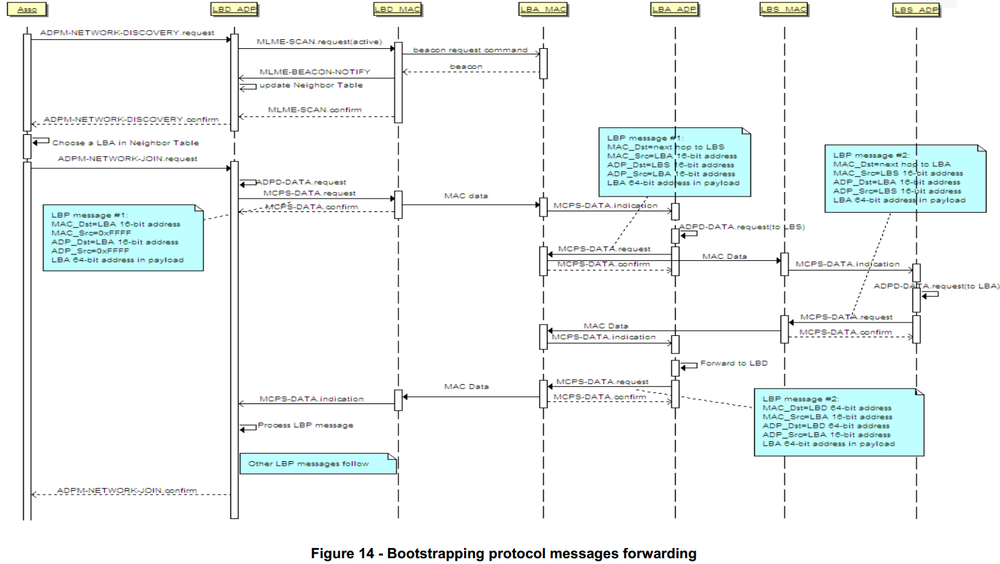

### 7.8.6.2.1 Discovering phase 发现阶段
　　At the beginning of the Bootstrapping procedure, an End Device (aka LoWPAN Bootstrapping Device or LBD) must launch an "active channel scan" (cf. [802.15.4] clause 7.5.2.1.2). The higher layer can start an active scan by invoking the ADPMDISCOVERY.request primitive, and specifying the duration of the scan. The adaptation layer then invokes the MLME-SCAN.request primitive of the MAC layer with the following parameters:  
　　在引导过程开始时，终端设备（也称为LoWPAN引导设备或LBD）必须启动“活动信道扫描”（参见[802.15.4]子句7.5.2.1.2）。 较高层可以通过调用ADPMDISCOVERY.request原语并指定扫描的持续时间来启动活动扫描。 然后，适配层使用以下参数调用MAC层的MLME-SCAN.request原语：  
- ScanType = 0x01
- ScanChannels = all bits to 0 (not used)
- ScanDuration = Duration
- ChannelPage = 0 (not used)
- SecurityLevel = 0
- KeyIdMode = Ignored
- KeySource = Ignored
- KeyIndex = Ignored

　　The LBD sends a 1-hop broadcast Beacon.request frame and any Full Feature Device in the Neighborhood should reply by sending a Beacon frame with its PAN identifier, short address and capabilities.  
　　LBD发送1跳广播信标请求帧，并且邻居中的任何全功能设备应通过发送具有其PAN标识符，短地址和能力的信标帧来应答。  

　　Upon completion, the MAC layer issues a MLME-SCAN.confirm primitive, with the list of existing PAN in the PANDescriptorList parameter. In response, the adaptation layer generates an ADPM-DISCOVERY.confirm primitive which contains the PANDescriptorList parameter provided by the MAC layer.  
　　一旦完成，MAC层发布MLME-SCAN.confirm原语，其中PANDescriptorList参数中的现有PAN的列表。 作为响应，适配层生成ADPM-DISCOVERY.confirm原语，其包含由MAC层提供的PANDescriptorList参数。  

　　At the end of the scan, the LBD selects one of the Beacon senders. It may be either the PAN coordinator that play the role of LoWPAN Bootstrapping Server (LBS) or another FFD. In the latter case, the FFD (aka LoWPAN Bootstrapping Agent or LBA) is in charge of relaying the LoWPAN Bootstrapping Protocol (LBP) frames between the LBA and the LBS.  
　　在扫描结束时，LBD选择一个信标发送者。 它可以是扮演LoWPAN引导服务器（LBS）或另一个FFD的角色的PAN协调器。 在后一种情况下，FFD（也称为LoWPAN自举代理或LBA）负责在LBA和LBS之间中继LoWPAN自举协议（LBP）帧。  

　　The choice is based on the following criteria:  
　　选择的依据如下：
1. Association permit, rejected if negative  
关联许可，如果否定则拒绝  
2. Link Quality, rejected below a threshold  
链路质量，不得低于阈值  
3. PAN identifier, according to a round robin algorithm   
PAN标识符，根据轮询算法  
4. PAN coordinator, preferred if positive   
PAN协调器，首选最佳  
5. Short address, according to a round robin algorithm   
短地址，根据循环算法  

　　A device must not perform more than adpMaxDiscoveryPerHour network discovery procedures per hour.  
　　设备每小时不得执行超过adpMaxDiscoveryPerHour次网络发现过程。  

### 7.8.6.2.2 Access Control phase 访问控制阶段
　　Then, the LBD send an LBP JOINING frame to the LBA. This frame includes a field that carries the EUI-64 address of the joining LBD.  
　　然后，LBD向LBA发送LBP JOINING帧。 该帧包括携带接合LBD的EUI-64地址的字段。

　　This frame, as any other frame during the initial part of the Bootstrapping process, is transmitted between the LBD and the LBA without any additional security at the MAC layer.  
　　与在自举过程的初始部分期间的任何其它帧一样，该帧在LBD和LBA之间传输，而在MAC层没有任何附加安全性。  

　　When received by the LBA, this frame is relayed by the LBA to the LBS. The LBA is supposed fully bootstrapped with the full capability to directly transmit any message to the LBS in a secure way.   
　　当由LBA接收时，该帧由LBA中继到LBS。 LBA被认为是完全自举的，具有以安全的方式将任何消息直接发送到LBS的全部能力。  

　　The LBP protocol has been designed to fit two different authentication rchitectures.  
　　LBP协议被设计成适合两种不同的认证架构:

- The authentication function is directly supported by the LBS, and in this case all the authentication material (access lists, credentials, etc.) must be loaded in the LBS.  
认证功能由LBS直接支持，并且在这种情况下，所有认证资料（访问列表，凭证等）必须被加载到LBS中。

- The authentication function is supported by a remote (and usually centralized) AAA server, and in this case, the LBS is only in charge of forwarding the EAP messages to the AAA server over a standard AAA protocol (i.e. RADIUS [rfc2865]).  
认证功能由远程（并且通常是集中式）AAA服务器支持，并且在这种情况下，LBS仅负责通过标准AAA协议（即RADIUS [rfc2865]）将EAP消息转发到AAA服务器。

　　The following procedure description is only based on the first architecture but extension to the second one appears straightforward.  
　　以下过程描述仅基于第一架构，但是对第二架构的扩展看起来很直接。  

　　So, when received by the LBS, the EUI-64 address should be compared with an Access Control list (white list or black list). Two possibilities:  
　　因此，当由LBS接收时，EUI-64地址应当与访问控制列表（白名单或黑名单）进行比较。 两种可能性：  

- This address does not fit the Access Control list and the LBS send back an LBP DECLINE message, embedding an EAP.failure message.  
此地址不匹配访问控制列表，LBS发送回LBP拒绝消息，嵌入EAP.failure消息。  

- This address fit the Access Control List (or the Access Control is not implemented) and the LBS send back an LBP CHALLENGE message, embedding an EAP. Request message. This latter message also carries the first authentication message.  
此地址匹配访问控制列表（或未实现访问控制），并且LBS发送回LBP CHALLENGE消息，嵌入EAP。 请求消息。 后一消息还携带第一认证消息。  

In the present version of the OFDM CPL specification, the EAP identity phase is skipped as proposed by [rfc3748] to directly move to the authentication phase by sending the first message of the selected EAP method.   
在OFDM CPL规范的当前版本中，如[rfc3748]所建议的跳过EAP身份阶段，以通过发送所选择的EAP方法的第一消息来直接移动到认证阶段。  

The EAP identity phase could be reintroduced later when the need of roaming features arise.  
EAP标识阶段可以在需要漫游时稍后重新引入特征出现。  

In both cases, these messages are relayed by the LBA to the LDB.  
在所有的可能中，这些消息都是LBA与LDB之间中继。

### 7.8.6.2.3 Authentication and Key Distribution phase 认证和密钥分发阶段
　　The Authentication phase is fully dependant of the EAP method in place. The EAP protocol is very flexible and support various EAP methods (EAP-MD5, EAP-AKA,EAP-TLS, etc.). Each method is characterized by its credentials (shared secret,certificate, SIM cards, etc.) and by its signature and encryption algorithms.  
　　认证阶段完全依赖于适当的EAP方法。 EAP协议非常灵活，并支持各种EAP方法（EAP-MD5，EAP-AKA，EAP-TLS等）。 每种方法的特征在于其凭证（共享秘密，证书，SIM卡等）及其签名和加密算法。  

　　Methods are ordinary based on two round-trip exchanges:  
　　方法是基于两个往返交换的普通方法：  
- The first one for mutual authentication and initial exchange of ciphering material  
第一个用于相互验证和加密资料的初始交换  

- The second one for mutual control of session keys derivation  
第二个用于会话密钥导出的相互控制  

　　At the end, the LBD should be equipped with two sets of session keys:  
　　最后，LBD应该配备两组会话密钥：  

- Unicast session keys for the end-to-end security of EAP messages. These keys are timely refreshed.  
用于EAP消息的端到端安全性的单播会话密钥。 这些键被及时刷新。  

- Group session keys for a basic PAN security. These keys are shared by all the authenticated nodes in the PAN. Every MAC data frame, except those involved in the initial phases of the bootstrapping procedure, is securely transmitted with encryption and decryption at every hop. These Group keys are timely refreshed and when a node is detached from the PAN.  
用于基本PAN安全性的组会话密钥。 这些密钥由PAN中的所有已认证节点共享。 除了在引导程序的初始阶段中涉及的那些MAC数据帧之外，每个MAC数据帧在每一跳处被加密和解密安全地传输。 这些组密钥被及时刷新，并且当节点从PAN分离时。  

　　Other keys may be derived for additional security services provided at the Application level.  
　　可以为在应用层提供的附加安全服务导出其他密钥。

　　Refer to §6.2 for further details on the proposed EAP method.  
　　有关建议的EAP方法的更多细节，请参见§6.2。

### 7.8.6.2.4 Authorization and initial configuration phase 授权和初始配置阶段
　　这时，两种可能性：
* The Authentication and Key Distribution process does reach completion and the LBS sends back an LBP DECLINE message, embedding an EAP.failure message and relayed by the LBA to the LBD.   
认证和密钥分发过程确实达到完成，并且LBS发回LBP拒绝消息，嵌入EAP失败消息并且由LBA中继到LBD。

* This process reaches completion and the LBS selects a 16-bit short Address,globally defined and fully routable in the PAN. The LBS sends back an LBP ACCEPTED message, embedding an EAP.success message, at receipt of this message the LBD activate the GMK key. A second LBP ACCEPTED message is sent by LBS embedding the global 16-bit short address and the various parameters (Device Specific and PAN Specific). These messages are relayed by the LBA to the LDB. At this stage, the LDB owns the necessary sessions keys and the messages are securely transferred end-to-end.  
该过程完成并且LBS选择在PAN中全局定义和完全可路由的16位短地址。 LBS发回LBP ACCEPTED消息，嵌入EAP.success消息，在接收到该消息时，LBD激活GMK密钥。 第二LBP ACCEPTED消息由嵌入全局16位短地址和各种参数（设备特定和PAN特定）的LBS发送。 这些消息由LBA中继到LDB。 在这个阶段，LDB拥有必要的会话密钥，并且消息被安全地端对端传送。

　　At reception of the LBP message, the LBD must set-up an optimized route to the LBS with the help of the LOAD protocol.  
　　在接收LBP消息时，LBD必须在LOAD协议下建立到LBS的优化路由。

### 7.8.6.2.5 Joining a PAN for any node except coordinator 除协调者以外的节点加入PAN
　　The network joining procedure must only be performed by a device which is not a PAN coordinator, and which does not have a short address. It is triggered by invocation of the ADPM-NETWORK-JOIN.request primitive. The algorithm the device must perform is:  
　　网络加入过程只能由不是PAN协调器并且不具有短地址的设备来执行。 它是通过调用ADPM-NETWORK-JOIN.request原语触发的。 设备必须执行的算法是：  

- Short_Address = 0xFFFF ( = no short address)短地址不存在
- Current_Neighbor_index = 0
- Connected = FALSE
- While (Short_Address == 0xFFFF)
  * Wait for a random number of seconds. The number of seconds the device must wait is adpNumDiscoveryAttempts*Rnd, where Rnd is a random integer value between 1 and adpDiscoveryAttemptsSpeed, and adpNumDiscoveryAttempts is the number of times the ADPMNETWORK-DISCOVERY.request primitive was called in this procedure. adpNumDiscoveryAttempts must be reset to 0 when ADPMNETWORK-DISCOVERY.request succeeds, on device startup, and after a reset of the adaptation layer. The value of adpNumDiscoveryAttempts must not be incremented anymore if it reaches 15.  
  等待一个随机秒数。 设备必须等待的秒数为adpNumDiscoveryAttempts * Rnd，其中Rnd是介于1和adpDiscoveryAttemptsSpeed之间的随机整数值，adpNumDiscoveryAttempts是在此过程中调用ADPMNETWORK-DISCOVERY.request原语的次数。 当ADPMNETWORK-DISCOVERY.request成功时，设备启动时以及适配层复位后，adpNumDiscoveryAttempts必须重置为0。 如果达到15，AdpNumDiscoveryAttempts的值不能再增加。
  * Perform the “Discovering Phase” through invocation of a ADPMNETWORK-DISCOVERY.request primitive (NOTE: the Neighbor Table must be updated for each received beacon)
  * If existing PANs were found
    * Select a PAN and LBA in the neighbor table (criteria beyond the scope of this document)
    * While ((Connected == FALSE) && (Current_Neighbor_index < Size_of_Neighbor_Table)
      * Perform the “Access Control”, “Authentication and Key Distribution” and “Authorization and initial configuration” phases through invocation of the ADPM-NETWORKJOIN.request primitive using the PAN  identifier and MAC address above:
        * PANId = PANId chosen above
        * LBAAddress = Address at index Current_Neighbor_index
    * If ADPM-NETWORK-JOIN.confirm == SUCCESS
      * Short_Address = result of association process
      * Connected = TRUE
    * Else
      * Current_Neighbor_index ++
  * While (Connected == TRUE)
    * Wait for a disconnection

### 7.8.6.2.6 Leaving a PAN 离开PAN
#### 7.8.6.2.6.1 Removal of a Device by the Coordinator 协调者移除设备
　　The PAN coordinator may instruct a device to remove itself from the network invoking the ADPM-LBP.request primitive, using a KICK frame. This frame is a standard LBP message frame with its Code field set to 100b. The bootstrapping data in that message should be empty.  
　　PAN协调器可以指示设备使用KICK帧从调用ADPM-LBP.request原语从网络中移除自身。 该帧是其代码字段设置为100b的标准LBP消息帧。 该消息中的引导数据应为空。  

　　When a device receives this message, it must check if the A_LBD field of the LBP message is its own address. If not, the message is silently  discarded. Else the device must perform the following steps:  
　　当设备接收到该消息时，它必须检查LBP消息的A_LBD字段是否是其自己的地址。 如果不是，则该消息被静默丢弃。 否则设备必须执行以下步骤：  

- Acknowledge the frame if necessary   
如有必要回复ACK  
- Set its 16-bit short address to 0xFFFF   
将其的短地址设置为0xFFFF  
- Generate a ADPM-NETWORK-LEAVE.indication containing the 64-bit address
of the device   
使用设备的64位地址产生一个ADPM-NETWORK-LEAVE.indication  
- Invoke a MLME-RESET.request primitive with the SetDefaultPIB parameter
set to TRUE   
使用SetDefaultPIB参数调用MLME-RESET.request原语设置为TRUE  
- Invoke its ADPM-RESET.request primitive to reset itself Figure 15 describes the messages exchanged during removal of a device from the PAN by the coordinator.  
调用其ADPM-RESET.request原语来重置自身图15描述了协调器从PAN移除设备期间交换的消息。  

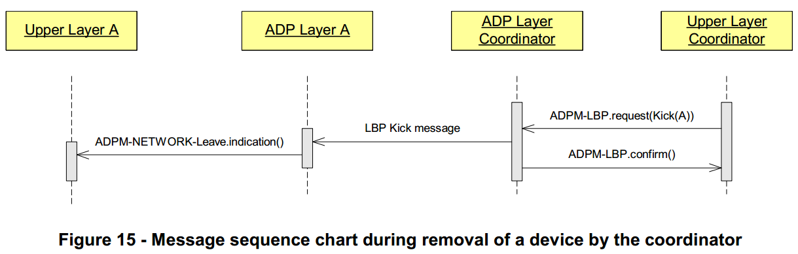

　　Upon completion of this procedure, the device must restart the joining network procedure described in clause 5.5.2.5 of the present document.  
　　完成此过程后，设备必须重新启动本文档第5.5.2.5节中所述的加入网络过程。

#### 7.8.6.2.6.2 Removal of a Device by Itself 设备自移除
　　A device may also call the ADPM-NETWORK-LEAVE.request primitive to remove itself from the network, and notify the PAN coordinator about this removal:    
　　设备还可以调用ADPM-NETWORK-LEAVE.request原语将其自身从网络中移除，并且通知PAN协调器关于该移除：  

　　On invocation of the ADPM-NETWORK-LEAVE.request primitive by a device which is not the PAN coordinator, and with a ExtendedAddress parameter not NULL, the adaptation layer must issue an ADPM-NETWORK-LEAVE.confirm primitive with the status INVALID_REQUEST.  
　　在由不是PAN协调器并且ExtendedAddress参数不为NULL的设备调用ADPM-NETWORK-LEAVE.request原语时，适配层必须发出状态为INVALID_REQUEST的ADPM-NETWORK-LEAVE.confirm原语。  

　　On invocation of the ADPM-NETWORK-LEAVE.request primitive by a device which is not the PAN coordinator, and with a ExtendedAddress parameter set to NULL, the adaptation layer must  
　　在由不是PAN协调器的设备调用ADPM-NETWORK-LEAVE.request原语并且将ExtendedAddress参数设置为NULL时，适配层必须  
- Send a KICK frame to the PAN coordinator using a ADPD-DATA.request primitive (and setting the T field in the LBP message to 1, to indicate a message from LBD)   
使用ADPD-DATA.request原语向PAN协调器发送KICK帧（并且将LBP消息中的T字段设置为1，以指示来自LBD的消息）  
- Set its 16-bit short address to 0xFFFF 将其16位短地址设置为0xFFFF
- Generate a ADPM-NETWORK-LEAVE.indication containing the 64-bit address of the device   
生成包含设备的64位地址的ADPM-NETWORK-LEAVE.indication  
- Invoke a MLME-RESET.request primitive with the SetDefaultPIB parameter set to TRUE  
调用设置为TRUE的SetDefaultPIB参数的MLME-RESET.request原语  
- Invoke its ADPM-RESET.request primitive to reset itself  
调用其ADPM-RESET.request原语来重置自身  

　　Figure 16 describes the messages exchanged during the removal of a device initiated by the device itself.  
　　图16描述了在移除由设备本身发起的设备期间交换的消息。

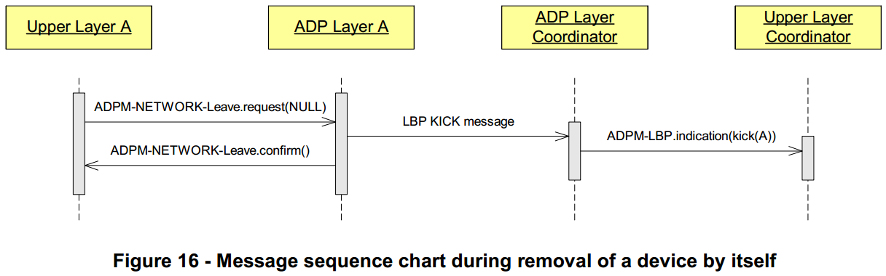

　　On the PAN coordinator side, an ADPM-LBP.indication containing the KICK message received, this message contain the 64-bit address of the device which removed itself from the PAN is generated to inform the upper layers.  
　　在PAN协调器侧，包含接收到的KICK消息的ADPM-LBP.indication，该消息包含从PAN移除自身的设备的64位地址，以通知上层。  
