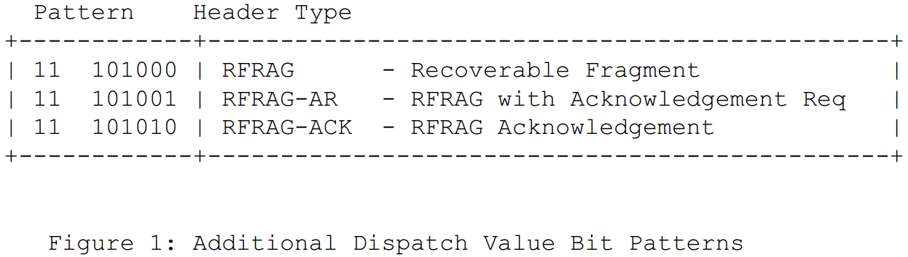
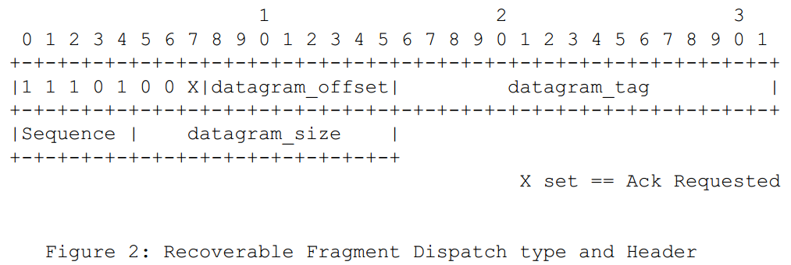
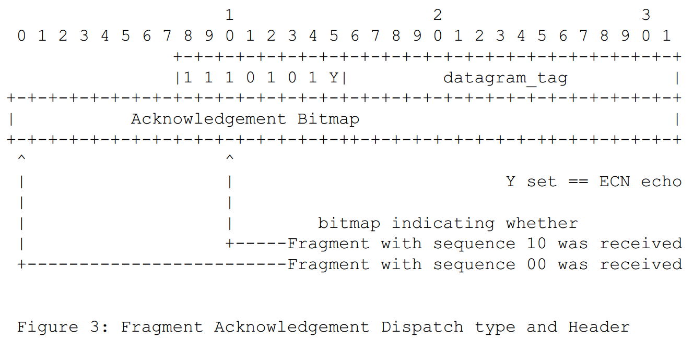

# 7.8.7 Fragment Recovery 碎片修复
　　该部分文档G3引用了[draft-thubert-6lowpan-simple-fragment-recovery-02]  
　　主要是用来描述因为低速网络每一帧数据的长度导致要将IP上的数据进行分包发送，然后导致一个完整的数据被碎片化，这些碎片如何恢复或者不可恢复的情况下如何处理等。

## 7.8.7.T1 Introduction 简介
>在G3标准中该部分作为规范

　　Considering that 6LoWPAN packets can be as large as 2K bytes and that a 802.15.4 frame with security will carry in the order of 80 bytes of effective payload, a packet might be fragmented into about 25 fragments at the 6LoWPAN shim layer. This level of fragmentation is much higher than that traditionally experienced over the Internet with IPv4 fragments. At the same time, the use of radios increases the probability of transmission loss and Mesh-Under techniques compound that risk over multiple hops.   
　　考虑6LoWPAN分组可以大到2K字节，并且具有安全性的802.15.4帧将以80字节的有效净荷的顺序携带，分组可以在6LoWPAN中介层处被分段成大约25个分段。这种碎片化水平比传统上通过IPv4片段在互联网上经历的碎片化水平高得多。同时，无线电的使用增加了传输损耗的概率，并且Mesh-Under技术复合了在多个跳上的风险。  

　　Past experience with fragmentation has shown that missassociated or lost fragments can lead to poor network behaviour and, eventually, trouble at application layer. The reader might start his research from [I-D.mathis-frag-harmful] and follow the references. That experience led to the definition of the Path MTU discovery [RFC1191] protocol that avoids fragmentation over the Internet.  
　　过去的碎片经验表明，失去关联或丢失的碎片可能导致糟糕的网络行为，并最终导致应用层的麻烦。读者可以从[I-D.mathis-frag-hazardous]开始他的研究，并遵循参考文献。这种经验导致了路径MTU发现[RFC1191]协议的定义，其避免了因特网上的分段。  

　　An end-to-end fragment recovery mechanism might be a good complement to a hop-by-hop MAC level recovery with a limited number of retries. This draft introduces a simple protocol to recover individual fragments between 6LoWPAN endpoints. Specifically in the case of UDP, valuable additional information can be found in UDP Usage Guidelines for Application Designers [I-D.ietf-tsvwg-udp-guidelines].  
　　端到端片段恢复机制可能是对具有有限数量的重试的逐跳MAC层恢复的良好补充。这个草案介绍了一个简单的协议来恢复6LoWPAN端点之间的单个片段。特别是在UDP的情况下，有价值的附加信息可以在应用设计者的UDP使用指南[I-D.ietf-tsvwg-udp-guidelines]中找到。

## 7.8.7.T2 Terminology 术语
>在G3标准中该部分作为规范

　　本文使用的关键词“MUST”、“MUSTNOT”、“REQUIRED”、“SHALL”、“SHALLNOT”、“SHOULD”、“SHOULDNOT”、“MAY”和“OPTIONAL”请参考[RFC2119]的描述。

　　Readers are expected to be familiar with all the terms and concepts that are discussed in "IPv6 over Low-Power Wireless Personal Area Networks (6LoWPANs): Overview, Assumptions, Problem Statement, and Goals" [RFC4919] and "Transmission of IPv6 Packets over IEEE 802.15.4 Networks" [RFC4944].  
　　读者应该熟悉在“IPv6 over Low-Power Wireless Personal Area Networks（6LoWPANs）：Overview，Assumptions，Problem Statement，and Goals”中讨论的所有术语和概念[RFC4919]和“IPv6 packetets over IEEE 802.15.4 Networks“[RFC4944]。

**ERP** - Error Recovery Procedure.错误修复过程

**LoWPAN endpoints** - The LoWPAN nodes in charge of generating or expanding a 6LoWPAN header from/to a full IPv6 packet. The LoWPAN endpoints are the points where fragmentation and reassembly take place. LoWPAN节点负责从/向完整的IPv6数据包生成或扩展6LoWPAN报头。 LoWPAN端点是碎裂和重组发生的点。

## 7.8.7.T3 Rationale 理由
>在G3标准中该部分作为规范

　　There are a number of usages for large packets in Wireless Sensor Networks. Such usages may not be the most typical or represent the largest amount of traffic over the LoWPAN; however, the associated functionality can be critical enough to justify extra care for ensuring effective transport of large packets across the LoWPAN.  
　　在无线传感器网络中存在用于大分组的许多用途。 这样的使用可能不是最典型的或代表在LoWPAN上的最大流量; 然而，相关联的功能可以是足够关键的，足以证明额外的注意以确保大分组跨LoWPAN的有效传输。  

　　The list of those usages includes:  
　　这些用法的列表包括：  
- Towards the LoWPAN node:  
对于LoWPAN节点
  * Packages of Commands: A number of commands or a full configuration can by packaged as a single message to ensure consistency and enable atomic execution or complete roll back. Until such commands are fully received and interpreted, the intended operation will not take effect.  
  命令包：许多命令或完整配置可以打包为单个消息，以确保一致性并启用原子执行或完全回滚。 在完全接收和解释这些命令之前，预期的操作将不会生效。
  * Firmware update: For example, a new version of the LoWPAN node software is downloaded from a system manager over unicast or multicast services. Such a reflashing operation typically involves updating a large number of similar 6LoWPAN nodes over a relatively short period of time.  
  固件更新：例如，通过单播或多播服务从系统管理器下载新版本的LoWPAN节点软件。 这种重新刷新操作通常涉及在相对短的时间段内更新大量类似的6LoWPAN节点。  
- From the LoWPAN node:  
来至LoWPAN节点
  * Waveform captures: A number of consecutive samples are measured at a high rate for a short time and then transferred from a sensor to a gateway or an edge server as a single large report.  
  波形捕获：以高速率在短时间内测量多个连续采样，然后作为单个大报告从传感器传输到网关或边缘服务器。  
  * Large data packets: Rich data types might require more than one fragment.  
  大数据包：数据类型可能需要多个片段。  

　　Uncontrolled firmware download or waveform upload can easily result in a massive increase of the traffic and saturate the network.  
　　不受控制的固件下载或波形上传很容易导致流量的大量增加并使网络饱和。  

　　When a fragment is lost in transmission, all fragments are resent, further contributing to the congestion that caused the initial loss, and potentially leading to congestion collapse.  
　　当片段在传输中丢失时，所有片段被重发，进一步导致引起初始丢失的拥塞，并且可能导致拥塞崩溃。  

　　This saturation may lead to excessive radio interference, or random early discard (leaky bucket) in relaying nodes. Additional queueing and memory congestion may result while waiting for a low power next hop to emerge from its sleeping state.  
　　这种饱和可能导致过度的无线电干扰，或者在中继节点中的随机早期丢弃（漏桶）。 在等待低功率下一跳从其休眠状态出现时可能导致额外的排队和存储器拥塞。    

## 7.8.7.T4 Requirements 要求
>在G3标准中该部分作为规范

　　This paper proposes a method to recover individual fragments between LoWPAN endpoints. The method is designed to fit the following requirements of a LoWPAN (with or without a Mesh-Under routing protocol):  
　　本文提出了一种在LoWPAN端点之间恢复单个片段的方法。 该方法被设计为符合LoWPAN的以下要求（具有或不具有Mesh-Under路由协议）：  

**Number of fragments** - The recovery mechanism must support highly fragmented packets, with a maximum of 32 fragments per packet.  
**片段数** - 恢复机制必须支持高度分片的数据包，每个数据包最多包含32个片段。

**Minimimum acknowledgement overhead** - Because the radio is half duplex, and because of silent time spent in the various medium access mechanisms, an acknowledgement consumes roughly as many resources as data fragment.  
The recovery mechanism should be able to acknowledge multiple fragments in a single message.  
**最小确认开销** - 由于无线电是半双工的，并且由于在各种介质访问机制中花费的静默时间，确认消耗大约与数据片段一样多的资源。  
恢复机制应该能够在单个消息中确认多个片段。

**Controlled latency** - The recovery mechanism must succeed or give up within the time boundary imposed by the recovery process of the Upper Layer Protocols.  
**受控延迟** - 恢复机制必须在上层协议的恢复过程施加的时间边界内成功或放弃。

**Support for out-of-order fragment delivery** - A Mesh-Under load balancing mechanism such as the ISA100 Data Link Layer can introduce out-of-sequence packets. The recovery mechanism must account for packets that appear lost but are actually only delayed over a different path.  
**支持无序片段传递** - Mesh-Under负载平衡机制（例如ISA100数据链路层）可能引入序列外的数据包。恢复机制必须考虑出现丢失但实际上只在不同路径上延迟的数据包。  

**Optional flow control** - The aggregation of multiple concurrent flows may lead to the saturation of the radio network and congestion collapse.  
The recovery mechanism should provide means for controlling the number of fragments in transit over the LoWPAN.   
**可选流控制** - 多个并发流的聚合可能导致无线电网络的饱和并且拥塞崩溃。  
恢复机制应该提供用于控制在LoWPAN上传送的片段的数量的装置。

**Backward compatibility** - A node that implements this draft should be able to communicate with a node that implements [RFC4944]. This draft assumes that compatibility information about the remote LoWPAN endpoint is obtained by external means.  
**向后兼容性** - 实现此草案的节点应能够与实现[RFC4944]的节点通信。本草案假定通过外部手段获得关于远程LoWPAN端点的兼容性信息。

## 7.8.7.T5 Overview
>在G3标准中该部分作为规范

　　Considering that a multi-hop LoWPAN can be a very sensitive environment due to the limited queueing capabilities of a large population of its nodes, this draft recommends a simple and conservative approach to flow control, based on TCP congestion avoidance.  
　　考虑到多跳LoWPAN可能是一个非常敏感的环境，由于其大量节点的有限的排队能力，该草案建议基于TCP拥塞避免的流控制的简单和保守的方法。  

　　Congestion on the forward path is assumed in case of packet loss, and packet loss is assumed upon time out.   
　　在分组丢失的情况下假定在前向路径上的拥塞，并且在超时时假定分组丢失。  

　　Congestion on the forward path can also be indicated by an Explicit Congestion Notification (ECN) mechanism. Though whether and how ECN [RFC3168] is carried out over the LoWPAN is out of scope, this draft provides a way for the destination endpoint to echo an ECN indication back to the source endpoint in an acknowledgement message as represented in Figure 3 in Section 6.2.  
　　前向路径上的拥塞也可以由显式拥塞通知（ECN）机制来指示。虽然是否以及如何通过LoWPAN执行ECN [RFC3168]超出了范围，但是本草案提供了一种方式，目的端点可以在确认消息中将ECN指示回送到源端点，如第6.2节中的图3所示。  

　　From the standpoint of a source LoWPAN endpoint, an outstanding fragment is a fragment that was sent but for which no explicit acknowledgement was received yet. This means that the fragment might be on the way, received but not yet acknowledged, or the acknowledgement might be on the way back. It is also possible that either the fragment or the acknowledgement was lost on the way.  
　　从源LoWPAN端点的角度来看，未完成的片段是已发送但尚未接收到明确确认的片段。这意味着片段可能在途中，已接收但尚未确认，或者确认可能正在回来。片段或确认在路上丢失也是可能的。  

　　Because a meshed LoWPAN might deliver frames out of order, it is virtually impossible to differentiate these situations. In other words, from the sender standpoint, all outstanding fragments might still be in the network and contribute to its congestion. There is an assumption, though, that after a certain amount of time, a frame is either received or lost, so it is not causing congestion anymore. This amount of time can be estimated based on the round trip delay between the LoWPAN endpoints. The method detailed in [RFC2988] is recommended for that computation.  
　　因为网状LoWPAN可能不按顺序传送帧，所以实际上不可能区分这些情况。换句话说，从发送者的角度来看，所有未完成的片段可能仍然在网络中并且有助于其拥塞。然而，存在一个假设，在一定时间之后，帧被接收或丢失，因此它不再引起拥塞。该时间量可以基于LoWPAN端点之间的往返延迟来估计。对于该计算，推荐[RFC2988]中详述的方法。  

　　The reader is encouraged to read through "Congestion Control Principles" [RFC2914]. Additionally [RFC2309] and [RFC2581] provide deeper information on why this mechanism is needed and how TCP handles Congestion Control. Basically, the goal here is to manage the amount of fragments present in the network; this is achieved by to reducing the number of outstanding fragments over a congested path by throttling the sources.  
　　鼓励读者阅读“拥塞控制原则”[RFC2914]。另外，[RFC2309]和[RFC2581]提供了有关为什么需要此机制以及TCP如何处理拥塞控制的更深入的信息。基本上，这里的目标是管理网络中存在的碎片的数量;这是通过减少在拥塞路径上的未完成分段的数量来实现的通过节流来源。  

　　Section 7 describes how the sender decides how many fragments are  (re)sent before an acknowledgement is required, and how the sender adapts that number to the network conditions.  
　　第7节描述了发送方如何确定在需要确认之前发送多少个片段，以及发送方如何根据网络条件来适配该数量。  

## 7.8.7.T6 New Dispatch types and headers 新的调度类型和头
>在G3标准中该部分作为规范

　　This specification extends "Transmission of IPv6 Packets over IEEE 802.15.4 Networks" [RFC4944] with 3 new dispatch types, for Recoverable Fragments (RFRAG) headers with or without Acknowledgement Request, and for the Acknowledgement back.  
　　该规范扩展了“具有IEEE 802.15.4网络的IPv6分组的传输”[RFC4944]，具有3种新的分派类型，用于具有或不具有确认请求的可恢复分段（RFRAG）报头，以及用于确认。

　　In the following sections, the semantics of "datagram_tag," "datagram_offset" and "datagram_size" and the reassembly process are unchanged from [RFC4944] Section 5.3. "Fragmentation Type and Header.  
　　在下面的章节中，“datagram_tag”，“datagram_offset”和“datagram_size”的语义和重组过程在[RFC4944]第5.3节“分片类型和头文件中没有改变。  

### 7.8.7.T6.1 Recoverable Fragment Dispatch type and Header 可恢复碎片分派类型和头
>在G3标准中该部分作为规范

**X bit** - When set, the sender requires an Acknowledgement from the receiver   
 当X位设置，发送至需要接受者的ACK应答  
**Sequence** - The sequence number of the fragment. Fragments are numbered
[0..N] where N is in [0..31].  
分片的序号，该序号应该是31以内

### 7.8.7.T6.2 Fragment Acknowledgement Dispatch type and Header 片段确认分派类型和标题
>在G3标准中该部分作为规范

**Y bit** - When set, the sender indicates that at least one of the acknowledged fragments was received with an Explicit Congestion Notification, indicating that the path followed by the fragments is subject to congestion.  
当设置时，发送方指示利用显式拥塞通知接收到确认片段中的至少一个，指示片段所遵循的路径遭受拥塞。  
**Acknowledgement Bitmap** - Each bit in the Bitmap refers to a particular fragment: bit n set indicates that fragment with sequence n was received, for n in [0..31].   
位图中的每个位指的是特定的片段：位n组指示接收到具有序列n的片段，对于[0..31]中的n。

　　All zeroes means that the fragment was dropped because it corresponds to an obsolete datagram_tag. This happens if the packet was already reassembled and passed to the network upper layer, or the packet expired and was dropped.  
　　所有零意味着该片段被删除，因为它对应于过时的datagram_tag。 如果数据包已经重新组合并传递到网络上层，或数据包已过期并被丢弃，则会发生这种情况。  

## 7.8.7.T7 Outstanding Fragments Control 突出片段控制
>在G3标准中该部分作为规范

　　A mechanism based on TCP congestion avoidance dictates the maximum number of outstanding fragments.    
　　基于TCP拥塞避免的机制规定了未完成片段的最大数量。

　　The maximum number of outstanding fragments for a given packet toward a given LoWPAN endpoint is initially set to a configured value, unless recent history indicates otherwise.   
　　向给定LoWPAN端点的给定分组的未完成分段的最大数目最初被设置为配置的值，除非最近历史指示不是这样。

　　Each time that maximum number of fragments is fully acknowledged, that number can be incremented by 1. ECN echo and packet loss cause the number to be divided by 2.  
　　每次最大数目的片段被完全确认，该数目可以增加1.ECN回声和分组丢失导致数目除以2。

　　The sender transfers a controlled number of fragments and flags the last fragment of a series with an acknowledgement request.   
　　发送方传送受控数量的片段，并用确认请求标记序列的最后一个片段。  

　　The sender arms a timer to cover the fragment that carries the Acknowledgement request. Upon time out, the sender assumes that all the fragments on the way are received or lost. It divides the maximum number of outstanding fragments by 2 and resets the number of outstanding fragments to 0.  
　　发送器支持定时器以覆盖承载确认请求的片段。一旦超时，发送方假定在路上的所有片段被接收或丢失。它将最大数量的未完成片段除以2，并将未完成片段的数量重置为0。  

　　Upon receipt of an Acknowledgement request, the receiver responds with an Acknowledgement containing a bitmap that indicates which fragments were actually received. The bitmap is a 32bit DWORD, which accommodates up to 32 fragments and is sufficient for the 6LoWPAN MTU. For all n in [0..31], bit n is set to 1 in the bitmap to indicate that fragment with sequence n was received, otherwise the bit is set to 0.  
　　在接收到确认请求时，接收器用包含指示哪些片段被实际接收的位图的确认来响应。位图是一个32位DWORD，可容纳多达32个片段，足够用于6LoWPAN MTU。对于[0..31]中的所有n，在位图中将位n设置为1，以指示接收到具有序列n的片段，否则该位被设置为0。  

　　The receiver MAY issue unsolicited acknowledgements. An unsolicited acknowledgement enables the sender endpoint to resume sending if it had reached its maximum number of outstanding fragments. Note that acknowledgements might consume precious resources so the use of unsolicited acknowledgements should be configurable and not enabled by default.  
　　接收方可以发出未经请求的确认。如果未经请求的确认已经达到其最大数量的未完成片段，则它使得发送者端点能够恢复发送。请注意，确认可能会消耗宝贵的资源，因此使用未经请求的确认应该是可配置的，默认情况下不启用。  

　　The received MUST acknowledge a fragment with the acknowledgement request bit set. If any fragment immediately preceding an acknowledgement request is still missing, the receiver MAY intentionally delay its  acknowledgement to allow in-transit fragments to arrive. This mechanism might defeat the round trip delay computation so it should be configurable and not enabled by default.  
　　接收到的MUST应答确认请求位置位的片段。如果紧接在确认请求之前的任何片段仍然丢失，则接收机可以有意地延迟其确认以允许进行中的片段到达。这种机制可能会破坏往返延迟计算，因此它应该是可配置的，默认情况下不启用。  

　　Fragments are sent in a round robin fashion: the sender sends all the fragments for a first time before it retries any lost fragment; lost fragments are retried in sequence, oldest first. This mechanism enables the receiver to acknowledge fragments that were delayed in the network before they are actually retried.  
　　片段以循环方式发送：发送方在重试任何丢失的片段之前首次发送所有片段;丢失的碎片按顺序重试，最旧的。这种机制使得接收机能够确认在实际重试之前在网络中被延迟的片段。

　　The process must complete within an acceptable time that is within the boundaries of upper layer retries. Additional work is required to define how this is achieved. When the source endpoint decides that a packet should be dropped and the fragmentation process cancelled, it sends a pseudo fragment with the datagram_offset, sequence and datagram_size all set to zero, and no data. Upon reception of this message, the receiver should clean up all resources for the packet associated to the datagram_tag.  
　　该过程必须在上层重试的边界内的可接受时间内完成。需要额外的工作来定义如何实现。当源端点决定应丢弃分组并取消分段过程时，它发送具有datagram_offset，sequence和datagram_size的伪分段，全部设置为零，没有数据。在接收到此消息时，接收器应清除与datagram_tag相关联的分组的所有资源。  

## 7.8.7.T8 Security Considerations 安全注意事项
>在G3标准中该部分作为规范

　　The process of recovering fragments does not appear to create any opening for new threat.  
　　恢复碎片的过程似乎不会为新的威胁创造任何机会。

## 7.8.7.T9 IANA Considerations
>在G3标准中该部分作为规范

　　Need extensions for formats defined in "Transmission of IPv6 Packets over IEEE 802.15.4 Networks" [RFC4944].
　　需要在“在IEEE 802.15.4网络上传输IPv6分组”[RFC4944]中定义的格式的扩展。

## 7.8.7.T10 Acknowledgments
>在G3标准中该部分不相关，也就是未使用

## 7.8.7.T11 References
>在G3标准中该部分作为规范

### 7.8.7.T11.1 Normative References
>在G3标准中该部分作为规范

### 7.8.7.T11.2 Informative References
