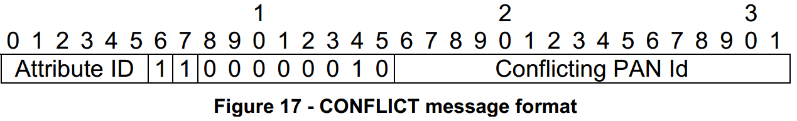

# 7.8.9 Functional Description 功能说明
## 7.8.9.1 Network Formation 网络信息

　　The network formation can only be performed by the PAN coordinator. Any device other than the PAN coordinator must not attempt to perform a network formation.  
　　网络形成只能由PAN协调器执行。除PAN协调器之外的任何设备不得尝试执行网络形成。  

　　Prior to the network formation, the PAN coordinator must perform an active scan as described in clause 5.5.2.1 of the present document. If the PANDescriptorList given by the ADPM-DISCOVERY.confirm primitive is empty, then the PAN coordinator can start a new network. If the PANDescriptorList is not empty, the PAN coordinator should inform the rest of the system that a PAN is already operating in the POS of the device, and may start a new network afterwards. The procedures and decisions associated with this behavior are beyond the scope of this document.  
　　在网络形成之前，PAN协调器必须执行如本文档的条款5.5.2.1中所述的主动扫描。如果ADPM-DISCOVERY.confirm原语给出的PANDescriptorList为空，则PAN协调器可以启动一个新的网络。如果PANDescriptorList不为空，则PAN协调器应该通知系统的其余部分PAN已经在设备的POS中操作，并且之后可以开始新的网络。与此行为相关的程序和决定超出了本文档的范围。  

　　After the network discovery, the PAN coordinator must set its PAN ID to the predefined value stored in it. This value can be obtained remotely from a configuration server, or locally computed. The way how this PAN ID is chosen and set in the coordinator is beyond the scope of this document. Additionally, the PAN identifier must be logically ANDed with 0xFCFF, as described in clause 5.3 of the present document (modified clause 6 of [rfc4944]).  
　　在网络发现之后，PAN协调器必须将其PAN ID设置为其中存储的预定义值。该值可以从配置服务器远程获取，也可以在本地计算。在协调器中如何选择和设置此PAN ID的方式超出了本文档的范围。另外，PAN标识符必须与0xFCFF逻辑AND，如本文档的第5.3节（[rfc4944]的修改的第6节）所述。  

　　Once the PAN identifier has been determined, the adaptation layer must invoke the MLME-START.request with the following parameters  
　　一旦已经确定PAN标识符，适配层必须使用以下参数调用MLME-START.request  
- PANId = the PAN identifier computed above
- LogicalChannel = 0 (not used)
- ChannelPage = 0 (not used)
- StartTime = 0 (not used)
- BeaconOrder = 15 (beaconless network)
- SuperframeOrder = 15 (not used)
- PANCoordinator = TRUE
- BatteryLifeExtension = FALSE (not used)
- CoordRealignment = FALSE
- CoordRealignSecurityLevel, , CoordRealignKeyIdMode,
CoordRealignKeySource and CoordRealignKeyIndex: not used, should be set to 0
- BeaconSecurityLevel = 0
- BeaconKeyIdMode, BeaconKeySource, BeaconKeyIndex: not used, should be set to 0

　　The MAC layer then generates a MLME-START.confirm primitive with the corresponding status code, which is forwarded to the upper layers through the generation of an ADPM-NETWORK-START.confirm.  
　　MAC层然后生成具有对应状态码的MLME-START.confirm原语，其通过生成ADPM-NETWORK-START.confirm被转发到上层。  

## 7.8.9.2 PAN ID Conflict Detection and Handling PAN ID冲突检测和处理
　　At any time, when a device is associated to a PAN, its MAC layer must analyze the Destination and Source PAN Identifier in the MAC header of any frame it receives. If a frame containing a Destination or Source PAN Identifier is received and does not match the PAN Identifier of the device, it must generate a MLME-SYNCLOSS.indication primitive with the following characteristics:  
　　在任何时候，当设备与PAN相关联时，其MAC层必须分析其接收的任何帧的MAC报头中的目的地和源PAN标识符。 如果接收到包含目的地或源PAN标识符的帧，并且与设备的PAN标识符不匹配，则必须生成具有以下特征的MLME-SYNCLOSS.indication原语：  
- LossReason = PAN_ID_CONFLICT
- PANId = The conflicting PAN ID
- LogicalChannel = 0 (not used)
- ChannelPage = 0 (not used)
- SecurityLevel = 0 (not used)
- KeyIdMode, KeySource and KeyIndex can be ignored

　　If the adaptation layer receives a MLME-SYNC-LOSS.indication primitive with another LossReason than PAN_ID_CONFLICT, it must ignore it.  
　　如果适配层接收到具有另一个LossReason而不是PAN_ID_CONFLICT的MLME-SYNC-LOSS.indication原语，则它必须忽略它。  

　　In response, the adaptation layer must generate a CONFLICT frame to its PAN coordinator. This frame is a standard LBP message frame with its Code field set to 101b. The bootstrapping data in that message should contain the PAN Id of the detected PAN using the following format defined in clause 3.3.1 of [draftcommissioning]:  
　　作为响应，适应层必须向其PAN协调器生成CONFLICT帧。 该帧是其代码字段设置为101b的标准LBP消息帧。 该消息中的引导数据应包含检测到的PAN的PAN Id，使用[draftcommissioning]的第3.3.1节中定义的以下格式：  

　　This frame is sent using an ADPD-DATA.request primitive with the following attributes:
- DstAddrMode = 0x02
- DstAddr = IPv6 destination address, formed with the short address of 0x0000
- NsduLength = the length of the frame
- Nsdu = the frame
- NsduHandle = a random number
- MaxHops = adpMaxHops
- DiscoverRoute = TRUE
- QualityOfService = FALSE
- SecurityEnabled = TRUE

　　A device must wait adpPANConflictWait seconds between two consecutive sendings of a CONFLICT frame for the same conflicting PAN Id, and the total number of CONFLICT frames sent for a given conflicting PAN Id must not exceed adpMaxPANConflitCount. When this value is reached, the device must stop sending CONFLICT frames for this conflicting PAN Id.  
　　设备必须在相同冲突PAN ID的CONFLICT帧的两个连续发送之间等待adpPANConflictWait秒，并且针对给定冲突PAN ID发送的CONFLICT帧的总数不能超过adpMaxPANConflitCount。 当达到此值时，设备必须停止为此冲突PAN ID发送CONFLICT帧。  

　　When the PAN coordinator receives this frame, it must generate an ADPMNETWORK-STATUS.indication primitive, with the Status set to PAN_ID_CONFLICT, and the AdditionalInformation set to the conflicting PAN Id.  
　　当PAN协调器接收到此帧时，它必须生成ADPMNETWORK-STATUS.indication原语，其状态设置为PAN_ID_CONFLICT，并且AdditionalInformation设置为冲突的PAN Id。  
